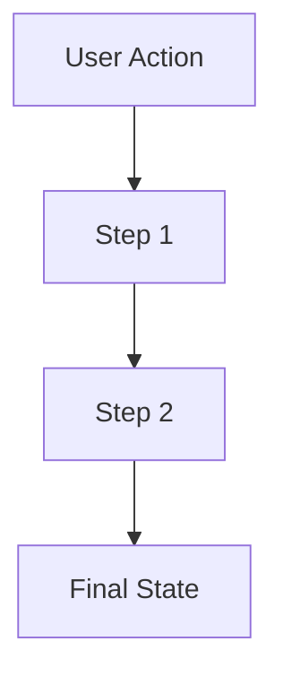
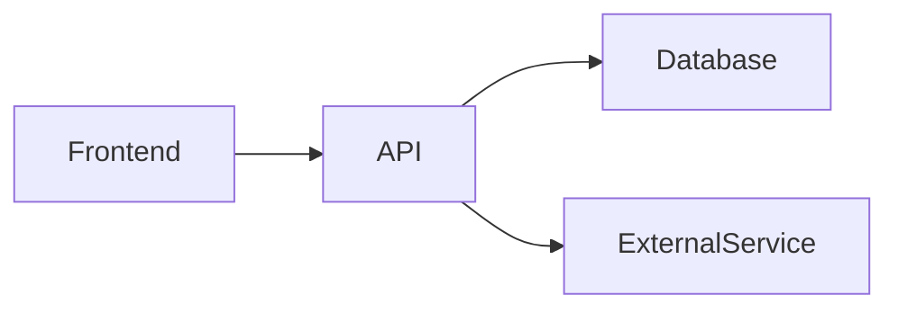

# [Feature Name]

<!-- 
  This template provides a standard structure for documenting features in Choose the Heat.
  Each section is designed to be AI-maintainable with clear boundaries and update triggers.
  Copy this template when creating new feature documentation.
-->

---

## Metadata

| Property | Value |
|----------|-------|
| **Feature Status** | 🚧 In Development / ✅ Production Ready / ⚠️ Experimental / 🔄 Being Refactored |
| **Last Updated** | YYYY-MM-DD |
| **Related Features** | [Feature A](./feature-a.md), [Feature B](./feature-b.md) |
| **Primary Maintainer** | Team/Person (optional) |
| **API Stability** | Stable / Beta / Experimental |

<!-- UPDATE TRIGGER: Update Last Updated date whenever ANY section changes -->
<!-- UPDATE TRIGGER: Update Feature Status when production state changes -->
<!-- UPDATE TRIGGER: Update Related Features when cross-feature dependencies change -->

---

## Overview

### Purpose

[1-2 sentence description of what this feature does and why it exists]

### Key Capabilities

- **Capability 1**: Brief description
- **Capability 2**: Brief description
- **Capability 3**: Brief description

<!-- UPDATE TRIGGER: Update when new major capabilities are added or removed -->

### Use Cases

1. **Use Case 1**: [User scenario]
   - User action: [what user does]
   - System response: [what happens]

2. **Use Case 2**: [Another scenario]
   - User action: [what user does]
   - System response: [what happens]

<!-- UPDATE TRIGGER: Add new use cases when feature scope expands -->

---

## User Experience

### Entry Points

| Location | Access Method | User Role Required |
|----------|---------------|-------------------|
| [Page/Component] | [Button/Link/Route] | User / Editor / Admin |
| [Page/Component] | [Button/Link/Route] | User / Editor / Admin |

<!-- UPDATE TRIGGER: Update when new UI access points are added -->

### User Interface

#### Primary Components

1. **[Component Name]** (`src/components/path/Component.tsx`)
   - Purpose: [what it displays/enables]
   - User actions: [clickable elements, inputs]
   - Visual location: [where it appears]

2. **[Component Name]** (`src/components/path/Component.tsx`)
   - Purpose: [what it displays/enables]
   - User actions: [clickable elements, inputs]
   - Visual location: [where it appears]

<!-- UPDATE TRIGGER: Update when UI components are added, removed, or significantly refactored -->

#### User Flows



<!-- UPDATE TRIGGER: Update when user flows change or new flows are added -->

### User Feedback

- **Loading States**: [How loading is indicated]
- **Success States**: [How success is communicated]
- **Error States**: [How errors are shown]
- **Empty States**: [What shows when no data]

<!-- UPDATE TRIGGER: Update when feedback mechanisms change -->

---

## Technical Implementation

### Architecture Overview

[High-level description of how the feature works architecturally]



<!-- UPDATE TRIGGER: Update when architectural changes occur -->

### Core Components

#### Frontend Components

| Component | Path | Responsibility |
|-----------|------|----------------|
| [Component] | `src/components/path/Component.tsx` | [What it does] |
| [Component] | `src/components/path/Component.tsx` | [What it does] |

<!-- UPDATE TRIGGER: Update when components are added, removed, moved, or renamed -->

#### Backend/API Routes

| Route | Method | Path | Purpose |
|-------|--------|------|---------|
| [Route Name] | GET/POST | `src/routes/api/path/route.ts` | [What it does] |
| [Route Name] | GET/POST | `src/routes/api/path/route.ts` | [What it does] |

<!-- UPDATE TRIGGER: Update when API routes are added, removed, or significantly changed -->

#### Database Schema

**Tables Used:**

```typescript
// Primary table
table_name {
  id: uuid (primary key)
  field1: type
  field2: type
  // ... relevant fields
}

// Related table
related_table {
  id: uuid (primary key)
  foreign_key: uuid (references table_name)
  field1: type
}
```

<!-- UPDATE TRIGGER: Update when database schema changes affect this feature -->

**Key Queries:**

- `src/lib/db/queries/feature-queries.ts`: [Description of main query functions]

<!-- UPDATE TRIGGER: Update when new database query files are created or moved -->

### State Management

**Client State:**

- [State management approach: React Query, local state, etc.]
- Key hooks: `useFeatureQuery()`, `useFeatureMutation()`

**Server State:**

- [How server manages state if applicable]

<!-- UPDATE TRIGGER: Update when state management approach changes or new hooks are added -->

### Data Flow

```
1. User Action → Component
2. Component → Hook/API Call
3. API Route → Database Query
4. Database → Response
5. Response → Component Update
6. UI Reflects Change
```

<!-- UPDATE TRIGGER: Update when data flow changes significantly -->

### External Dependencies

| Dependency | Purpose | Configuration Location |
|------------|---------|----------------------|
| [Library/Service] | [What it's used for] | [Config file path] |
| [Library/Service] | [What it's used for] | [Config file path] |

<!-- UPDATE TRIGGER: Update when external dependencies are added or removed -->

---

## API Reference

### Public APIs

#### [API Function/Route Name]

**Purpose:** [What this API does]

**Request:**

```typescript
interface RequestType {
  field1: string;
  field2: number;
  // ... all fields
}
```

**Response:**

```typescript
interface ResponseType {
  field1: string;
  field2: number;
  // ... all fields
}
```

**Example Usage:**

```typescript
// Client-side usage
const result = await apiFunction({
  field1: "value",
  field2: 123
});
```

**Error Codes:**

- `400`: [Description]
- `404`: [Description]
- `500`: [Description]

<!-- UPDATE TRIGGER: Update when API signatures change, new APIs are added, or error handling changes -->

#### [Another API Function/Route Name]

[Same structure as above]

---

## Code Locations

### Directory Structure

```
src/
├── components/
│   └── feature-name/          # Feature-specific components
│       ├── Component1.tsx
│       └── Component2.tsx
├── routes/
│   ├── feature/               # Feature pages
│   │   └── page.tsx
│   └── api/
│       └── feature/           # Feature API routes
│           └── route.ts
├── lib/
│   ├── feature/               # Feature business logic
│   │   ├── utils.ts
│   │   └── helpers.ts
│   └── db/
│       └── queries/
│           └── feature-queries.ts
└── hooks/
    └── useFeature*.ts         # Feature-specific hooks
```

<!-- UPDATE TRIGGER: Update when files are added, removed, moved, or renamed within the feature -->

### Key Files

| File | Purpose | Lines of Code |
|------|---------|---------------|
| `path/to/file.ts` | [What it does] | ~XXX |
| `path/to/file.tsx` | [What it does] | ~XXX |

<!-- UPDATE TRIGGER: Update when significant files are added or removed -->

---

## Configuration

### Environment Variables

```bash
# Required
FEATURE_API_KEY=              # [Description of what this does]
FEATURE_SETTING=              # [Description, default value]

# Optional
FEATURE_OPTIONAL_CONFIG=      # [Description, default value]
```

<!-- UPDATE TRIGGER: Update when new environment variables are added or removed -->

### Application Settings

**Settings Location:** `src/lib/config/feature-config.ts`

```typescript
export const FEATURE_CONFIG = {
  option1: "value",
  option2: 123,
  // ... configuration options
};
```

<!-- UPDATE TRIGGER: Update when configuration options change -->

---

## Related Features

### Dependencies

- **[Feature Name](./feature.md)**: [How this feature depends on it]
- **[Feature Name](./feature.md)**: [How this feature depends on it]

### Dependents

- **[Feature Name](./feature.md)**: [How that feature depends on this one]
- **[Feature Name](./feature.md)**: [How that feature depends on this one]

<!-- UPDATE TRIGGER: Update when feature dependencies change -->

---

## Testing

### Test Coverage

**Unit Tests:**

- `tests/unit/feature.test.ts`: [What is tested]

**Integration Tests:**

- `tests/integration/feature.test.ts`: [What is tested]

**E2E Tests:**

- `tests/e2e/feature.spec.ts`: [What is tested]

<!-- UPDATE TRIGGER: Update when test files are added or test coverage changes -->

### Manual Testing Checklist

- [ ] [Test scenario 1]
- [ ] [Test scenario 2]
- [ ] [Test edge case 1]
- [ ] [Test error handling]

<!-- UPDATE TRIGGER: Update when new test scenarios are identified -->

---

## Performance Considerations

### Optimization Strategies

- **[Strategy Name]**: [Description and impact]
- **[Strategy Name]**: [Description and impact]

### Known Limitations

- **[Limitation]**: [Description and potential impact]
- **[Limitation]**: [Description and mitigation if any]

<!-- UPDATE TRIGGER: Update when performance optimizations are added or limitations are discovered -->

---

## Future Enhancements

### Planned Features

- [ ] **[Feature Name]**: [Brief description]
  - Status: Planned / In Design / In Progress
  - Target: [Quarter/Version]

- [ ] **[Feature Name]**: [Brief description]
  - Status: Planned / In Design / In Progress
  - Target: [Quarter/Version]

### Potential Improvements

- [Improvement idea 1]
- [Improvement idea 2]

<!-- UPDATE TRIGGER: Update when roadmap changes or enhancements are completed -->

---

## Troubleshooting

### Common Issues

#### Issue: [Description of problem]

**Symptoms:**

- [What user sees or experiences]

**Cause:**

- [Why this happens]

**Solution:**

- [How to fix it]

#### Issue: [Another problem]

[Same structure as above]

<!-- UPDATE TRIGGER: Update when new issues are discovered or solved -->

### Debug Mode

**Enable Debug Logging:**

```typescript
// Set in .env.development
DEBUG_FEATURE=true
```

**Console Output:**

- Look for `[Feature]` prefix in console logs

<!-- UPDATE TRIGGER: Update when debugging capabilities change -->

---

## AI Agent Maintenance Guidelines

### When to Update This Document

1. **Component Changes** (Priority: HIGH)
   - New component added to feature → Update "Frontend Components" table
   - Component renamed/moved → Update all path references
   - Component deleted → Remove from "Frontend Components" table

2. **API Changes** (Priority: HIGH)
   - New API route → Add to "Backend/API Routes" and "API Reference"
   - API signature changed → Update "API Reference" with new types
   - API removed → Remove from all relevant sections

3. **Database Changes** (Priority: HIGH)
   - Schema migration affecting feature → Update "Database Schema"
   - New query function → Update "Key Queries"

4. **Feature Status Changes** (Priority: MEDIUM)
   - Feature moves to production → Update metadata status to ✅
   - Feature deprecated → Update metadata status and add warning

5. **Configuration Changes** (Priority: MEDIUM)
   - New environment variable → Add to "Configuration" section
   - Config file changed → Update configuration examples

6. **User Experience Changes** (Priority: MEDIUM)
   - New UI entry point → Update "Entry Points" table
   - User flow modified → Update "User Flows" diagram
   - New component added to UI → Update "Primary Components"

7. **Documentation Improvements** (Priority: LOW)
   - Better examples discovered → Enhance "Example Usage"
   - Common issue found → Add to "Troubleshooting"

### Update Patterns

**Pattern 1: New Feature Component Added**

```markdown
1. Add component to "Frontend Components" table in Technical Implementation
2. Update "Directory Structure" with new file location
3. Add component to "Primary Components" in User Experience (if user-facing)
4. Update "Last Updated" in Metadata
```

**Pattern 2: API Route Modified**

```markdown
1. Update API signature in "API Reference" section
2. Update example usage code
3. Update error codes if error handling changed
4. Update "Last Updated" in Metadata
```

**Pattern 3: Feature Reaches Production**

```markdown
1. Change Feature Status from 🚧 to ✅ in Metadata
2. Update API Stability if applicable
3. Remove experimental warnings
4. Update "Last Updated" in Metadata
```

### AI Agent Instructions

**When modifying code related to this feature:**

1. **Before making code changes:**
   - Review this documentation to understand current architecture
   - Check "Code Locations" to find all related files
   - Review "API Reference" if modifying APIs

2. **After making code changes:**
   - Update relevant sections based on "When to Update This Document"
   - Follow update patterns for consistency
   - Update "Last Updated" date in Metadata
   - If adding new file: Update "Directory Structure" and "Key Files"
   - If modifying API: Update "API Reference" with new signatures
   - If changing component: Update "Frontend Components" table

3. **Quality checks:**
   - Ensure all file paths are absolute and correct
   - Verify TypeScript interfaces in examples are accurate
   - Check that related features cross-references are bidirectional
   - Confirm mermaid diagrams render correctly (if modified)

**Automation hooks (for future CI/CD integration):**

- Detect file additions in feature directories → Prompt to update docs
- Detect API route changes → Validate API Reference is updated
- Detect schema migrations → Validate Database Schema section is current

---

## Change Log

| Date | Change | Author |
|------|--------|--------|
| YYYY-MM-DD | [Description of change] | [Who made it] |
| YYYY-MM-DD | [Description of change] | [Who made it] |

<!-- UPDATE TRIGGER: Add entry whenever significant changes are made to this document -->
