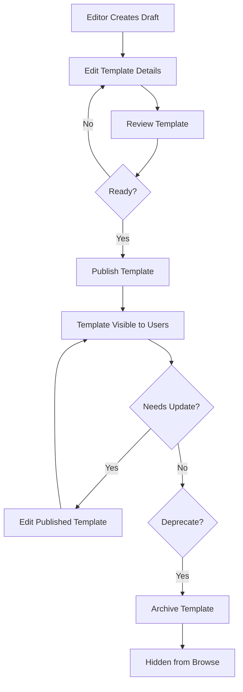
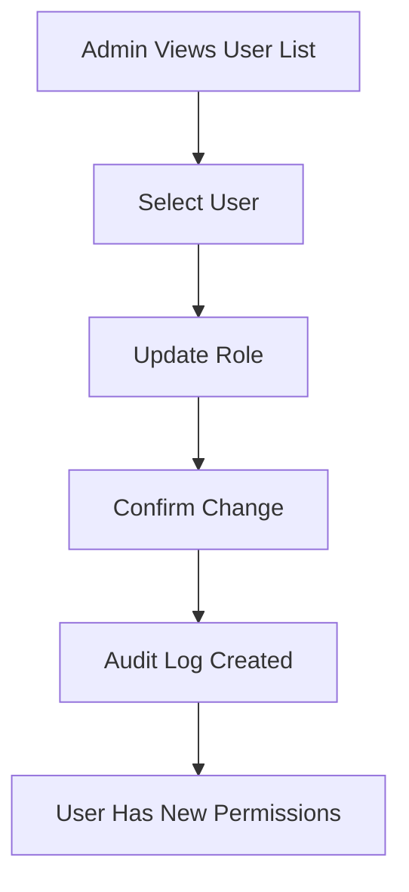
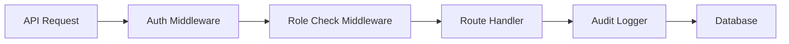

# Admin Dashboard

<!--
  This document follows the standard feature documentation template.
  Migrated from docs/technical/ADMIN.md on 2025-12-09
-->

---

## Metadata

| Property | Value |
|----------|-------|
| **Feature Status** | Backend ✅ Complete, Frontend 🚧 In Progress |
| **Last Updated** | 2025-12-10 |
| **Related Features** | [Authentication](./authentication.md), [AI Story Generation](./ai-story-generation.md), [Story Experience](./story-experience.md), [Text-to-Speech](./text-to-speech.md) |
| **Primary Maintainer** | Core Team |
| **API Stability** | Backend Stable, Frontend Beta |

<!-- UPDATE TRIGGER: Update Last Updated date whenever ANY section changes -->
<!-- UPDATE TRIGGER: Update Feature Status when frontend is complete -->
<!-- UPDATE TRIGGER: Update Related Features when cross-feature dependencies change -->

---

## Overview

### Purpose

The admin dashboard provides role-based access control for managing the Choose the Heat platform, including template management, user administration, and system monitoring.

### Key Capabilities

- **Role-Based Access Control**: Three-tier permission system (User, Editor, Admin)
- **Template Management**: Create, edit, publish, archive, and delete novel templates
- **User Management**: Admin-only user administration with role assignment
- **API Key Management**: Secure encrypted storage and management of AI provider API keys (Admin only)
- **Audit Logging**: Comprehensive tracking of all admin and editor actions
- **Dashboard Statistics**: Role-specific system metrics and insights
- **Test Interface**: Admin testing page for AI text generation and TTS audio

<!-- UPDATE TRIGGER: Update when new major capabilities are added or removed -->

### Use Cases

1. **Template Lifecycle Management**
   - Editor creates draft template
   - Editor publishes template for users
   - Editor archives outdated template
   - Admin deletes unused template

2. **User Administration**
   - Admin promotes user to editor role
   - Admin updates user details
   - Admin views user activity in audit logs

3. **System Monitoring**
   - Admin reviews audit logs for security
   - Editor views template statistics
   - Admin monitors user growth metrics

4. **API Key Management**
   - Admin adds new AI provider API key
   - Admin tests existing API key for validity
   - Admin rotates expired API keys
   - Admin removes unused provider keys

<!-- UPDATE TRIGGER: Add new use cases when feature scope expands -->

---

## User Experience

### Entry Points

| Location | Access Method | User Role Required |
|----------|---------------|-------------------|
| Admin Dashboard | `/admin` route (to be implemented) | Editor, Admin |
| Template Management | `/admin/templates` (to be implemented) | Editor, Admin |
| User Management | `/admin/users` (to be implemented) | Admin |
| API Key Management | [/admin/settings](../../src/routes/admin/settings/index.tsx) (API Keys tab) | Admin |
| Test Page | [/admin/test](../../src/routes/admin/test.tsx) | Admin |
| Audit Logs | `/admin/audit` (to be implemented) | Admin |

<!-- UPDATE TRIGGER: Update when new UI access points are added -->

### User Interface

#### Primary Components

**Note**: Frontend is currently in progress. Components listed below are planned/partial implementations.

1. **Admin Dashboard Page** (Planned)
   - Purpose: Display role-specific statistics and quick actions
   - User actions: View metrics, navigate to management pages
   - Visual location: `/admin` route

2. **Template Management Interface** (Planned)
   - Purpose: Browse, create, edit, and manage novel templates
   - User actions: CRUD operations on templates, status changes
   - Visual location: `/admin/templates`

3. **User Management Interface** (Planned)
   - Purpose: Admin-only user list and management
   - User actions: View users, edit details, assign roles, delete users
   - Visual location: `/admin/users`

4. **API Key Management Interface** ([src/routes/admin/settings/index.tsx](../../src/routes/admin/settings/index.tsx))
   - Purpose: Secure management of AI provider API keys
   - User actions: Add/edit keys, test validation, view status, delete keys
   - Visual location: `/admin/settings` (API Keys tab)
   - Features: Encrypted storage, automatic validation, status indicators

5. **Test Page** ([src/routes/admin/test.tsx](../../src/routes/admin/test.tsx))
   - Purpose: Test AI text generation and TTS audio generation
   - User actions: Select providers, generate text/audio, play audio
   - Visual location: `/admin/test`

6. **Audit Log Viewer** (Planned)
   - Purpose: View system audit logs with filtering
   - User actions: Filter by entity type, user, action
   - Visual location: `/admin/audit`

<!-- UPDATE TRIGGER: Update when UI components are added, removed, or significantly refactored -->

#### User Flows

**Template Publishing Flow**:



**User Role Assignment Flow**:



<!-- UPDATE TRIGGER: Update when user flows change or new flows are added -->

### User Feedback

- **Loading States**: Loading indicators during API operations
- **Success States**: Toast notifications for successful actions (template published, user updated, etc.)
- **Error States**: Error messages for failed operations with specific details
- **Empty States**: "No templates" or "No users" messages with create/invite actions
- **Confirmation Dialogs**: Confirmation prompts for destructive actions (delete user, delete template)

<!-- UPDATE TRIGGER: Update when feedback mechanisms change -->

---

## Technical Implementation

### Architecture Overview

The admin system uses role-based middleware to protect API routes and audit logging to track all administrative actions.

**Role Hierarchy**: `User → Editor → Admin`



<!-- UPDATE TRIGGER: Update when architectural changes occur -->

### Core Components

#### Frontend Components

| Component | Path | Responsibility |
|-----------|------|----------------|
| Admin Settings Page | [src/routes/admin/settings/index.tsx](../../src/routes/admin/settings/index.tsx) | Admin settings with API Keys tab |
| Admin Test Page | [src/routes/admin/test.tsx](../../src/routes/admin/test.tsx) | AI and TTS testing interface |
| Admin Layout | TBD | Admin panel layout wrapper |
| Template List | TBD | Template management UI |
| User List | TBD | User management UI |
| Audit Log Viewer | TBD | Audit log display |

<!-- UPDATE TRIGGER: Update when components are added, removed, moved, or renamed -->

#### Backend/API Routes

| Route | Method | Path | Purpose |
|-------|--------|------|---------|
| List Templates | GET | [src/routes/api/admin/templates/index.ts](../../src/routes/api/admin/templates/index.ts) | Get all templates (Editor+) |
| Create Template | POST | [src/routes/api/admin/templates/index.ts](../../src/routes/api/admin/templates/index.ts) | Create template (Editor+) |
| Get Template | GET | [src/routes/api/admin/templates/$id.ts](../../src/routes/api/admin/templates/$id.ts) | Get single template (Editor+) |
| Update Template | PATCH | [src/routes/api/admin/templates/$id.ts](../../src/routes/api/admin/templates/$id.ts) | Update template (Editor+) |
| Delete Template | DELETE | [src/routes/api/admin/templates/$id.ts](../../src/routes/api/admin/templates/$id.ts) | Delete template (Admin only) |
| Update Template Status | PATCH | [src/routes/api/admin/templates/$id/status.ts](../../src/routes/api/admin/templates/$id/status.ts) | Change status (Editor+) |
| List Users | GET | [src/routes/api/admin/users/index.ts](../../src/routes/api/admin/users/index.ts) | Get all users (Admin only) |
| Get User | GET | [src/routes/api/admin/users/$id.ts](../../src/routes/api/admin/users/$id.ts) | Get single user (Admin only) |
| Update User | PATCH | [src/routes/api/admin/users/$id.ts](../../src/routes/api/admin/users/$id.ts) | Update user (Admin only) |
| Delete User | DELETE | [src/routes/api/admin/users/$id.ts](../../src/routes/api/admin/users/$id.ts) | Delete user (Admin only) |
| List API Keys | GET | [src/routes/api/admin/api-keys/index.ts](../../src/routes/api/admin/api-keys/index.ts) | Get all API keys metadata (Admin only) |
| Update API Key | PUT | [src/routes/api/admin/api-keys/$provider.ts](../../src/routes/api/admin/api-keys/$provider.ts) | Update/create key with validation (Admin only) |
| Delete API Key | DELETE | [src/routes/api/admin/api-keys/$provider.ts](../../src/routes/api/admin/api-keys/$provider.ts) | Delete API key (Admin only) |
| Dashboard Stats | GET | [src/routes/api/admin/dashboard.ts](../../src/routes/api/admin/dashboard.ts) | Get statistics (Editor+) |
| Audit Logs | GET | [src/routes/api/admin/audit-logs.ts](../../src/routes/api/admin/audit-logs.ts) | Get audit logs (Admin only) |

<!-- UPDATE TRIGGER: Update when API routes are added, removed, or significantly changed -->

#### Database Schema

**users Table (Role field)**:

```typescript
{
  id: uuid (primary key)
  email: varchar(255) unique
  name: varchar(255)
  role: varchar(20)                   // 'user' | 'editor' | 'admin'
  // ... other user fields
}
```

**novel_templates Table**:

```typescript
{
  id: uuid (primary key)
  title: varchar(255)
  description: text
  base_tropes: jsonb
  estimated_scenes: integer
  cover_gradient: varchar(255)
  status: varchar(20)                 // 'draft' | 'published' | 'archived'
  created_by: uuid (foreign key → users)
  archived_at: timestamp (nullable)
  archived_by: uuid (foreign key → users, nullable)
  created_at: timestamp
  updated_at: timestamp
}
```

**admin_audit_logs Table**:

```typescript
{
  id: uuid (primary key)
  user_id: uuid (foreign key → users)
  action: varchar(50)                 // e.g., 'create_template', 'update_user_role'
  entity_type: varchar(50)            // 'template' | 'user'
  entity_id: uuid (nullable)
  changes: jsonb (nullable)           // Stores old/new values
  created_at: timestamp

  // Indexes:
  // - (user_id, created_at)
  // - (entity_type, entity_id, created_at)
  // - (created_at) for cleanup queries
}
```

**api_keys Table**:

```typescript
{
  id: uuid (primary key)
  provider: varchar(50) unique        // 'openai' | 'google' | 'anthropic' | 'mistral' | 'xai' | 'openrouter' | 'google_tts'
  encrypted_key: text                 // AES-256-GCM encrypted API key
  iv: varchar(32)                     // Initialization vector for decryption
  encryption_version: integer         // Version for future key rotation (default: 1)
  last_tested_at: timestamp (nullable)
  test_status: varchar(20)            // 'valid' | 'invalid' | 'untested'
  test_error: text (nullable)
  created_at: timestamp
  updated_at: timestamp
  created_by: uuid (foreign key → users, nullable)
  updated_by: uuid (foreign key → users, nullable)

  // Indexes:
  // - provider (unique)
}
```

<!-- UPDATE TRIGGER: Update when database schema changes affect this feature -->

**Key Query Functions:**

- Database queries handled inline in API routes
- Audit logging in [src/lib/audit.ts](../../src/lib/audit.ts) (if exists) or inline

<!-- UPDATE TRIGGER: Update when new database query files are created or moved -->

### State Management

**Client State:**

- **React Query** for admin data with appropriate stale times
- **Local state** for UI interactions (filters, modal state, etc.)
- **Hooks**: Admin-specific hooks to be created as frontend develops

**Server State:**

- **Database** for all admin data persistence
- **Session** for authentication and role verification
- **In-memory** for role middleware checks

<!-- UPDATE TRIGGER: Update when state management approach changes or new hooks are added -->

### Data Flow

**Template Management Flow**:

```
1. Editor clicks "Create Template"
2. POST /api/admin/templates with template data
3. Middleware verifies editor or admin role
4. Insert template into novel_templates table
5. Create audit log entry (action: 'create_template')
6. Return template with generated ID
7. UI updates with new template
```

**Role Assignment Flow**:

```
1. Admin updates user role
2. PATCH /api/admin/users/:id with new role
3. Middleware verifies admin role
4. Update users table
5. Create audit log entry (action: 'update_user_role', changes: {old, new})
6. Return updated user
7. UI reflects new role
```

<!-- UPDATE TRIGGER: Update when data flow changes significantly -->

### External Dependencies

| Dependency | Purpose | Configuration Location |
|------------|---------|----------------------|
| None | Admin features use core framework only | N/A |

<!-- UPDATE TRIGGER: Update when external dependencies are added or removed -->

---

## API Reference

### Public APIs

#### GET /api/admin/templates

**Status**: ✅ Active in Production

**Purpose**: List all templates (includes draft and archived for editors/admins)

**Authorization**: Editor or Admin role required

**Query Parameters**:

- `status` (optional): Filter by status ("draft" | "published" | "archived")
- `limit` (optional): Results per page (default: 50)
- `offset` (optional): Pagination offset (default: 0)

**Response**:

```typescript
{
  templates: Array<{
    id: string;
    title: string;
    description: string;
    baseTropes: string[];
    estimatedScenes: number;
    coverGradient: string;
    status: "draft" | "published" | "archived";
    createdBy: string;
    archivedAt: string | null;
    archivedBy: string | null;
    createdAt: string;
    updatedAt: string;
  }>;
  pagination: {
    total: number;
    limit: number;
    offset: number;
    hasMore: boolean;
  };
}
```

**Error Codes**:

- `401`: User not authenticated
- `403`: User is not editor or admin
- `500`: Database error

<!-- UPDATE TRIGGER: Update when API signatures change -->

#### POST /api/admin/templates

**Status**: ✅ Active in Production

**Purpose**: Create new template

**Authorization**: Editor or Admin role required

**Request Body**:

```typescript
{
  title: string;
  description: string;
  baseTropes: string[];
  estimatedScenes: number;
  coverGradient: string;
  status: "draft" | "published";  // Default: "draft"
}
```

**Response**:

```typescript
{
  id: string;
  title: string;
  description: string;
  baseTropes: string[];
  estimatedScenes: number;
  coverGradient: string;
  status: "draft";
  createdBy: string;
  createdAt: string;
  updatedAt: string;
}
```

**Error Codes**:

- `400`: Invalid request body
- `401`: User not authenticated
- `403`: User is not editor or admin
- `500`: Database error

<!-- UPDATE TRIGGER: Update when API signatures change -->

#### PATCH /api/admin/templates/:id/status

**Status**: ✅ Active in Production

**Purpose**: Update template status (draft/published/archived)

**Authorization**: Editor or Admin role required

**Request Body**:

```typescript
{
  status: "draft" | "published" | "archived";
}
```

**Response**:

```typescript
{
  id: string;
  status: "published";
  archivedAt: string | null;
  archivedBy: string | null;
  updatedAt: string;
}
```

**Notes**:

- Archiving sets `archivedAt` and `archivedBy`
- Unarchiving (draft/published) clears `archivedAt` and `archivedBy`
- Audit log created for status changes

**Error Codes**:

- `400`: Invalid status value
- `401`: User not authenticated
- `403`: User is not editor or admin
- `404`: Template not found
- `500`: Database error

<!-- UPDATE TRIGGER: Update when API signatures change -->

#### DELETE /api/admin/templates/:id

**Status**: ✅ Active in Production

**Purpose**: Permanently delete template (Admin only)

**Authorization**: Admin role required

**Response**:

```typescript
{ success: true }
```

**Error Codes**:

- `401`: User not authenticated
- `403`: User is not admin
- `404`: Template not found
- `409`: Template has associated user stories (cannot delete)
- `500`: Database error

<!-- UPDATE TRIGGER: Update when API signatures change -->

#### GET /api/admin/users

**Status**: ✅ Active in Production

**Purpose**: List all users (Admin only)

**Authorization**: Admin role required

**Query Parameters**:

- `role` (optional): Filter by role ("user" | "editor" | "admin")
- `search` (optional): Search by email or name
- `limit` (optional): Results per page (default: 50)
- `offset` (optional): Pagination offset (default: 0)

**Response**:

```typescript
{
  users: Array<{
    id: string;
    email: string;
    name: string;
    role: "user" | "editor" | "admin";
    createdAt: string;
    // ... other user fields
  }>;
  pagination: {
    total: number;
    limit: number;
    offset: number;
    hasMore: boolean;
  };
}
```

**Error Codes**:

- `401`: User not authenticated
- `403`: User is not admin
- `500`: Database error

<!-- UPDATE TRIGGER: Update when API signatures change -->

#### PATCH /api/admin/users/:id

**Status**: ✅ Active in Production

**Purpose**: Update user details and/or role (Admin only)

**Authorization**: Admin role required

**Request Body**:

```typescript
{
  email?: string;
  name?: string;
  role?: "user" | "editor" | "admin";
}
```

**Response**:

```typescript
{
  id: string;
  email: string;
  name: string;
  role: "editor";
  updatedAt: string;
}
```

**Validations**:

- Email must be unique
- Role must be valid enum value
- Audit log created if role changed

**Error Codes**:

- `400`: Invalid request body or duplicate email
- `401`: User not authenticated
- `403`: User is not admin
- `404`: User not found
- `500`: Database error

<!-- UPDATE TRIGGER: Update when API signatures change -->

#### DELETE /api/admin/users/:id

**Status**: ✅ Active in Production

**Purpose**: Permanently delete user and all their data (Admin only)

**Authorization**: Admin role required

**Response**:

```typescript
{ success: true }
```

**Notes**:

- Deletes all user data (stories, scenes, choices)
- Admins cannot delete their own account
- Cascade deletion handled by database foreign keys

**Error Codes**:

- `400`: Cannot delete own account
- `401`: User not authenticated
- `403`: User is not admin
- `404`: User not found
- `500`: Database error

<!-- UPDATE TRIGGER: Update when API signatures change -->

#### GET /api/admin/dashboard

**Status**: ✅ Active in Production

**Purpose**: Get role-specific dashboard statistics

**Authorization**: Editor or Admin role required

**Response for Editors**:

```typescript
{
  stats: {
    templates: {
      total: number;
      draft: number;
      published: number;
      archived: number;
    };
  };
}
```

**Response for Admins**:

```typescript
{
  stats: {
    templates: {
      total: number;
      draft: number;
      published: number;
      archived: number;
    };
    users: {
      total: number;
      user: number;
      editor: number;
      admin: number;
    };
  };
}
```

**Error Codes**:

- `401`: User not authenticated
- `403`: User is not editor or admin
- `500`: Database error

<!-- UPDATE TRIGGER: Update when API signatures change -->

#### GET /api/admin/audit-logs

**Status**: ✅ Active in Production

**Purpose**: Get audit logs with filtering (Admin only)

**Authorization**: Admin role required

**Query Parameters**:

- `entityType` (optional): Filter by entity type ("template" | "user")
- `entityId` (optional): Filter by specific entity ID
- `userId` (optional): Filter by user who performed action
- `action` (optional): Filter by specific action
- `limit` (optional): Results per page (default: 50)
- `offset` (optional): Pagination offset (default: 0)

**Response**:

```typescript
{
  logs: Array<{
    id: string;
    userId: string;
    userEmail: string;
    userName: string;
    action: string;
    entityType: string;
    entityId: string | null;
    changes: {
      [field: string]: {
        old: any;
        new: any;
      };
    } | null;
    createdAt: string;
  }>;
  pagination: {
    total: number;
    limit: number;
    offset: number;
    hasMore: boolean;
  };
}
```

**Logged Actions**:

**Templates**: `create_template`, `update_template`, `published_template`, `archived_template`, `draft_template`, `delete_template`

**Users**: `update_user`, `update_user_role`, `delete_user`

**API Keys**: `api_key_updated`, `api_key_deleted`

**Error Codes**:

- `401`: User not authenticated
- `403`: User is not admin
- `500`: Database error

<!-- UPDATE TRIGGER: Update when API signatures change -->

#### GET /api/admin/api-keys

**Status**: ✅ Active in Production

**Purpose**: List all API keys metadata (Admin only)

**Authorization**: Admin role required

**Response**:

```typescript
{
  keys: Array<{
    id: string;
    provider: "openai" | "google" | "anthropic" | "mistral" | "xai" | "openrouter" | "google_tts";
    encryptedKey: string;          // Always "******" or empty (never exposed)
    testStatus: "valid" | "invalid" | "untested" | null;
    testError: string | null;
    lastTestedAt: string | null;
    updatedAt: string;
  }>;
}
```

**Error Codes**:

- `401`: User not authenticated
- `403`: User is not admin
- `500`: Database error

<!-- UPDATE TRIGGER: Update when API signatures change -->

#### PUT /api/admin/api-keys/:provider

**Status**: ✅ Active in Production

**Purpose**: Update/create API key for a specific provider (Admin only)

**Authorization**: Admin role required

**URL Parameters**:

- `provider`: AI provider identifier ("openai" | "google" | "anthropic" | "mistral" | "xai" | "openrouter" | "google_tts")

**Request Body**:

```typescript
{
  apiKey: string;  // Provider API key (will be encrypted)
}
```

**Validation Process**:

1. Trims whitespace from API key
2. Validates key with provider API (makes test call)
3. If valid: Encrypts with AES-256-GCM and stores
4. If invalid: Returns error without storing
5. Creates audit log entry

**Response**:

```typescript
{
  success: true
}
```

**Error Codes**:

- `400`: Invalid request body or API key failed validation
- `401`: User not authenticated
- `403`: User is not admin
- `500`: Database or encryption error

**Example Validation Errors**:

```json
{
  "error": "Invalid API key - authentication failed"
}
```

<!-- UPDATE TRIGGER: Update when API signatures change -->

#### DELETE /api/admin/api-keys/:provider

**Status**: ✅ Active in Production

**Purpose**: Delete API key for a specific provider (Admin only)

**Authorization**: Admin role required

**URL Parameters**:

- `provider`: AI provider identifier

**Response**:

```typescript
{
  success: true
}
```

**Notes**:

- Sets `encrypted_key` and `iv` to empty strings (soft delete)
- Creates audit log entry
- Cannot be undone (key must be re-entered)

**Error Codes**:

- `400`: Invalid provider
- `401`: User not authenticated
- `403`: User is not admin
- `404`: API key not found
- `500`: Database error

<!-- UPDATE TRIGGER: Update when API signatures change -->

---

## Code Locations

### Directory Structure

```
src/
├── routes/
│   ├── admin/
│   │   └── test.tsx                  # Admin testing interface
│   └── api/
│       └── admin/
│           ├── templates/
│           │   ├── index.ts          # List/create templates
│           │   ├── $id.ts            # Get/update/delete template
│           │   └── $id/
│           │       └── status.ts     # Update template status
│           ├── users/
│           │   ├── index.ts          # List users
│           │   └── $id.ts            # Get/update/delete user
│           ├── dashboard.ts          # Dashboard statistics
│           └── audit-logs.ts         # Audit log viewer
└── lib/
    └── audit.ts (optional)           # Audit logging utilities
```

<!-- UPDATE TRIGGER: Update when files are added, removed, moved, or renamed within the feature -->

### Key Files

| File | Purpose | Lines of Code |
|------|---------|---------------|
| [src/routes/api/admin/templates/index.ts](../../src/routes/api/admin/templates/index.ts) | Template list and creation | ~150 |
| [src/routes/api/admin/templates/$id.ts](../../src/routes/api/admin/templates/$id.ts) | Template CRUD operations | ~200 |
| [src/routes/api/admin/users/$id.ts](../../src/routes/api/admin/users/$id.ts) | User management | ~150 |
| [src/routes/api/admin/audit-logs.ts](../../src/routes/api/admin/audit-logs.ts) | Audit log queries | ~100 |
| [src/routes/admin/test.tsx](../../src/routes/admin/test.tsx) | Admin testing interface | ~400 |

<!-- UPDATE TRIGGER: Update when significant files are added or removed -->

---

## Configuration

### Environment Variables

```bash
# Admin User Setup (for database seed)
ADMIN_EMAIL=admin@example.com         # Email for initial admin account
ADMIN_PASSWORD=your-secure-password   # Password for initial admin account
ADMIN_NAME=Admin User                 # Display name for admin

# API Key Management (required for encrypted storage)
ENCRYPTION_KEY=<base64-encoded-32-byte-key>  # Generate with: node -e "console.log(require('crypto').randomBytes(32).toString('base64'))"
```

**Important**:

- Change admin password immediately after first login!
- Keep `ENCRYPTION_KEY` secure and never commit to version control
- If `ENCRYPTION_KEY` is lost, all stored API keys must be re-entered
- Use the same `ENCRYPTION_KEY` across all environments for the same database

<!-- UPDATE TRIGGER: Update when new environment variables are added or removed -->

### Application Settings

**Role Configuration**: Roles are defined in code, not configurable

```typescript
enum UserRole {
  USER = 'user',
  EDITOR = 'editor',
  ADMIN = 'admin'
}
```

**Audit Log Retention**: 90 days (3 months) by default

```bash
# Cleanup script (manual or cron)
pnpm cleanup:audit-logs          # Default 90 days
pnpm cleanup:audit-logs 30       # Custom retention (30 days)
```

<!-- UPDATE TRIGGER: Update when configuration options change -->

---

## Related Features

### Dependencies

- **[Authentication](./authentication.md)**: Requires user session and role verification
- **[AI Story Generation](./ai-story-generation.md)**: Templates used for story generation

### Dependents

- **[Text-to-Speech](./text-to-speech.md)**: Admin test page provides TTS testing interface
- **[Story Experience](./story-experience.md)**: Templates browsed and used for story creation

<!-- UPDATE TRIGGER: Update when feature dependencies change -->

---

## Testing

### Test Coverage

**Manual Testing**:

- Admin test page at `/admin/test` for AI and TTS testing
- API endpoints tested via curl or Postman

**Testing Checklist**:

- [ ] Create admin user via seed script
- [ ] Verify editor can manage templates
- [ ] Verify editor cannot access user management
- [ ] Verify admin can assign roles
- [ ] Test template status workflow (draft → published → archived)
- [ ] Verify template deletion blocked if user stories exist
- [ ] Test user deletion cascades to user data
- [ ] Verify admins cannot delete their own account
- [ ] Check audit logs created for all actions
- [ ] Test audit log filtering and pagination
- [ ] Verify cleanup script removes old audit logs

**Unit Tests**: To be added as frontend develops

<!-- UPDATE TRIGGER: Update when test files are added or test coverage changes -->

### Manual Testing Checklist

- [ ] **Role Assignment**: Promote user to editor, verify permissions
- [ ] **Template Lifecycle**: Create draft, publish, archive, attempt delete
- [ ] **User Management**: Update user details, change role, delete user
- [ ] **Audit Logs**: Create actions, filter logs, verify accuracy
- [ ] **Security**: Attempt unauthorized access, verify 403 errors
- [ ] **Admin Test Page**: Test AI generation and TTS with different providers

<!-- UPDATE TRIGGER: Update when new test scenarios are identified -->

---

## Performance Considerations

### Optimization Strategies

- **Database Indexes**: Indexes on `admin_audit_logs` for common queries (user_id, entity_type/id, created_at)
- **Pagination**: All list endpoints support limit/offset pagination
- **Role Caching**: Role checked from session (no extra DB query per request)
- **Audit Log Cleanup**: Scheduled cleanup prevents table growth

### Known Limitations

- **Audit Log Growth**: Large tables if retention period is too long
- **No Bulk Operations**: Templates and users managed one at a time
- **Sequential Queries**: Some operations require multiple sequential queries

<!-- UPDATE TRIGGER: Update when performance optimizations are added or limitations are discovered -->

---

## Future Enhancements

### Planned Features

- [ ] **Advanced Analytics and Reporting**
  - Template usage statistics
  - User engagement metrics
  - Export reports

- [ ] **Email Notifications**
  - Notify admins of important actions
  - Alert on suspicious activities

- [ ] **Two-Factor Authentication**
  - Optional 2FA for admin accounts
  - Enhanced security for administrative access

- [ ] **Mobile-Responsive Admin UI**
  - Responsive design for admin panel
  - Mobile-friendly table views

- [ ] **Template Preview**
  - Preview template before publishing
  - Test template generation

- [ ] **Advanced Search and Filtering**
  - Full-text search for templates and users
  - Advanced filtering options

- [ ] **Bulk Operations**
  - Bulk import/export templates
  - Bulk user operations

- [ ] **Alert System**
  - Automated alerts for suspicious activities
  - Configurable alert thresholds

### Potential Improvements

- Add rate limiting for admin endpoints
- Implement audit log export functionality
- Add template versioning
- Create admin activity dashboard
- Add template usage analytics

<!-- UPDATE TRIGGER: Update when roadmap changes or enhancements are completed -->

---

## Troubleshooting

### Common Issues

#### Issue: Cannot Access Admin Panel

**Symptoms:**

- 403 Forbidden when accessing admin routes
- User logged in but cannot access admin features

**Cause:**

- User role is not "editor" or "admin"
- Session expired or invalid

**Solution:**

1. Check user role in database:

   ```sql
   SELECT id, email, role FROM users WHERE email = 'your-email@example.com';
   ```

2. Verify session is valid (check session cookie exists and not expired)

3. If role is "user", have an admin promote you:

   ```bash
   # Via API
   curl -X PATCH http://localhost:3000/api/admin/users/{userId} \
     -H "Content-Type: application/json" \
     -d '{"role": "editor"}'
   ```

4. Or manually update database:

   ```sql
   UPDATE users SET role = 'editor' WHERE email = 'your-email@example.com';
   ```

#### Issue: Admin User Not Created During Seed

**Symptoms:**

- Seed script runs but admin user not in database
- No error messages

**Cause:**

- Environment variables not set
- Seed script error

**Solution:**

1. Verify environment variables:

   ```bash
   echo $ADMIN_EMAIL
   echo $ADMIN_PASSWORD
   echo $ADMIN_NAME
   ```

2. Check seed script output for errors

3. Manually create admin user:

   ```sql
   UPDATE users SET role = 'admin' WHERE email = 'your-email@example.com';
   ```

#### Issue: Cannot Delete Template

**Symptoms:**

- 409 Conflict error when deleting template
- Error message about user stories

**Cause:**

- Template has associated user stories
- Foreign key constraint prevents deletion

**Solution:**

- Archive template instead of deleting (recommended)
- Or delete all user stories first (not recommended, data loss)

#### Issue: Audit Logs Growing Too Large

**Symptoms:**

- Database size increasing rapidly
- Slow queries on admin_audit_logs table

**Cause:**

- Audit log retention period too long
- Cleanup script not running

**Solution:**

1. Run cleanup script more frequently:

   ```bash
   # Add to cron (daily at 2 AM)
   0 2 * * * cd /path/to/app && pnpm cleanup:audit-logs
   ```

2. Reduce retention period:

   ```bash
   pnpm cleanup:audit-logs 30  # 30 days instead of 90
   ```

3. Verify database indexes exist (should be from migration)

<!-- UPDATE TRIGGER: Update when new issues are discovered or solved -->

### Debug Mode

**Enable Debug Logging:**

```typescript
// Add to .env.development
DEBUG_ADMIN=true
```

**Console Output:**

- Look for `[Admin]` prefix in server logs
- Check Network tab for API request/response details

**Server Logs:**

```bash
# View admin-related logs
pnpm logs | grep Admin
```

<!-- UPDATE TRIGGER: Update when debugging capabilities change -->

---

## AI Agent Maintenance Guidelines

### When to Update This Document

1. **Role Changes** (Priority: HIGH)
   - New role added → Update role system documentation and permissions matrix
   - Permission matrix changed → Update permissions section
   - Role middleware modified → Update technical implementation

2. **Admin Feature Changes** (Priority: HIGH)
   - New admin page added → Update user experience section and entry points
   - New management API → Add to API Reference section
   - Admin capability added → Update key capabilities

3. **Audit System Changes** (Priority: MEDIUM)
   - Audit logging modified → Update technical implementation
   - New logged actions → Update API Reference audit logs section
   - Retention policy changed → Update configuration section

4. **API Changes** (Priority: HIGH)
   - New endpoint added → Add to API Reference section
   - Endpoint signature changed → Update request/response types
   - Error codes changed → Update error documentation

5. **Component Changes** (Priority: HIGH)
   - New component added → Update components table and directory structure
   - Component renamed/moved → Update all path references
   - Component deleted → Remove from components table

6. **Frontend Progress** (Priority: MEDIUM)
   - Frontend components completed → Update feature status and component descriptions
   - UI implemented → Update user experience section with screenshots/details

### Update Patterns

**Pattern 1: New Admin Feature Added**

```markdown
1. Add feature to "Key Capabilities"
2. Add UI entry point to "Entry Points" table
3. Add component to "Frontend Components" if UI exists
4. Add API route(s) to "Backend/API Routes" table
5. Add API documentation to "API Reference"
6. Update "Related Features" if dependencies exist
7. Update "Last Updated" in Metadata
```

**Pattern 2: Permission Matrix Changed**

```markdown
1. Update "Permissions Matrix" table
2. Update affected API endpoint authorizations in "API Reference"
3. Update role descriptions if needed
4. Add audit log entry if new logged action
5. Update "Last Updated" in Metadata
```

**Pattern 3: Frontend Component Completed**

```markdown
1. Change component status from "Planned" to active with screenshot/details
2. Update "Entry Points" with actual route
3. Update "User Flows" if workflow clarified
4. Update Feature Status in Metadata if major milestone
5. Update "Last Updated" in Metadata
```

### AI Agent Instructions

**When modifying code related to this feature:**

1. **Before making code changes:**
   - Review this documentation to understand admin architecture
   - Check "Code Locations" to find all related files
   - Review "API Reference" if modifying endpoints
   - Check "Permissions Matrix" for role requirements

2. **After making code changes:**
   - Update relevant sections based on "When to Update This Document"
   - Follow update patterns for consistency
   - Update "Last Updated" date in Metadata
   - If adding new file: Update "Directory Structure" and "Key Files"
   - If modifying API: Update "API Reference" with new signatures
   - If changing permissions: Update "Permissions Matrix"
   - If adding component: Update "Frontend Components" table

3. **Quality checks:**
   - Ensure all file paths are correct and use markdown links
   - Verify TypeScript interfaces in examples match actual code
   - Check that related features cross-references are bidirectional
   - Confirm mermaid diagrams render correctly (if modified)
   - Test that all internal links work

**Automation hooks (for future CI/CD integration):**

- Detect file additions in `src/routes/admin/`, `src/routes/api/admin/` → Prompt to update docs
- Detect API route changes in `src/routes/api/admin/` → Validate API Reference is updated
- Detect schema migrations affecting `admin_audit_logs` or `users.role` → Validate Database Schema section is current
- Detect changes to role middleware → Validate permissions matrix is updated

---

## Change Log

| Date | Change | Author |
|------|--------|--------|
| 2025-12-09 | Migrated from docs/technical/ADMIN.md to feature-centric structure | AI Assistant |
| 2025-01-14 | Original documentation last updated (pre-migration) | Development Team |

<!-- UPDATE TRIGGER: Add entry whenever significant changes are made to this document -->

---

## Security

### Best Practices

1. **Change Default Admin Password**
   - Update admin password immediately after first login
   - Use strong, unique passwords (minimum 12 characters, mixed case, numbers, symbols)

2. **Limit Admin Accounts**
   - Only create admin accounts when absolutely necessary
   - Prefer editor role for template management
   - Regularly review admin account list

3. **Regular Audit Reviews**
   - Review audit logs weekly for suspicious activity
   - Monitor role changes and user deletions
   - Set up alerts for sensitive operations

4. **Environment Variables**
   - Never commit `.env` file to version control
   - Use different credentials for production
   - Rotate admin passwords regularly

5. **API Key Security**
   - All API keys encrypted at rest using AES-256-GCM
   - Encryption key stored separately in `ENCRYPTION_KEY` environment variable
   - Back up encryption key in secure password manager
   - Rotate API keys regularly through admin interface
   - Never log or expose API keys in plaintext

6. **HTTPS in Production**
   - Always use HTTPS in production
   - Session cookies have `Secure` flag enabled
   - Use HSTS headers

### Role Assignment Guidelines

- **User**: Default role for all new registrations
- **Editor**: For trusted users who manage content (templates)
- **Admin**: For platform administrators only (full access)

### Security Protections

**Self-Deletion Protection:**

- Admins cannot delete their own account
- Prevents accidental lockout

**Email Uniqueness:**

- Email addresses must be unique
- Prevents duplicate accounts

**Cascade Deletion:**

- Deleting a user removes all their data
- Templates with user stories cannot be deleted (prevents data loss)

**Session Security:**

- Sessions expire after 30 days of inactivity
- Secure and HttpOnly flags on session cookies
- CSRF protection (if implemented)

**API Key Encryption:**

- AES-256-GCM authenticated encryption for all API keys at rest
- Unique initialization vector (IV) per encryption operation
- 16-byte authentication tag prevents tampering
- Keys never exposed in API responses (always masked as "******")
- Keys never logged in plaintext
- Automatic validation before storage
- Admin-only access to all key operations

---

## Maintenance

### Cleaning Up Audit Logs

Audit logs are retained for **90 days (3 months)** by default.

**Manual Cleanup:**

```bash
# Use default 90-day retention
pnpm cleanup:audit-logs

# Custom retention (e.g., 30 days)
pnpm cleanup:audit-logs 30
```

**Automated Cleanup (Recommended):**

Add a cron job to run the cleanup script daily:

```bash
# Run daily at 2 AM
0 2 * * * cd /path/to/choose-the-heat && pnpm cleanup:audit-logs
```

**Docker:**

```bash
# Add to docker-compose.yml or run manually
docker exec choose-the-heat-app pnpm cleanup:audit-logs
```

### Database Migrations

When deploying updates:

```bash
pnpm db:migrate     # Run migrations
pnpm db:codegen     # Regenerate types
```

---

## Related Documentation

- [Authentication](./authentication.md) - User authentication and session management
- [AI Story Generation](./ai-story-generation.md) - Template usage for story generation
- [Text-to-Speech](./text-to-speech.md) - Admin test page TTS integration
- [Implementation Progress](../development/PROGRESS.md) - Full project progress including admin features
