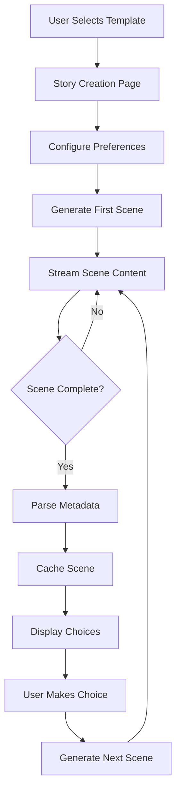
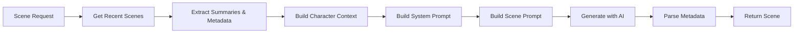
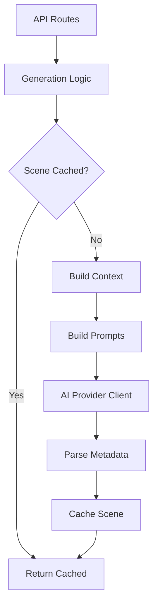

# AI Story Generation

<!--
  This document follows the standard feature documentation template.
  Created on 2025-12-09, incorporating content from docs/technical/SCENE_METADATA.md
-->

---

## Metadata

| Property | Value |
|----------|-------|
| **Feature Status** | ✅ Production Ready |
| **Last Updated** | 2025-12-24 |
| **Related Features** | [Authentication](./authentication.md), [Personalization](./personalization.md), [Story Experience](./story-experience.md), [Text-to-Speech](./text-to-speech.md), [Admin Dashboard](./admin-dashboard.md) |
| **Primary Maintainer** | Core Team |
| **API Stability** | Stable |

<!-- UPDATE TRIGGER: Update Last Updated date whenever ANY section changes -->
<!-- UPDATE TRIGGER: Update Feature Status when production state changes -->
<!-- UPDATE TRIGGER: Update Related Features when cross-feature dependencies change -->

---

## Overview

### Purpose

The AI Story Generation system powers the core narrative experience by generating dynamic, personalized romance stories using large language models. The system supports multiple AI providers, maintains story continuity through metadata, and adapts to user preferences.

### Key Capabilities

- **Multi-Provider Support**: OpenAI, Google Gemini, Anthropic Claude, Mistral, xAI, OpenRouter
- **Admin Provider Management**: Unified UI for provider configuration, activation, and status monitoring
- **Provider Status System**: Real-time status tracking (ready, incomplete, invalid, unconfigured)
- **Secure API Key Storage**: AES-256 encrypted API key storage with validation
- **Template-Based Generation**: Trope-based and prompt-based story templates
- **Scene Generation**: Contextually-aware scene generation with metadata
- **Scene Metadata System**: Tracks emotional beats, tension threads, relationship progress, characters, POV, and setting
- **Streaming Generation**: Real-time scene generation with client-side streaming
- **Context Management**: Efficient context using summaries (97% token reduction)
- **Caching Strategy**: Scene-level caching for performance and cost savings
- **Provider Configuration**: Per-story AI settings lock (provider, model, temperature)
- **User Preferences Integration**: Spice level, pacing, scene length, POV gender

<!-- UPDATE TRIGGER: Update when new major capabilities are added or removed -->

### Use Cases

1. **New Story Creation**
   - User selects template from browse page
   - System generates first scene with user preferences
   - AI settings locked to story for consistency

2. **Continuing a Story**
   - User makes choice at scene end
   - System generates next scene using recent context
   - Metadata maintains continuity (characters, setting, emotional progress)

3. **Template Creation** (Editor/Admin)
   - Editor creates trope-based template
   - System can generate prompt-based templates on demand
   - Templates define base tropes and estimated scene count

<!-- UPDATE TRIGGER: Add new use cases when feature scope expands -->

---

## User Experience

### Entry Points

| Location | Access Method | User Role Required |
|----------|---------------|-------------------|
| Browse Page | Select template | User |
| Story Creation | `/story/create` route | User |
| Reading Page | Continue story / Make choice | User |
| Admin Test Page | `/admin/test` | Admin |
| **Provider Management** | **`/admin/providers`** | **Admin** |

<!-- UPDATE TRIGGER: Update when new UI access points are added -->

### User Interface

#### Primary Components

1. **Template Browse** ([src/routes/browse.tsx](../../src/routes/browse.tsx))
   - Purpose: Display available story templates
   - User actions: Select template to start story
   - Visual location: `/browse` route

2. **Story Creation** ([src/routes/story/create.tsx](../../src/routes/story/create.tsx))
   - Purpose: Capture user preferences and generate first scene
   - User actions: Configure preferences, start generation
   - Visual location: `/story/create` route

3. **Reading Page with Streaming** ([src/routes/story/$id/read.tsx](../../src/routes/story/$id/read.tsx))
   - Purpose: Display generated scenes in real-time
   - User actions: Read scene, make choices, continue story
   - Visual location: `/story/:id/read` route

4. **Admin Test Page** ([src/routes/admin/test.tsx](../../src/routes/admin/test.tsx))
   - Purpose: Test AI providers and models
   - User actions: Select provider/model, generate test text
   - Visual location: `/admin/test`

5. **Provider Management** ([src/routes/admin/providers/index.tsx](../../src/routes/admin/providers/index.tsx))
   - Purpose: Configure and manage AI providers
   - User actions: Configure API keys, activate providers, view status
   - Visual location: `/admin/providers`
   - Components:
     - [AIProviderManagement](../../src/components/admin/AIProviderManagement.tsx) - Main management UI
     - [ProviderCard](../../src/components/admin/ProviderCard.tsx) - Individual provider display
     - [ProviderConfigModal](../../src/components/admin/ProviderConfigModal.tsx) - API key configuration

<!-- UPDATE TRIGGER: Update when UI components are added, removed, or significantly refactored -->

#### User Flows

**Story Generation Flow**:



**Context Building for Scene Generation**:



<!-- UPDATE TRIGGER: Update when user flows change or new flows are added -->

### User Feedback

- **Loading States**: "Generating scene..." with streaming text appearing in real-time
- **Success States**: Scene completes, choices appear at bottom
- **Error States**: "Failed to generate scene" with retry option
- **Empty States**: "No templates available" on browse page
- **Progress Indicators**: Real-time text streaming shows generation progress

<!-- UPDATE TRIGGER: Update when feedback mechanisms change -->

---

## Technical Implementation

### Architecture Overview

The AI generation system follows a layered architecture with provider abstraction, intelligent caching, and metadata-driven context management.

**Layers**:

1. **API Layer**: Express routes handle scene generation requests
2. **Generation Layer**: Core generation logic with caching
3. **Provider Layer**: Abstraction over multiple AI providers
4. **Prompt Layer**: System and user prompt construction
5. **Metadata Layer**: Scene metadata parsing and storage
6. **Database Layer**: Scene caching and metadata persistence



<!-- UPDATE TRIGGER: Update when architectural changes occur -->

### Core Components

#### Frontend Components

| Component | Path | Responsibility |
|-----------|------|----------------|
| Browse Page | [src/routes/browse.tsx](../../src/routes/browse.tsx) | Template selection |
| Story Creation | [src/routes/story/create.tsx](../../src/routes/story/create.tsx) | Story initialization |
| Reading Page | [src/routes/story/$id/read.tsx](../../src/routes/story/$id/read.tsx) | Scene display with streaming |
| Admin Test | [src/routes/admin/test.tsx](../../src/routes/admin/test.tsx) | AI provider testing |
| **Provider Management** | **[src/routes/admin/providers/index.tsx](../../src/routes/admin/providers/index.tsx)** | **Provider configuration UI** |
| **Provider Card** | **[src/components/admin/ProviderCard.tsx](../../src/components/admin/ProviderCard.tsx)** | **Individual provider display** |
| **Config Modal** | **[src/components/admin/ProviderConfigModal.tsx](../../src/components/admin/ProviderConfigModal.tsx)** | **API key configuration** |
| **Provider Status** | **[src/lib/ai/providerStatus.ts](../../src/lib/ai/providerStatus.ts)** | **Status determination logic** |

<!-- UPDATE TRIGGER: Update when components are added, removed, moved, or renamed -->

#### Backend/API Routes

| Route | Method | Path | Purpose |
|-------|--------|------|---------|
| Generate Scene (Streaming) | GET | [src/routes/api/stories/$id/scene/stream.ts](../../src/routes/api/stories/$id/scene/stream.ts) | Generate scene with real-time streaming |
| Generate Scene (Non-streaming) | POST | [src/routes/api/stories/$id/scene/generate.ts](../../src/routes/api/stories/$id/scene/generate.ts) | Generate scene (synchronous) |
| Get Scene | GET | [src/routes/api/stories/$id/scene/$number.ts](../../src/routes/api/stories/$id/scene/$number.ts) | Fetch cached scene |
| Create Story | POST | [src/routes/api/stories/index.ts](../../src/routes/api/stories/index.ts) | Initialize new story |
| List Templates | GET | [src/routes/api/templates/index.ts](../../src/routes/api/templates/index.ts) | Get available templates |
| **Provider Status** | **GET** | **[src/routes/api/admin/providers/status.ts](../../src/routes/api/admin/providers/status.ts)** | **Get all provider statuses** |
| **Activate Provider** | **POST** | **[src/routes/api/admin/providers/activate.ts](../../src/routes/api/admin/providers/activate.ts)** | **Activate AI provider** |

<!-- UPDATE TRIGGER: Update when API routes are added, removed, or significantly changed -->

#### Database Schema

**scenes Table**:

```typescript
{
  id: uuid (primary key)
  story_id: uuid (foreign key → user_stories)
  scene_number: integer
  content: text                       // Clean narrative content
  word_count: integer
  metadata: jsonb (nullable)          // Scene metadata
  summary: text (nullable)            // Generated summary for context
  created_at: timestamp
  // Unique constraint: (story_id, scene_number)
}
```

**user_stories Table**:

```typescript
{
  id: uuid (primary key)
  user_id: uuid (foreign key → users)
  template_id: uuid (foreign key → novel_templates)
  title: varchar(255)
  current_scene_number: integer
  // AI Settings (locked after first scene)
  ai_provider: varchar(50) (nullable)
  ai_model: varchar(100) (nullable)
  ai_temperature: decimal (nullable)
  // User preferences
  pov_character_gender: varchar(20)
  spice_level: integer (1-5)
  pacing: varchar(20)
  scene_length: varchar(20)
  created_at: timestamp
  updated_at: timestamp
}
```

**novel_templates Table**:

```typescript
{
  id: uuid (primary key)
  title: varchar(255)
  description: text
  base_tropes: jsonb                  // Array of trope strings
  estimated_scenes: integer
  cover_gradient: varchar(255)
  status: varchar(20)                 // 'draft' | 'published' | 'archived'
  created_by: uuid (foreign key → users)
  created_at: timestamp
  updated_at: timestamp
}
```

<!-- UPDATE TRIGGER: Update when database schema changes affect this feature -->

**Key Query Functions:**

- [src/lib/db/queries/scenes.ts](../../src/lib/db/queries/scenes.ts): `cacheScene()`, `getCachedScene()`, `getRecentScenes()`, `getSceneMetadata()`, `getStoryMetadataProgression()`
- [src/lib/db/queries/stories.ts](../../src/lib/db/queries/stories.ts): `createStory()`, `updateStoryAISettings()`, `getChoicePointForScene()`
- [src/lib/db/queries/templates.ts](../../src/lib/db/queries/templates.ts): `getPublishedTemplates()`, `getTemplateById()`

<!-- UPDATE TRIGGER: Update when new database query files are created or moved -->

### State Management

**Client State:**

- **React Query** for scene data with streaming updates
- **Local state** for streaming content accumulation
- **Hooks**: `useSceneStreamQuery()` for real-time scene generation

**Server State:**

- **Database** for scene caching and metadata
- **In-memory cache** for AI configuration (5-minute TTL)
- **Session** for user authentication

<!-- UPDATE TRIGGER: Update when state management approach changes or new hooks are added -->

### Data Flow

**Scene Generation Flow**:

```
1. User navigates to scene or makes choice
2. Frontend calls /api/stories/:id/scene/stream
3. Server checks cache (getCachedScene)
4. If cached: return immediately
5. If not cached:
   a. Get recent scenes for context (getRecentScenes)
   b. Build character context from metadata
   c. Build system prompt with preferences
   d. Build scene prompt with context
   e. Call AI provider via generateCompletion()
   f. Stream response to client in real-time
   g. Filter out <SCENE_META> blocks during streaming
   h. Parse metadata after completion
   i. Cache scene with metadata and summary
   j. Update story AI settings (first scene only)
6. Return complete scene to client
```

**Metadata Flow**:

```
1. AI generates scene with <SCENE_META> block
2. Server-side streaming filters metadata from user view
3. After completion, parseSceneMeta() extracts:
   - Clean content (narrative only)
   - Structured metadata object
   - Generated summary
4. cacheScene() stores all three components
5. Future generations use summaries + metadata for context
6. Token usage reduced by ~97% (2000 tokens → 60 tokens for 2 scenes)
```

<!-- UPDATE TRIGGER: Update when data flow changes significantly -->

### External Dependencies

| Dependency | Purpose | Configuration Location |
|------------|---------|----------------------|
| ai (Vercel AI SDK) | Provider abstraction and text generation | [src/lib/ai/client.ts](../../src/lib/ai/client.ts) |
| @ai-sdk/openai | OpenAI provider integration | [src/lib/ai/client.ts](../../src/lib/ai/client.ts) |
| @ai-sdk/google | Google Gemini provider integration | [src/lib/ai/client.ts](../../src/lib/ai/client.ts) |
| @ai-sdk/anthropic | Anthropic Claude provider integration | [src/lib/ai/client.ts](../../src/lib/ai/client.ts) |
| @ai-sdk/mistral | Mistral provider integration | [src/lib/ai/client.ts](../../src/lib/ai/client.ts) |

<!-- UPDATE TRIGGER: Update when external dependencies are added or removed -->

---

## Scene Metadata System

**Note**: This section documents the scene metadata system that enables efficient context management and story continuity.

### Metadata Structure

```typescript
interface SceneMetadata {
  emotional_beat?: string;           // e.g., "tentative trust building"
  tension_threads?: string;          // e.g., "secret identity, past trauma"
  relationship_progress?: number;    // -5 to +5 scale
  key_moment?: string;               // e.g., "first vulnerable confession"
  key_characters?: string;           // Comma-separated list
  pov_character?: string;            // Perspective character
  setting_location?: string;         // Scene location
}
```

### How It Works

**1. AI Generation**

The AI is instructed to include a `<SCENE_META>` block after each scene:

```text
<SCENE_META>
emotional_beat: tentative trust building
tension_threads: secret identity, jealousy subplot
relationship_progress: 2
key_moment: protagonist reveals past trauma
key_characters: Emma, Liam
pov_character: Emma
setting_location: coffee shop downtown
</SCENE_META>
```

**Important**: This metadata block is automatically filtered out during streaming and never shown to users.

**2. Streaming & Filtering**

- **Server-side filtering**: The streaming endpoint uses a 200-character buffer to detect `<SCENE_META>` opening tags
- **Detection logic**: Scans incoming chunks for metadata block markers, stops streaming when detected
- **Clean output**: Only narrative content reaches the user
- **Final parsing**: After streaming completes, full content is parsed via `parseSceneMeta()` for database storage

**3. Parsing**

The `parseSceneMeta()` function ([src/lib/ai/prompts.ts](../../src/lib/ai/prompts.ts)) extracts:

- Clean narrative content (without meta tags)
- Structured metadata object
- Generated summary

**4. Storage**

Metadata is stored in the database alongside the scene content:

```typescript
await cacheScene(
  storyId,
  sceneNumber,
  content,    // cleaned narrative
  metadata,   // structured metadata
  summary     // generated summary
);
```

**5. Context Usage**

When generating the next scene:

- `getRecentScenes()` returns summaries AND metadata instead of full content
- Character context is built from previous scenes' metadata
- Established characters are tracked and not reintroduced
- POV consistency is maintained or shifts are deliberate
- Setting continuity is preserved with location tracking

### Token Efficiency

- **Full scene**: ~800-1200 tokens
- **Summary with metadata**: ~20-40 tokens
- **Recent context (2 scenes)**: Reduced from ~2000 tokens to ~60 tokens
- **Token reduction**: ~97%
- **Cost savings**: Significant on multi-scene stories

### Benefits

**Better Continuity**:

- Tracks emotional progression numerically
- Maintains awareness of unresolved tensions
- Highlights key moments for callback opportunities
- Tracks introduced characters and their consistency
- Maintains POV consistency across scenes
- Preserves setting continuity and spatial logic
- Enables character relationship mapping over time

**Future Features**:

- Progression visualization (relationship arc over time)
- Tension tracking (active subplot threads)
- Emotional heatmap (pacing and intensity)
- Smart choices (context-aware choice options)
- Story analytics (insights on completed stories)

### API Functions

**Core Functions** ([src/lib/ai/prompts.ts](../../src/lib/ai/prompts.ts)):

```typescript
// Parse scene with metadata
const parsed = parseSceneMeta(rawContent);
// Returns: { content, metadata, summary }

// Extract summary (prefers metadata)
const summary = extractSceneSummary(sceneContent);
```

**Query Functions** ([src/lib/db/queries/scenes.ts](../../src/lib/db/queries/scenes.ts)):

```typescript
// Store scene with metadata
cacheScene(storyId, sceneNumber, content, metadata?, summary?)

// Get metadata for one scene
getSceneMetadata(storyId, sceneNumber)

// Get all metadata for analysis
getStoryMetadataProgression(storyId)

// Get summaries for context
getRecentScenes(storyId, count)
```

### Backward Compatibility

- Metadata columns are nullable
- Existing scenes without metadata continue to work
- Heuristic fallback ensures summaries for old content
- No breaking changes to existing API

### Fallback Logic

If metadata is missing or incomplete:

1. Try to use available metadata fields
2. Fall back to heuristic keyword extraction
3. Always return a valid summary string

**Heuristic Analysis** (when metadata unavailable):

- "kiss", "touch" → "physical spark grows"
- "argu", "tension" → "conflict escalates"
- "secret", "reveal" → "partial reveal"
- "fear", "anxious" → "emotional vulnerability"
- Default → "relationship advances subtly"

---

## API Reference

### Public APIs

#### GET /api/stories/:id/scene/stream

**Status**: ✅ Active in Production

**Purpose**: Generate scene with real-time streaming to client

**Query Parameters**:

- `sceneNumber` (required): Scene number to generate
- `choice` (optional): User's choice from previous scene

**Response**: Server-Sent Events (SSE) stream

**Event Types**:

```typescript
// Streaming content
data: {"type": "content", "content": "scene text chunk"}

// Metadata parsed (end of stream)
data: {"type": "metadata", "metadata": {...}}

// Complete signal
data: {"type": "done"}

// Error
data: {"type": "error", "error": "error message"}
```

**Example Usage**:

```typescript
const response = await fetch(`/api/stories/${storyId}/scene/stream?sceneNumber=2`);
const reader = response.body.getReader();
const decoder = new TextDecoder();

while (true) {
  const { done, value } = await reader.read();
  if (done) break;

  const text = decoder.decode(value);
  const lines = text.split('\n');

  for (const line of lines) {
    if (line.startsWith('data: ')) {
      const data = JSON.parse(line.slice(6));
      if (data.type === 'content') {
        // Append content to display
        console.log(data.content);
      }
    }
  }
}
```

**Error Codes**:

- `401`: User not authenticated
- `403`: User does not own story
- `404`: Story not found
- `500`: Generation failed or AI provider error

<!-- UPDATE TRIGGER: Update when API signatures change -->

#### POST /api/stories/:id/scene/generate

**Status**: ✅ Active in Production (Fallback)

**Purpose**: Generate scene synchronously (no streaming)

**Request Body**:

```typescript
{
  sceneNumber: number;
  choice?: string;
}
```

**Response**:

```typescript
{
  content: string;
  cached: boolean;
  metadata?: SceneMetadata;
}
```

**Error Codes**:

- `401`: User not authenticated
- `403`: User does not own story
- `404`: Story not found
- `500`: Generation failed or AI provider error

<!-- UPDATE TRIGGER: Update when API signatures change -->

#### GET /api/stories/:id/scene/:number

**Status**: ✅ Active in Production

**Purpose**: Fetch cached scene (no generation)

**Response**:

```typescript
{
  id: string;
  sceneNumber: number;
  content: string;
  wordCount: number;
  metadata?: SceneMetadata;
  summary?: string;
  createdAt: string;
}
```

**Error Codes**:

- `401`: User not authenticated
- `403`: User does not own story
- `404`: Scene not found

<!-- UPDATE TRIGGER: Update when API signatures change -->

#### POST /api/stories

**Status**: ✅ Active in Production

**Purpose**: Create new story from template

**Request Body**:

```typescript
{
  templateId: string;
  title: string;
  povCharacterGender: "male" | "female";
  spiceLevel: number;           // 1-5
  pacing: "slow-burn" | "medium" | "fast-paced";
  sceneLength: "short" | "medium" | "long";
}
```

**Response**:

```typescript
{
  id: string;
  templateId: string;
  title: string;
  currentSceneNumber: number;
  createdAt: string;
}
```

**Error Codes**:

- `400`: Invalid request body
- `401`: User not authenticated
- `404`: Template not found
- `500`: Database error

<!-- UPDATE TRIGGER: Update when API signatures change -->

#### GET /api/templates

**Status**: ✅ Active in Production

**Purpose**: List published templates

**Query Parameters**:

- `limit` (optional): Results per page (default: 50)
- `offset` (optional): Pagination offset (default: 0)

**Response**:

```typescript
{
  templates: Array<{
    id: string;
    title: string;
    description: string;
    baseTropes: string[];
    estimatedScenes: number;
    coverGradient: string;
  }>;
  pagination: {
    total: number;
    limit: number;
    offset: number;
    hasMore: boolean;
  };
}
```

<!-- UPDATE TRIGGER: Update when API signatures change -->

#### GET /api/admin/providers/status

**Status**: ✅ Active in Production

**Purpose**: Get comprehensive status for all AI providers

**Authentication**: Admin only

**Query Parameters**:

- `category` (optional): `text` or `tts` (default: `text`)

**Response**:

```typescript
{
  statuses: Array<{
    provider: string;                    // Provider ID (e.g., "openai", "anthropic")
    status: "ready" | "incomplete" | "invalid" | "unconfigured";
    metadata: {
      id: string;
      name: string;
      description: string;
      requiresKey: boolean;
      models: string[];
    };
    hasApiKey: boolean;
    apiKeyStatus: "valid" | "invalid" | "untested" | null;
    apiKeyError?: string | null;
    availableModels: string[];
    defaultModel?: string;
    isActive: boolean;
  }>;
}
```

**Status Values**:
- `ready`: Provider fully configured with valid API key and models
- `incomplete`: Has API key but missing configuration (models/default)
- `invalid`: API key test failed
- `unconfigured`: No API key set

**Example Usage**:

```typescript
const response = await fetch('/api/admin/providers/status?category=text');
const { statuses } = await response.json();

// Check if provider is ready
const openai = statuses.find(s => s.provider === 'openai');
if (openai?.status === 'ready') {
  // Provider is ready to use
}
```

**Error Codes**:

- `401`: User not authenticated
- `403`: User is not admin
- `400`: Invalid category parameter
- `500`: Server error

<!-- UPDATE TRIGGER: Update when API signatures change -->

#### POST /api/admin/providers/activate

**Status**: ✅ Active in Production

**Purpose**: Activate an AI provider for story generation

**Authentication**: Admin only

**Request Body**:

```typescript
{
  provider: string;              // Provider ID (e.g., "openai")
  category: "text" | "tts";      // Provider category
}
```

**Response**:

```typescript
{
  success: boolean;
  provider: string;              // Activated provider ID
}
```

**Side Effects**:
- Updates `ai.provider` or `tts.provider` setting in database
- Invalidates configuration cache
- Makes provider active for all new generation requests

**Example Usage**:

```typescript
const response = await fetch('/api/admin/providers/activate', {
  method: 'POST',
  headers: { 'Content-Type': 'application/json' },
  body: JSON.stringify({
    provider: 'anthropic',
    category: 'text'
  })
});
const { success, provider } = await response.json();
```

**Error Codes**:

- `401`: User not authenticated
- `403`: User is not admin
- `400`: Validation failed (invalid provider or category)
- `500`: Failed to activate provider

<!-- UPDATE TRIGGER: Update when API signatures change -->

---

## Code Locations

### Directory Structure

```
src/
├── lib/
│   └── ai/
│       ├── client.ts                 # AI provider abstraction
│       ├── config.ts                 # AI configuration management
│       ├── generate.ts               # Core scene generation logic
│       ├── generateTemplate.ts       # Template generation
│       ├── prompts.ts                # Prompt building & metadata parsing
│       ├── streaming.ts              # Streaming utilities
│       ├── validator.ts              # Input validation
│       ├── character-names.ts        # Character name generation
│       └── parseGeneratedTemplate.ts # Template parsing
├── routes/
│   ├── browse.tsx                    # Template browse page
│   ├── story/
│   │   ├── create.tsx                # Story creation flow
│   │   └── $id/
│   │       └── read.tsx              # Reading page with streaming
│   └── api/
│       ├── stories/
│       │   ├── index.ts              # Create story
│       │   └── $id/
│       │       └── scene/
│       │           ├── stream.ts     # Streaming generation
│       │           ├── generate.ts   # Sync generation
│       │           └── $number.ts    # Fetch cached scene
│       └── templates/
│           └── index.ts              # List templates
└── hooks/
    └── useSceneStreamQuery.ts        # Scene streaming hook
```

<!-- UPDATE TRIGGER: Update when files are added, removed, moved, or renamed within the feature -->

### Key Files

| File | Purpose | Lines of Code |
|------|---------|---------------|
| [src/lib/ai/client.ts](../../src/lib/ai/client.ts) | Multi-provider AI client abstraction | ~200 |
| [src/lib/ai/generate.ts](../../src/lib/ai/generate.ts) | Core scene generation with caching | ~300 |
| [src/lib/ai/prompts.ts](../../src/lib/ai/prompts.ts) | Prompt building and metadata parsing | ~400 |
| [src/lib/ai/config.ts](../../src/lib/ai/config.ts) | AI configuration with fallback logic | ~150 |
| [src/routes/api/stories/$id/scene/stream.ts](../../src/routes/api/stories/$id/scene/stream.ts) | Real-time streaming endpoint | ~250 |
| [src/lib/db/queries/scenes.ts](../../src/lib/db/queries/scenes.ts) | Scene caching and metadata queries | ~200 |

<!-- UPDATE TRIGGER: Update when significant files are added or removed -->

---

## Configuration

### Environment Variables

**Note**: AI provider configuration is managed via Admin Settings > API Keys. Environment variables serve as fallback.

```bash
# AI Provider API Keys (Fallback - prefer Admin Settings)
OPENAI_API_KEY=                       # OpenAI API key
ANTHROPIC_API_KEY=                    # Claude API key
GOOGLE_GENERATIVE_AI_API_KEY=         # Gemini API key
MISTRAL_API_KEY=                      # Mistral API key
XAI_API_KEY=                          # xAI API key

# Default AI Configuration
AI_PROVIDER=openai                    # Default provider
AI_MODEL=gpt-4-turbo-preview          # Default model
AI_TEMPERATURE=0.8                    # Default temperature (0-2)
AI_MAX_TOKENS=2000                    # Max tokens per generation
AI_TIMEOUT=60000                      # Timeout in milliseconds
```

For detailed provider configuration, see [AI_PROVIDERS.md](../configuration/AI_PROVIDERS.md).

<!-- UPDATE TRIGGER: Update when new environment variables are added or removed -->

### Application Settings

**Settings Location**: Database `app_settings` table, category `ai`

```typescript
// Stored in app_settings table
{
  category: 'ai',
  key: 'provider',
  value: 'openai'
}
{
  category: 'ai',
  key: 'model',
  value: 'gpt-4-turbo-preview'
}
{
  category: 'ai',
  key: 'temperature',
  value: '0.8'
}
```

**In-Memory Cache**: 5-minute TTL, falls back to environment variables

**Per-Story Settings**: AI settings locked after first scene generation to ensure consistency

<!-- UPDATE TRIGGER: Update when configuration options change -->

### Provider Details

**Supported Providers**:

- **OpenAI**: GPT-3.5, GPT-4, GPT-4 Turbo
- **Google**: Gemini Pro, Gemini Pro Vision
- **Anthropic**: Claude 3 (Haiku, Sonnet, Opus)
- **Mistral**: Mistral Small, Medium, Large
- **xAI**: Grok models
- **OpenRouter**: Any model via OpenRouter

---

## Related Features

### Dependencies

- **[Personalization](./personalization.md)**: Uses user preferences (spice level, pacing, scene length, POV gender)
- **[Authentication](./authentication.md)**: Requires user identity for story ownership
- **[Admin Dashboard](./admin-dashboard.md)**: Templates managed by editors/admins

### Dependents

- **[Story Experience](./story-experience.md)**: Displays generated content in reading interface
- **[Text-to-Speech](./text-to-speech.md)**: Converts generated text to audio

<!-- UPDATE TRIGGER: Update when feature dependencies change -->

---

## Testing

### Test Coverage

**Manual Testing**:

- Admin test page at `/admin/test` for provider testing
- Story creation flow testing
- Scene generation testing with various preferences

**Testing Checklist**:

- [ ] Generate first scene with different templates
- [ ] Test scene continuity (metadata preserved)
- [ ] Verify streaming works with all providers
- [ ] Test caching (cached scenes return immediately)
- [ ] Test with different user preferences
- [ ] Verify metadata parsing (emotional_beat, characters, etc.)
- [ ] Test context building (recent scenes used correctly)
- [ ] Verify AI settings lock after first scene
- [ ] Test error handling (invalid API keys, rate limits)
- [ ] Test fallback to heuristic summaries

**Unit Tests**: To be added for parsing and prompt building logic

<!-- UPDATE TRIGGER: Update when test files are added or test coverage changes -->

### Manual Testing Checklist

- [ ] **Story Creation**: Create story with each template
- [ ] **Scene Generation**: Generate multiple scenes, verify continuity
- [ ] **Streaming**: Verify real-time text appearance
- [ ] **Metadata**: Check metadata extracted correctly
- [ ] **Context**: Verify summaries used in next scene prompt
- [ ] **Caching**: Generate scene, refresh page, verify cached
- [ ] **Preferences**: Test different spice levels, pacing, scene lengths
- [ ] **Providers**: Test with OpenAI, Gemini, Claude
- [ ] **Error Handling**: Test with invalid API keys
- [ ] **Admin Test**: Use `/admin/test` to test all providers

<!-- UPDATE TRIGGER: Update when new test scenarios are identified -->

---

## Performance Considerations

### Optimization Strategies

- **Scene Caching**: Every generated scene cached in database
- **Context Efficiency**: Summaries reduce context tokens by 97%
- **AI Config Caching**: 5-minute TTL reduces database queries
- **Streaming**: Real-time streaming improves perceived performance
- **Provider Selection**: Per-story AI settings prevent mid-story provider changes
- **Metadata Buffer**: 200-character buffer minimizes streaming overhead

### Known Limitations

- **Generation Time**: Depends on AI provider (3-30 seconds per scene)
- **Token Limits**: Provider-specific limits (OpenAI: 4096 tokens, Claude: 100K tokens)
- **Rate Limits**: Subject to provider rate limits
- **Sequential Generation**: Scenes generated one at a time (no parallel generation)
- **Context Window**: Limited to recent 2 scenes for context (configurable)

<!-- UPDATE TRIGGER: Update when performance optimizations are added or limitations are discovered -->

---

## Future Enhancements

### Planned Features

- [ ] **Adaptive Choices**: Generate choice options based on metadata
- [ ] **Pacing Intelligence**: Adjust scene length based on tension level
- [ ] **Callback System**: Reference key moments from metadata
- [ ] **Reader Analytics**: Show users their story's emotional journey
- [ ] **AI Summarization**: Use AI to generate better summaries
- [ ] **Relationship Graph**: Visualize character relationship evolution
- [ ] **Multi-Scene Generation**: Generate multiple scenes at once
- [ ] **Advanced Context**: Use more than 2 recent scenes with intelligent pruning
- [ ] **Story Branching**: Support for branching narratives with metadata tracking
- [ ] **Template Generation**: AI-powered template creation from user descriptions

### Potential Improvements

- Add support for custom AI prompts (advanced users)
- Implement scene regeneration with different parameters
- Add scene editing capability (regenerate parts of scene)
- Create "story style" presets (voice, tone, complexity)
- Add support for multiple POV characters per story
- Implement story forking (alternative paths from same point)

<!-- UPDATE TRIGGER: Update when roadmap changes or enhancements are completed -->

---

## Troubleshooting

### Common Issues

#### Issue: "AI Provider API key not configured"

**Symptoms:**

- Scene generation fails with API key error
- Error message in browser console

**Cause:**

- No valid API key for selected AI provider in Admin Settings

**Solution:**

1. Navigate to Admin Settings > API Keys
2. Configure the AI provider's API key
3. Test the key with admin test page
4. Retry scene generation

#### Issue: "Scene generation timeout"

**Symptoms:**

- Generation hangs or times out after 60 seconds
- No content appears

**Cause:**

- AI provider rate limit exceeded
- Network timeout
- Provider API outage

**Solution:**

1. Check provider API status page
2. Wait a few minutes and retry
3. Switch to different provider if needed
4. Check AI_TIMEOUT environment variable

#### Issue: "Scene lacks continuity with previous scenes"

**Symptoms:**

- Characters reintroduced unnecessarily
- Setting changes illogically
- Emotional progression resets

**Cause:**

- Metadata not extracted correctly
- Context building failed
- Heuristic fallback used instead of metadata

**Solution:**

1. Check database for metadata in scenes table
2. Verify `parseSceneMeta()` function working correctly
3. Check recent scenes query returns summaries
4. Review system prompt includes context correctly

#### Issue: "Streaming stops mid-scene"

**Symptoms:**

- Scene generation starts but stops before completion
- No error message displayed

**Cause:**

- Network connection interrupted
- Provider API error mid-stream
- Metadata detection error in buffer

**Solution:**

1. Check browser network tab for connection errors
2. Verify provider API status
3. Retry scene generation
4. Check server logs for streaming errors

<!-- UPDATE TRIGGER: Update when new issues are discovered or solved -->

### Debug Mode

**Enable Debug Logging:**

```typescript
// Add to .env.development
DEBUG_AI=true
```

**Console Output:**

- Look for `[AI Generation]`, `[Scene Generation]` prefixes in server logs
- Check Network tab for streaming events
- Inspect scene metadata in database

**Server Logs:**

```bash
# View AI-related logs
pnpm logs | grep "AI Generation"
pnpm logs | grep "Scene Generation"
```

**Database Inspection:**

```sql
-- Check scene metadata
SELECT scene_number, metadata, summary
FROM scenes
WHERE story_id = '<story-id>';

-- Check story AI settings
SELECT ai_provider, ai_model, ai_temperature
FROM user_stories
WHERE id = '<story-id>';
```

<!-- UPDATE TRIGGER: Update when debugging capabilities change -->

---

## AI Agent Maintenance Guidelines

### When to Update This Document

1. **Provider Changes** (Priority: HIGH)
   - New AI provider added → Update providers list, configuration, and client code
   - Provider API changed → Update technical implementation
   - Model options changed → Update configuration section

2. **Metadata Changes** (Priority: HIGH)
   - Metadata structure changed → Update Scene Metadata System section
   - New metadata fields added → Update schema and parsing documentation
   - Context building logic changed → Update data flow

3. **API Changes** (Priority: HIGH)
   - New generation endpoint → Add to API Reference
   - Streaming protocol changed → Update streaming documentation
   - Request/response changed → Update API signatures

4. **Component Changes** (Priority: HIGH)
   - New generation component added → Update components table
   - Generation flow modified → Update user flows
   - Prompt building changed → Update technical implementation

5. **Performance Changes** (Priority: MEDIUM)
   - Caching strategy modified → Update performance section
   - Context efficiency improved → Update token efficiency metrics
   - New optimization added → Update optimization strategies

### Update Patterns

**Pattern 1: New AI Provider Added**

```markdown
1. Add provider to "Key Capabilities" under Multi-Provider Support
2. Update client.ts code location reference
3. Add provider to Configuration > Provider Details
4. Update "Supported Providers" list
5. Add provider-specific configuration if needed
6. Update "Last Updated" in Metadata
```

**Pattern 2: Metadata Structure Changed**

```markdown
1. Update "Scene Metadata System" > "Metadata Structure"
2. Update Database Schema section
3. Update parsing documentation
4. Update API Reference with new metadata fields
5. Update example usage
6. Update "Last Updated" in Metadata
```

**Pattern 3: New Generation Capability Added**

```markdown
1. Add to "Key Capabilities"
2. Update Technical Implementation if architecture changes
3. Add API endpoint if new route
4. Update Code Locations if new files
5. Update user flows if UX changes
6. Update "Last Updated" in Metadata
```

### AI Agent Instructions

**When modifying code related to this feature:**

1. **Before making code changes:**
   - Review this documentation to understand AI generation architecture
   - Check "Code Locations" to find all related files
   - Review "Scene Metadata System" if modifying metadata
   - Check Configuration for provider setup

2. **After making code changes:**
   - Update relevant sections based on "When to Update This Document"
   - Follow update patterns for consistency
   - Update "Last Updated" date in Metadata
   - If adding new file: Update "Directory Structure" and "Key Files"
   - If modifying API: Update "API Reference" with new signatures
   - If changing metadata: Update "Scene Metadata System"
   - If adding provider: Update provider list and configuration

3. **Quality checks:**
   - Ensure all file paths are correct and use markdown links
   - Verify TypeScript interfaces match actual code
   - Check that related features cross-references are bidirectional
   - Confirm mermaid diagrams render correctly (if modified)
   - Test that all internal links work

**Automation hooks (for future CI/CD integration):**

- Detect file additions in `src/lib/ai/` → Prompt to update docs
- Detect API route changes in `src/routes/api/stories/` → Validate API Reference is updated
- Detect schema migrations affecting `scenes` table → Validate Database Schema section
- Detect changes to `prompts.ts` → Validate Scene Metadata System documentation

---

## Change Log

| Date | Change | Author |
|------|--------|--------|
| 2025-12-09 | Created from template, incorporated SCENE_METADATA.md content | AI Assistant |

<!-- UPDATE TRIGGER: Add entry whenever significant changes are made to this document -->

---

## Related Documentation

- [AI Providers Configuration](../configuration/AI_PROVIDERS.md) - Detailed provider setup and model selection
- [Personalization](./personalization.md) - User preferences that influence generation
- [Story Experience](./story-experience.md) - Reading interface integration
- [Text-to-Speech](./text-to-speech.md) - Audio generation from text
- [Admin Dashboard](./admin-dashboard.md) - Template management
- [Implementation Progress](../development/PROGRESS.md) - Project progress including AI features
