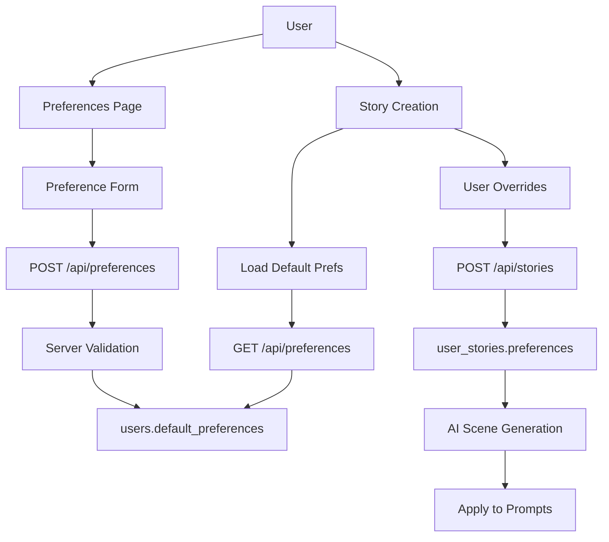

# Personalization & Preferences

<!--
  This document follows the standard feature documentation template.
  See FEATURE_DOCUMENTATION_TEMPLATE.md for section descriptions and update triggers.
-->

Complete guide to the user preference system for customizing AI story generation.

---

## Metadata

| Property | Value |
|----------|-------|
| **Feature Status** | ✅ Production Ready |
| **Last Updated** | 2025-12-09 |
| **Related Features** | [Authentication](./authentication.md), [AI Story Generation](./ai-story-generation.md), [Story Experience](./story-experience.md) |
| **Primary Maintainer** | Core Team |
| **API Stability** | Stable |

<!-- UPDATE TRIGGER: Update Last Updated date whenever ANY section changes -->
<!-- UPDATE TRIGGER: Update Feature Status when production state changes -->
<!-- UPDATE TRIGGER: Update Related Features when cross-feature dependencies change -->

---

## Overview

### Purpose

The Personalization & Preferences feature allows users to customize how AI generates stories, tailoring content, pacing, and style to their individual tastes. These preferences serve as both:

1. **User defaults**: Saved preferences used for all future story creations
2. **Story-specific overrides**: Per-story customizations at creation time

This enables a flexible, personalized reading experience where users control the intensity, pacing, perspective, and themes of generated content.

### Key Capabilities

- **Spice Level Control**: 5-level scale from sweet romance to explicit content
- **Genre Selection**: Multi-select from 6 romance subgenres
- **Trope Selection**: Database-driven trope system with 20+ options
- **Pacing Options**: Slow-burn vs. fast-paced relationship development
- **Scene Length**: Control word count per scene (short/medium/long)
- **POV Character Gender**: 8 gender identity options for protagonist perspective
- **Default Persistence**: Preferences saved to user profile
- **Story Overrides**: Per-story customization at creation time
- **Real-time Validation**: Client and server-side validation
- **Auto-save Feedback**: Success messages and error handling

<!-- UPDATE TRIGGER: Update when new major capabilities are added or removed -->

### Use Cases

**Primary User Flows:**

1. **First-time Setup**
   - New user navigates to preferences page
   - Selects genres, tropes, spice level, pacing, scene length, POV gender
   - Saves preferences as defaults
   - Preferences automatically applied to future story creations

2. **Updating Defaults**
   - User returns to preferences page
   - Modifies existing selections
   - Saves updated preferences
   - New defaults applied to subsequent stories (existing stories unchanged)

3. **Per-Story Customization**
   - User creates story from template
   - Default preferences pre-filled
   - User overrides specific preferences for this story
   - Story generated with custom settings
   - User's defaults remain unchanged

4. **Viewing Story Preferences**
   - User views story info page
   - Sees applied preferences for that specific story
   - Understands how story was configured

<!-- UPDATE TRIGGER: Add new use cases when feature scope expands -->

---

## User Experience

### Preferences Page

**Location**: `/preferences`

**Access**: Via profile page or main navigation

**Layout:**

1. **Page Header**
   - Settings icon
   - "Novel Generation Preferences" heading
   - Description: "Customize how AI generates stories for you"
   - Back to Profile link

2. **Success/Error Messages**
   - Green success banner on save
   - Auto-dismisses after 3 seconds
   - Red error messages for validation failures

3. **Preference Sections** (in order)

   **Genres Section:**
   - Multi-select grid of 6 genre cards
   - Icons and labels for each genre
   - Selected genres highlighted with color
   - Required: At least 1 genre
   - Options: Contemporary, Fantasy, Paranormal, Historical, Sci-Fi, Small Town

   **Tropes Section:**
   - Multi-select grid of database-driven tropes
   - Examples: Enemies to Lovers, Fake Dating, Second Chance, Grumpy/Sunshine
   - Selected tropes highlighted
   - Required: At least 1 trope

   **Spice Level Section:**
   - 5 vertically stacked cards with flame icons
   - Level 1 (Sweet): Kisses and hand-holding
   - Level 2 (Warm): Closed-door romance
   - Level 3 (Spicy): Some sensual scenes
   - Level 4 (Extra Spicy): Explicit scenes
   - Level 5 (Fire): Very explicit content
   - Visual flame indicators (1-5 flames)
   - Radio button selection

   **Pacing Section:**
   - 2 cards: Slow-burn vs. Fast-paced
   - Slow-burn: "Gradual relationship development"
   - Fast-paced: "Quick chemistry and passion"
   - Radio button selection

   **Scene Length Section:**
   - 3 cards: Short, Medium, Long
   - Short: ~500-700 words (Quick, punchy scenes)
   - Medium: ~800-1100 words (Balanced pacing)
   - Long: ~1100-1500 words (Detailed, immersive scenes)
   - Radio button selection

   **POV Character Gender Section:**
   - 8 options for protagonist gender identity
   - Female, Male, Non-binary, Genderqueer, Trans Man, Trans Woman, Agender, Genderfluid
   - Radio button selection
   - Each with descriptive label

4. **Action Buttons**
   - Cancel: Returns to profile without saving
   - Save Preferences: Validates and saves to database

**Visual Design:**

- Card-based layout with shadows
- Rose/romance color scheme for selected items
- Flame icons for spice level
- Settings icon throughout
- Responsive grid layouts
- Dark mode support

### Story Creation Override UI

**Location**: `/story/create?templateId={id}`

**Integration**: Same preference selectors embedded in story creation flow

**Behavior**:

- Default preferences pre-filled
- User can modify any preference for this story only
- Changes don't affect user's saved defaults
- Visual indicator shows auto-generated vs. custom title

---

## Technical Implementation

### Architecture Overview



### Data Model

**TypeScript Interfaces:**

```typescript
// src/lib/types/preferences.ts

export type SpiceLevel = 1 | 2 | 3 | 4 | 5

export type Genre =
  | "contemporary"
  | "fantasy"
  | "paranormal"
  | "historical"
  | "sci-fi"
  | "small-town"

export type PacingOption = "slow-burn" | "fast-paced"

export type SceneLengthOption = "short" | "medium" | "long"

export type PovCharacterGender =
  | "male"
  | "female"
  | "non-binary"
  | "genderqueer"
  | "trans-man"
  | "trans-woman"
  | "agender"
  | "genderfluid"

export interface UserPreferences {
  genres: Genre[]                      // Multi-select, min 1
  tropes: string[]                     // DB-driven tropes, min 1
  spiceLevel: SpiceLevel               // 1-5 scale
  pacing: PacingOption                 // slow-burn or fast-paced
  sceneLength?: SceneLengthOption      // Optional, default "medium"
  povCharacterGender?: PovCharacterGender  // Optional, default "female"
}
```

**Database Schema:**

```sql
-- users table
default_preferences JSONB  -- Stores UserPreferences as JSON

-- user_stories table
preferences JSONB          -- Per-story preferences (copy of user defaults + overrides)
```

### Preference Storage

**Default Preferences (User Profile):**

- Stored in `users.default_preferences` as JSONB
- Updated via POST /api/preferences
- Loaded when user creates new story
- Can be null for new users (requires onboarding)

**Story-Specific Preferences:**

- Copied from user defaults at story creation
- Overrides applied if user customizes
- Stored in `user_stories.preferences` as JSONB
- Never modified after story creation (immutable)

### Preference Application

**At Story Creation:**

1. Load user's default preferences
2. Pre-fill creation form
3. User optionally overrides
4. Final preferences saved with story
5. Protagonist name generated based on POV gender

**During Scene Generation:**

1. Fetch story preferences from database
2. Build generation prompt with:
   - Spice level influencing explicitness
   - Pacing affecting relationship progression speed
   - Scene length targeting word count
   - POV gender setting pronouns and perspective
   - Genres/tropes influencing plot elements

3. AI generates content following preferences

### Validation Rules

**Client-Side:**

- At least 1 genre required
- At least 1 trope required
- Spice level must be 1-5
- Pacing must be valid option
- Scene length must be valid option (if provided)
- POV gender must be valid option (if provided)

**Server-Side:**

```typescript
// POST /api/preferences validation

// Genres
- Must be array with length > 0
- Each genre must exist in GENRES constant
- Invalid genres rejected with 400 error

// Tropes
- Must be array with length > 0
- Each trope validated against database
- Invalid tropes rejected with 400 error (includes invalid keys)

// Spice Level
- Must be number between 1-5 inclusive
- Type checking enforced

// Pacing
- Must match PACING_OPTIONS constant
- Invalid values rejected with 400 error

// Scene Length (optional)
- Must match SCENE_LENGTH_OPTIONS if provided
- Defaults to "medium" if not provided

// POV Character Gender (optional)
- Must match POV_CHARACTER_GENDER_OPTIONS if provided
- Defaults to "female" if not provided
```

### Preference Labels

**Defined in** `src/lib/types/preferences.ts`:

```typescript
export const GENRE_LABELS: Record<Genre, string> = {
  contemporary: "Contemporary",
  fantasy: "Fantasy",
  paranormal: "Paranormal",
  historical: "Historical",
  "sci-fi": "Sci-Fi",
  "small-town": "Small Town"
}

export const SPICE_LABELS: Record<SpiceLevel, { label: string; description: string }> = {
  1: { label: "Sweet", description: "Kisses and hand-holding" },
  2: { label: "Warm", description: "Closed-door romance" },
  3: { label: "Spicy", description: "Some sensual scenes" },
  4: { label: "Extra Spicy", description: "Explicit scenes" },
  5: { label: "Fire", description: "Very explicit content" }
}

export const PACING_LABELS: Record<PacingOption, { label: string; description: string }> = {
  "slow-burn": { label: "Slow Burn", description: "Gradual relationship development" },
  "fast-paced": { label: "Fast-Paced", description: "Quick chemistry and passion" }
}

export const SCENE_LENGTH_LABELS: Record<SceneLengthOption, { ... }> = {
  short: { label: "Short", description: "Quick, punchy scenes", wordCount: "~500-700 words" },
  medium: { label: "Medium", description: "Balanced pacing", wordCount: "~800-1100 words" },
  long: { label: "Long", description: "Detailed, immersive scenes", wordCount: "~1100-1500 words" }
}

export const POV_CHARACTER_GENDER_LABELS: Record<PovCharacterGender, { ... }> = {
  male: { label: "Male", description: "Male protagonist perspective" },
  female: { label: "Female", description: "Female protagonist perspective" },
  "non-binary": { label: "Non-binary", description: "Non-binary protagonist perspective" },
  // ... etc for all 8 gender options
}
```

### Trope Management

**Dynamic Loading:**

- Tropes stored in `tropes` database table
- Fetched via `/api/tropes` endpoint
- Allows admin to add new tropes without code changes
- Trope keys must match database entries
- Validation queries database for trope existence

---

## API Reference

### Get User Preferences

```typescript
GET /api/preferences

Authentication: Required (session cookie)

Response: 200 OK
{
  preferences: UserPreferences | null
}

// preferences is null if user hasn't set any yet
// preferences is JSON string that gets parsed

Example Response:
{
  preferences: {
    genres: ["contemporary", "fantasy"],
    tropes: ["enemies-to-lovers", "fake-dating"],
    spiceLevel: 3,
    pacing: "slow-burn",
    sceneLength: "medium",
    povCharacterGender: "female"
  }
}

Errors:
- 401: Unauthorized (no valid session)
- 404: User not found
- 500: Internal server error
```

### Save User Preferences

```typescript
POST /api/preferences

Authentication: Required (session cookie)

Request Body: UserPreferences
{
  genres: string[]              // At least 1 required
  tropes: string[]              // At least 1 required
  spiceLevel: number            // 1-5
  pacing: string                // "slow-burn" | "fast-paced"
  sceneLength?: string          // "short" | "medium" | "long" (optional)
  povCharacterGender?: string   // Any of 8 gender options (optional)
}

Example Request:
{
  "genres": ["contemporary", "paranormal"],
  "tropes": ["second-chance", "grumpy-sunshine"],
  "spiceLevel": 4,
  "pacing": "fast-paced",
  "sceneLength": "long",
  "povCharacterGender": "non-binary"
}

Response: 200 OK
{
  success: true
  preferences: UserPreferences  // Saved preferences with defaults applied
}

Validation Errors: 400 Bad Request
{
  error: string  // Description of validation failure
}

Examples:
- "At least one genre is required"
- "At least one trope is required"
- "Invalid genre selection"
- "Invalid trope selection: invalid-trope-key"
- "Invalid spice level"
- "Invalid pacing selection"
- "Invalid POV character gender selection"

Other Errors:
- 401: Unauthorized (no valid session)
- 500: Internal server error
```

---

## Code Locations

### Directory Structure

```
src/
├── lib/
│   └── types/
│       └── preferences.ts              # Type definitions and labels (141 lines)
├── routes/
│   ├── preferences.tsx                 # Preferences page UI (251 lines)
│   └── api/
│       └── preferences.ts              # API handlers (155 lines)
├── components/
│   └── preferences/
│       ├── GenresSection.tsx           # Genre selector UI
│       ├── TropesSection.tsx           # Trope selector UI
│       ├── SpiceLevelSection.tsx       # Spice level selector (78 lines)
│       ├── PacingSection.tsx           # Pacing selector
│       ├── SceneLengthSection.tsx      # Scene length selector
│       └── PovCharacterGenderSection.tsx  # POV gender selector
└── hooks/
    ├── useUserPreferencesQuery.ts      # Fetch preferences hook (41 lines)
    └── useUpdatePreferencesMutation.ts # Save preferences hook
```

### Key Files

#### Preference Type Definitions

**File**: [src/lib/types/preferences.ts](../../src/lib/types/preferences.ts)

**Purpose**: Centralized type definitions, constants, and labels

**Exports**:

- Type definitions for all preference options
- Validation constants (GENRES, PACING_OPTIONS, etc.)
- Display labels for UI rendering
- UserPreferences interface

#### Preferences Page

**File**: [src/routes/preferences.tsx](../../src/routes/preferences.tsx)

**Purpose**: Main preferences configuration UI

**Features**:

- Form with all preference sections
- Real-time validation
- Auto-save with success feedback
- Error handling with retry
- Cancel/Save buttons

#### Preferences API

**File**: [src/routes/api/preferences.ts](../../src/routes/api/preferences.ts)

**Purpose**: Server-side preference CRUD operations

**Handlers**:

- GET: Fetch user preferences from database
- POST: Validate and save preferences to database

---

## Configuration

### Default Values

```typescript
// Applied when user hasn't set preferences or fields are optional

sceneLength: "medium"
povCharacterGender: "female"

// No defaults for required fields:
// - genres (user must select)
// - tropes (user must select)
// - spiceLevel (user must select)
// - pacing (user must select)
```

### Preference Immutability

**User Defaults:**

- Mutable - user can update anytime via preferences page
- Changes don't affect existing stories

**Story Preferences:**

- Immutable - set at story creation, never changed
- Ensures consistent generation throughout story

### Database Storage

**Format**: JSONB (PostgreSQL JSON type)

**Benefits**:

- Flexible schema for future preference additions
- Efficient querying with JSON operators
- Human-readable in database
- Direct serialization from TypeScript types

---

## Related Features

### Dependencies

- **[Authentication](./authentication.md)**: User identity required for preference storage

### Dependents

- **[AI Story Generation](./ai-story-generation.md)**: Applies preferences to generation prompts
- **[Story Experience](./story-experience.md)**: Uses preferences at story creation time

### Integration Points

**With AI Story Generation:**

- Spice level affects content filtering and explicitness
- Pacing influences relationship progression speed
- Scene length targets generation word count
- POV gender sets pronouns and protagonist name
- Genres/tropes guide plot direction

**With Story Experience:**

- Story creation pre-fills user defaults
- User can override per story
- Story info displays applied preferences
- Preferences immutable after story creation

---

## Testing

### Unit Tests

**Preference Validation:**

```typescript
// Test genre validation
- Empty genres array → Validation error
- Valid genres → Pass
- Invalid genre key → Validation error

// Test trope validation
- Empty tropes array → Validation error
- Valid tropes from database → Pass
- Invalid trope key → Validation error with key name

// Test spice level validation
- Level 0 → Validation error
- Levels 1-5 → Pass
- Level 6 → Validation error
- Non-number → Validation error

// Test optional fields
- Missing sceneLength → Defaults to "medium"
- Missing povCharacterGender → Defaults to "female"
```

**Preference Persistence:**

```typescript
// Test save and load cycle
1. Save preferences via POST /api/preferences
2. Fetch via GET /api/preferences
3. Verify all fields match
4. Verify defaults applied to optional fields
```

### Integration Tests

**Preference Application:**

```typescript
// Test story creation inherits defaults
1. Set user preferences
2. Create story without overrides
3. Verify story.preferences matches user defaults

// Test story creation with overrides
1. Set user preferences (e.g., spiceLevel: 3)
2. Create story with override (e.g., spiceLevel: 5)
3. Verify story.preferences uses override
4. Verify user defaults unchanged

// Test preference immutability
1. Create story with preferences
2. Update user defaults
3. Verify story preferences unchanged
```

### Manual Testing Checklist

- [ ] Create new user account (no preferences)
- [ ] Set initial preferences successfully
- [ ] Update existing preferences
- [ ] Validation errors show for invalid input
- [ ] Success message appears on save
- [ ] Success message auto-dismisses after 3s
- [ ] Cancel button returns without saving
- [ ] Create story with default preferences
- [ ] Create story with preference overrides
- [ ] Verify story info displays correct preferences
- [ ] Update user defaults don't affect existing stories
- [ ] All 6 genre options work
- [ ] All trope options work (database-driven)
- [ ] All 5 spice levels work
- [ ] All 2 pacing options work
- [ ] All 3 scene length options work
- [ ] All 8 POV gender options work
- [ ] Dark mode rendering
- [ ] Mobile responsiveness

---

## Performance Considerations

### Query Optimization

**Preference Loading:**

- Single query to fetch user preferences
- JSONB field returned directly (no parsing in SQL)
- Client-side JSON parsing for type safety

**Preference Saving:**

- Single UPDATE query
- JSONB column updated atomically
- No cascading updates needed

### Caching Strategy

**Client-Side:**

- React Query caches preferences after first load
- Cache invalidated on save
- Stale-while-revalidate pattern

**Server-Side:**

- No server caching (preferences change infrequently)
- Database query very fast (indexed on user ID)

### State Management

**Form State:**

- Local React state for form fields
- Updates on blur/change
- No unnecessary re-renders
- Batch updates on save

---

## Future Enhancements

### Planned Features

**Preference Expansion:**

- [ ] Additional pacing option: "medium" (between slow-burn and fast-paced)
- [ ] Romance sub-types (MM, FF, MF, poly, etc.)
- [ ] Content warnings/triggers management
- [ ] Favorite character archetypes
- [ ] Preferred emotional themes (angst, fluff, hurt/comfort)
- [ ] Narration style (first person, third person limited, omniscient)

**UI Improvements:**

- [ ] Preference presets (e.g., "Classic Romance", "Steamy Adventure")
- [ ] Visual preview of how preferences affect stories
- [ ] Recommendation engine for tropes based on favorites
- [ ] Undo/redo for preference changes
- [ ] Import/export preferences (share with friends)

**Advanced Features:**

- [ ] Preference versioning (track changes over time)
- [ ] A/B testing different preference combinations
- [ ] Analytics on popular preference combinations
- [ ] Preference suggestions based on completed stories
- [ ] Seasonal preference themes

**Social Features:**

- [ ] Share preference profiles
- [ ] Community preference trends
- [ ] Discover stories matching your preferences

---

## Troubleshooting

### Preferences Not Saving

**Symptom**: Save button doesn't persist changes

**Causes**:

1. Validation error (missing required field)
2. Network error during API call
3. Session expired (401 error)

**Solutions**:

- Check for error message displayed on page
- Verify at least 1 genre and 1 trope selected
- Check browser console for errors
- Re-authenticate if session expired

**Debug Steps**:

```sql
-- Check if preferences saved
SELECT id, email, default_preferences
FROM users
WHERE email = 'user@example.com';

-- Should show JSONB with preferences
```

### Preferences Not Loading

**Symptom**: Preferences page shows empty/default values instead of saved preferences

**Causes**:

1. User hasn't set preferences yet (null in database)
2. JSON parsing error
3. Query error

**Solutions**:

- First time users must set preferences
- Check browser console for JSON parse errors
- Verify database contains valid JSON

**Debug Steps**:

```sql
-- Check preference format
SELECT default_preferences::text
FROM users
WHERE id = 'user-id';

-- Should be valid JSON
```

### Story Creation Not Using Preferences

**Symptom**: Story created with different preferences than user defaults

**Causes**:

1. User explicitly overrode preferences at creation
2. User's default preferences were null
3. Preferences not loaded before story creation

**Solutions**:

- Check if user modified preferences in creation form
- Verify user has set default preferences
- Ensure preferences loaded before rendering form

**Verification**:

```sql
-- Check story preferences vs. user defaults
SELECT
  us.id,
  us.preferences as story_prefs,
  u.default_preferences as user_defaults
FROM user_stories us
JOIN users u ON u.id = us.user_id
WHERE us.id = 'story-id';
```

### Invalid Trope Errors

**Symptom**: "Invalid trope selection" error when saving

**Causes**:

1. Trope key doesn't exist in database
2. Trope was deleted after user selected it
3. Database sync issue

**Solutions**:

- Refresh page to reload current tropes
- Remove invalid trope from selection
- Contact admin if trope should exist

**Debug Steps**:

```sql
-- Check available tropes
SELECT trope_key, display_name FROM tropes;

-- Check user's invalid trope
-- (error message includes invalid key)
```

### Preference UI Not Responsive

**Symptom**: Preference selectors don't update on click

**Causes**:

1. JavaScript error breaking state updates
2. Event handler not attached
3. React rendering issue

**Solutions**:

- Check browser console for errors
- Hard refresh page (Ctrl+Shift+R)
- Clear browser cache

---

## AI Agent Maintenance Guidelines

### When to Update This Document

1. **Preference Type Changes** (Priority: HIGH)
   - New preference field added → Update "Key Capabilities", "Data Model", "API Reference"
   - Preference removed → Remove from all sections
   - Validation rules changed → Update "Validation Rules" section

2. **UI Changes** (Priority: HIGH)
   - New preference section added → Update "User Experience" section
   - Section layout changed → Update section descriptions
   - Visual design changed → Update "Visual Design" notes

3. **API Changes** (Priority: HIGH)
   - Endpoint modified → Update "API Reference" section
   - Request/response schema changed → Update examples
   - Validation error messages changed → Update error examples

4. **Database Schema Changes** (Priority: HIGH)
   - Preference storage location changed → Update "Database Schema" section
   - JSONB structure changed → Update "Data Model" section

5. **Label Updates** (Priority: MEDIUM)
   - Preference label text changed → Update relevant labels in documentation
   - New labels added → Add to "Preference Labels" section

6. **Bug Fixes** (Priority: LOW)
   - Common issue resolved → Add to "Troubleshooting"
   - Workaround discovered → Document in relevant section

### Update Patterns

**When adding a new preference type:**

1. Update "Key Capabilities" with one-line description
2. Add to "Data Model" TypeScript interface
3. Add validation rules to "Validation Rules" section
4. Update "API Reference" request/response examples
5. Add UI section to "User Experience"
6. Add label constants to "Preference Labels"
7. Update "Change Log"

**When modifying existing preference:**

1. Update type definition in "Data Model"
2. Revise validation rules if changed
3. Update API examples with new structure
4. Update UI description if display changed
5. Test examples still compile/work
6. Update "Last Updated" metadata

**When fixing a preference bug:**

1. Add entry to "Troubleshooting" section
2. Include symptoms, causes, and solutions
3. Add SQL debug queries if applicable
4. Update "Change Log" if significant

---

## Change Log

| Date | Change | Author |
|------|--------|--------|
| 2025-12-09 | Complete documentation created from codebase exploration | AI Assistant |
| 2025-12-09 | Documented 6 preference types with validation rules | AI Assistant |
| 2025-12-09 | Added comprehensive API reference and troubleshooting | AI Assistant |
