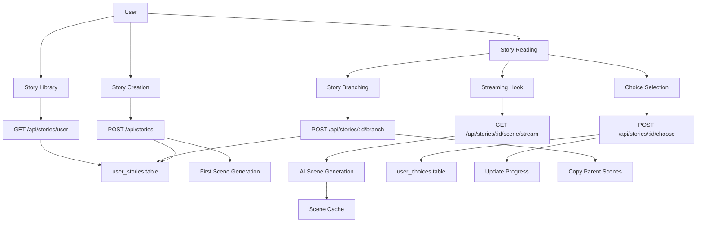

# Story Experience

<!--
  This document follows the standard feature documentation template.
  See FEATURE_DOCUMENTATION_TEMPLATE.md for section descriptions and update triggers.
-->

Complete guide to the interactive story reading and management experience.

---

## Metadata

| Property | Value |
|----------|-------|
| **Feature Status** | ✅ Production Ready |
| **Last Updated** | 2025-12-09 |
| **Related Features** | [AI Story Generation](./ai-story-generation.md), [Text-to-Speech](./text-to-speech.md), [Personalization](./personalization.md), [Authentication](./authentication.md) |
| **Primary Maintainer** | Core Team |
| **API Stability** | Stable |

<!-- UPDATE TRIGGER: Update Last Updated date whenever ANY section changes -->
<!-- UPDATE TRIGGER: Update Feature Status when production state changes -->
<!-- UPDATE TRIGGER: Update Related Features when cross-feature dependencies change -->

---

## Overview

### Purpose

The Story Experience feature provides an immersive, interactive reading environment where users can:

- Create personalized stories from templates
- Read AI-generated content with real-time streaming
- Make meaningful choices that branch narratives
- Track progress and manage their story library
- Navigate between scenes and explore alternate paths

This is the core user-facing feature that ties together AI generation, personalization, and multimedia elements into a cohesive reading experience.

### Key Capabilities

- **Story Creation Flow**: Template selection with preference customization
- **Real-time Scene Streaming**: Live generation with progress indicators
- **Interactive Choices**: Branching story paths with tone-based options
- **Story Branching**: Explore alternate choices without losing progress
- **Scene Navigation**: Jump between scenes with next/previous controls
- **Progress Tracking**: Visual progress bars and reading statistics
- **Story Management**: Library with filtering, favorites, and deletion
- **Title Customization**: Edit story titles with auto-numbering for duplicates
- **Audio Integration**: Inline TTS audio player for immersive reading
- **Responsive UI**: Auto-hiding header on scroll for distraction-free reading

<!-- UPDATE TRIGGER: Update when new major capabilities are added or removed -->

### Use Cases

**Primary User Flows:**

1. **Creating a New Story**
   - Browse templates → Select template → Customize preferences → Generate story
   - Auto-numbered titles for duplicate template selections

2. **Reading Experience**
   - View scene with streaming generation → Read content → Make choice or continue
   - Navigate between scenes → Track progress → Listen to audio narration

3. **Exploring Branches**
   - Read to choice point → View previous choice → Try different option → Create branch
   - System detects existing branches to avoid duplicates

4. **Managing Stories**
   - View library (in-progress/completed/favorites) → Select story → Read info
   - Edit title → Toggle favorite → Delete story

<!-- UPDATE TRIGGER: Add new use cases when feature scope expands -->

---

## User Experience

### Story Creation Page

**Location**: `/story/create?templateId={id}`

**Interface Elements:**

1. **Template Display**
   - Template title and description
   - Scene count estimate
   - Cover image/gradient

2. **Preference Customization**
   - **Spice Level**: Visual flame selector (1-5)
   - **Pacing**: Radio buttons (slow-burn/medium/fast-paced)
   - **Scene Length**: Radio buttons (short/medium/long with word counts)
   - **POV Character Gender**: Radio buttons (female/male/non-binary)
   - **Story Title**: Optional custom title input with auto-generated preview

3. **Duplicate Warning**
   - Shows count of existing stories from same template
   - Displays auto-generated title (e.g., "Template Title #2")

4. **Action Buttons**
   - Cancel (returns to browse)
   - Start Reading (creates story and navigates to reading page)

### Reading Page

**Location**: `/story/:id/read?scene={number}`

**Layout:**

1. **Sticky Header** (auto-hides on scroll down, shows on scroll up)
   - Cover image background (blurred, 15% opacity)
   - Back to Library button
   - Story title
   - Progress bar with percentage
   - Scene counter (e.g., "Scene 3 of 12")
   - Audio generation button
   - Audio indicator
   - Info button

2. **Scene Navigation** (top and bottom)
   - Previous scene button (disabled on scene 1)
   - Scene number indicator with scene jump dropdown
   - Next scene button (disabled at choice points)

3. **Scene Content Card**
   - Streaming indicator while generating
   - Prose-formatted paragraphs
   - Reading statistics (word count, estimated reading time)
   - "Freshly generated" badge for non-cached scenes

4. **Choice Point Card** (when applicable)
   - Choice prompt text
   - 2-3 choice options with tone labels
   - For made choices:
     - Read-only display with "Your Choice" badge
     - Branch buttons on unchosen options
   - For new choices:
     - Selectable radio buttons
     - Continue Story button

5. **Story Complete Card** (final scene)
   - "The End" message
   - Mark as Completed button
   - Back to Library button

6. **Floating Audio Player** (when active)
   - Compact player at bottom of screen
   - Play/pause, seek, volume controls
   - Close button (audio icon remains visible)

**Visual Design:**

- Gradient background (rose/purple/pink)
- White/dark mode cards with shadows
- Garamond font for story text
- Rose/purple accent colors
- Smooth animations and transitions

### Story Info Page

**Location**: `/story/:id/info`

**Sections:**

1. **Story Header**
   - Cover image or gradient background
   - Favorite button (heart icon, toggles filled/outline)
   - Story title with inline edit button
   - Template description
   - Metadata: Start date, scene count
   - Progress bar with scene tracker
   - Continue Reading / Read Again button
   - Delete button

2. **Story Settings Card**
   - Spice level with description
   - Pacing preferences
   - Scene length
   - Genres (as tags)
   - Tropes (as tags)

3. **AI Configuration Card** (if applicable)
   - AI provider name
   - Model identifier
   - Temperature setting

### Library View

**Location**: `/library?tab={status}&favorites={boolean}`

**Features:**

- Tab filters: All, In Progress, Completed
- Favorites toggle
- Story cards with:
  - Cover image or gradient
  - Story title
  - Progress indicator
  - Last updated date
  - Quick actions (continue, info, favorite)

---

## Technical Implementation

### Architecture Overview



### Story Creation Flow

**Process:**

1. User selects template from browse page
2. System loads user's default preferences
3. User optionally overrides preferences for this story
4. System generates protagonist name based on POV gender
5. System checks for existing stories from same template
6. Auto-generates numbered title if duplicates exist
7. Story created with:
   - Template ID reference
   - User preferences (serialized JSON)
   - Custom or auto-generated title
   - Current AI configuration snapshot
8. User redirected to reading page for scene 1

**Implementation:**

```typescript
// src/routes/api/stories/index.ts
POST /api/stories/

Request Body:
{
  templateId: string (UUID)
  storyTitle?: string (optional, max 255 chars)
  preferences?: {
    genres: string[]
    tropes: string[]
    spiceLevel: 1-5
    pacing: "slow-burn" | "medium" | "fast-paced"
    sceneLength: "short" | "medium" | "long"
    povCharacterGender: "female" | "male" | "non-binary"
    protagonistName?: string (auto-generated if not provided)
  }
}

Response:
{
  story: {
    id: string
    story_title: string
    template: Template
    preferences: UserPreferences
    ai_provider: string
    ai_model: string
    ai_temperature: number
    current_scene: 1
    status: "in-progress"
  }
}
```

### Story Reading Flow

**Scene Loading:**

1. Component mounts with story ID and optional scene number
2. `useStreamingScene` hook initiated
3. Hook calls streaming endpoint with SSE connection
4. Server checks scene cache
5. If cached: Returns immediately
6. If not cached: Generates scene in real-time
7. Content streams to client with metadata
8. Scene displayed progressively
9. Reading statistics calculated
10. Progress auto-updated if viewing beyond current scene

**Streaming Hook:**

```typescript
// src/hooks/useStreamingScene.ts
const streamingState = useStreamingScene(storyId, sceneNumber, enabled);

// Returns:
{
  content: string           // Scene text (updates during streaming)
  metadata: {              // Scene metadata
    scene: { number, cached }
    story: { title, currentScene, estimatedScenes, status }
    choicePoint: ChoicePoint | null
    previousChoice: number | null
  }
  isStreaming: boolean     // True during generation
  isComplete: boolean      // True when done
  error: string | null     // Error message if failed
  retry: () => void        // Retry generation function
}
```

### Choice System

**Choice Recording:**

1. User selects choice option (0-2 index)
2. Click "Continue Story" button
3. API records choice in `user_choices` table
4. API calculates next scene number
5. API updates story progress if moving forward
6. Client navigates to next scene

**Choice Point Structure:**

```typescript
interface ChoicePoint {
  id: string              // UUID
  template_id: string     // Template reference
  scene_number: number    // Scene where choice appears
  prompt_text: string     // "What do you do?"
  options: [
    {
      text: string        // "Tell the truth"
      tone: string        // "Honest", "Bold", "Cautious"
      impact: string      // Impact description
    },
    // 2-3 total options
  ]
}
```

**API Endpoint:**

```typescript
POST /api/stories/:id/choose

Request Body:
{
  choicePointId: string (UUID)
  selectedOption: number (0-2)
  currentScene: number
}

Response:
{
  success: true
  nextScene: number
  completed: boolean
}
```

### Story Branching System

**Purpose:** Allow users to explore alternate choices without losing their original story path.

**Branch Creation Flow:**

1. User reads to a scene with a choice
2. User sees their previous choice marked
3. User clicks "Try this choice instead" on an unchosen option
4. System checks for existing branch with same parameters
5. If existing branch found:
   - Dialog shows existing branch info
   - User can navigate to existing branch
6. If no existing branch:
   - System creates new story entry
   - Copies all scenes up to branch point
   - Records branch metadata
   - Sets new choice for branch point
   - User navigates to branched story at next scene

**Branch Detection:**

```typescript
GET /api/stories/:id/branch?sceneNumber={n}&choicePointId={id}&choiceOption={n}

Response:
{
  exists: boolean
  branch?: {
    id: string
    story_title: string
    created_at: string
  }
}
```

**Branch Creation:**

```typescript
POST /api/stories/:id/branch

Request Body:
{
  sceneNumber: number       // Scene where branch occurs
  choicePointId: string     // Choice point ID
  newChoice: number         // New choice option (0-3)
}

Response:
{
  success: true
  storyId: string          // New branched story ID
}
```

**Database Schema:**

```sql
-- user_stories table
branched_from_story_id UUID REFERENCES user_stories(id)
branched_at_scene INTEGER
```

### Progress Tracking

**Auto-Update Logic:**

- Progress updated when viewing scene beyond `current_scene`
- Prevents regressing progress by navigating backwards
- Triggers on scene view (debounced to once per scene)

**Manual Update:**

```typescript
PATCH /api/stories/:id/progress

Request Body:
{
  currentScene: number
}
```

**Story Completion:**

- When user reaches final scene (scene >= estimatedScenes)
- "Mark as Completed" button shown
- Sets `current_scene = estimatedScenes + 1`
- Updates `status = "completed"`
- Redirects to completed library

### Scene Navigation

**Navigation Controls:**

1. **Previous Button**: Loads scene N-1
2. **Next Button**: Loads scene N+1 (disabled at choice points)
3. **Scene Dropdown**: Jump to any scene 1 to currentScene

**URL State:**

- Scene number stored in URL query: `?scene={number}`
- Missing scene parameter defaults to `current_scene` from story
- Browser back/forward supported
- Scroll to top on scene change

**Navigation Component:**

```typescript
// src/components/SceneNavigation.tsx
<SceneNavigation
  currentScene={number}
  totalScenes={number}
  hasChoicePoint={boolean}
  hasAlreadyMadeChoice={boolean}
  onNavigateScene={(sceneNum) => void}
/>
```

---

## API Reference

### Story Management

#### Create Story

```typescript
POST /api/stories/

Authentication: Required (session cookie)

Request Body:
{
  templateId: string        // UUID of novel template
  storyTitle?: string       // Optional custom title (max 255 chars)
  preferences?: {
    genres: string[]        // Array of genre keys
    tropes: string[]        // Array of trope keys
    spiceLevel: number      // 1-5
    pacing: string          // "slow-burn" | "medium" | "fast-paced"
    sceneLength?: string    // "short" | "medium" | "long"
    povCharacterGender?: string  // "female" | "male" | "non-binary"
    protagonistName?: string     // Auto-generated if not provided
  }
}

Response: 201 Created
{
  story: UserStory          // Full story object with template
}

Errors:
- 400: Invalid request data, invalid tropes
- 401: Unauthorized (no session)
- 500: Failed to create story
```

#### List User Stories

```typescript
GET /api/stories/user?status={status}&favorites={boolean}

Authentication: Required

Query Parameters:
- status: "in-progress" | "completed" (optional)
- favorites: "true" | "false" (default: false)

Response: 200 OK
{
  stories: UserStory[]      // Array of stories with templates
}

Errors:
- 401: Unauthorized
- 500: Failed to fetch stories
```

#### Get Story Details

```typescript
GET /api/stories/:id

Authentication: Required

Response: 200 OK
{
  story: UserStory          // Full story with template and metadata
}

Errors:
- 401: Unauthorized
- 403: Forbidden (not owner)
- 404: Story not found
- 500: Server error
```

#### Update Story Title

```typescript
PATCH /api/stories/:id/title

Authentication: Required

Request Body:
{
  storyTitle: string        // New title (1-255 chars)
}

Response: 200 OK
{
  success: true
  story: UserStory
}

Errors:
- 400: Invalid title
- 401: Unauthorized
- 403: Forbidden
- 404: Story not found
```

#### Update Story Progress

```typescript
PATCH /api/stories/:id/progress

Authentication: Required

Request Body:
{
  currentScene: number      // New current scene
}

Response: 200 OK
{
  success: true
}

Errors:
- 400: Invalid scene number
- 401: Unauthorized
- 403: Forbidden
```

#### Toggle Favorite

```typescript
POST /api/stories/:id/favorite

Authentication: Required

Request Body:
{
  isFavorite: boolean       // true to favorite, false to unfavorite
}

Response: 200 OK
{
  success: true
}

Errors:
- 401: Unauthorized
- 403: Forbidden
- 404: Story not found
```

#### Delete Story

```typescript
DELETE /api/stories/:id

Authentication: Required

Response: 200 OK
{
  success: true
}

Errors:
- 401: Unauthorized
- 403: Forbidden
- 404: Story not found
- 500: Failed to delete
```

### Choice System

#### Record Choice

```typescript
POST /api/stories/:id/choose

Authentication: Required

Request Body:
{
  choicePointId: string     // UUID of choice point
  selectedOption: number    // Choice index (0-2)
  currentScene: number      // Scene where choice made
}

Response: 200 OK
{
  success: true
  nextScene: number         // Next scene to navigate to
  completed: boolean        // True if story complete
}

Errors:
- 400: Invalid choice data
- 401: Unauthorized
- 403: Forbidden (not owner)
- 404: Story not found
- 500: Failed to record choice
```

### Story Branching

#### Check Existing Branch

```typescript
GET /api/stories/:id/branch?sceneNumber={n}&choicePointId={id}&choiceOption={n}

Authentication: Required

Query Parameters:
- sceneNumber: number      // Scene where branch would occur
- choicePointId: string    // UUID of choice point
- choiceOption: number     // Choice option to check (0-3)

Response: 200 OK
{
  exists: boolean
  branch?: {
    id: string              // Branched story ID
    story_title: string
    created_at: string
  }
}

Errors:
- 400: Invalid parameters
- 401: Unauthorized
- 500: Server error
```

#### Create Branch

```typescript
POST /api/stories/:id/branch

Authentication: Required

Request Body:
{
  sceneNumber: number       // Scene where branch occurs
  choicePointId: string     // UUID of choice point
  newChoice: number         // New choice option (0-3)
}

Response: 200 OK
{
  success: true
  storyId: string          // New branched story ID
}

Process:
1. Creates new user_stories entry
2. Copies all scenes up to branch point
3. Copies all choices up to branch point
4. Records new choice for branch scene
5. Sets branched_from_story_id and branched_at_scene

Errors:
- 400: Invalid branch data
- 401: Unauthorized
- 403: Forbidden
- 404: Story not found
- 500: Failed to create branch
```

### Scene Access

Scene loading is handled through the AI Story Generation streaming endpoint. See [AI Story Generation API Reference](./ai-story-generation.md#api-reference) for details.

---

## Code Locations

### Directory Structure

```
src/
├── routes/
│   ├── story/
│   │   ├── create.tsx                    # Story creation page
│   │   ├── $id.read.tsx                  # Story reading page (726 lines)
│   │   └── $id.info.tsx                  # Story info/management page
│   └── api/
│       └── stories/
│           ├── index.ts                  # POST /api/stories (create)
│           ├── user.ts                   # GET /api/stories/user (list)
│           ├── $id.ts                    # GET /api/stories/:id (details)
│           ├── $id.choose.ts             # POST /api/stories/:id/choose
│           ├── $id.branch.ts             # POST/GET /api/stories/:id/branch
│           └── $id/
│               └── favorite.ts           # POST /api/stories/:id/favorite
├── components/
│   ├── SceneNavigation.tsx              # Scene prev/next/jump controls
│   ├── StoryCard.tsx                    # Story card for library
│   ├── StoryProgressBar.tsx             # Progress visualization
│   ├── BranchConfirmationDialog.tsx     # Branch creation dialog
│   └── AudioPlayer.tsx                  # Inline audio player
├── hooks/
│   ├── useCreateStoryMutation.ts        # Story creation hook
│   ├── useStoryQuery.ts                 # Fetch story details
│   ├── useUserStoriesQuery.ts           # Fetch user story list
│   ├── useStreamingScene.ts             # Scene streaming hook
│   ├── useMakeChoiceMutation.ts         # Record choice
│   ├── useBranchStoryMutation.ts        # Create branch
│   ├── useCheckExistingBranch.ts        # Check for existing branch
│   ├── useUpdateProgressMutation.ts     # Update progress
│   ├── useUpdateStoryTitleMutation.ts   # Update title
│   ├── useToggleFavoriteMutation.ts     # Toggle favorite
│   └── useDeleteStoryMutation.ts        # Delete story
└── lib/
    ├── db/
    │   └── queries/
    │       └── stories.ts               # Story database queries
    ├── api/
    │   └── types.ts                     # Story type definitions
    └── utils.ts                         # calculateStoryProgress()
```

### Key Files

#### Story Reading Page

**File**: [src/routes/story/$id.read.tsx](../../src/routes/story/$id.read.tsx)

**Purpose**: Main reading experience with streaming, choices, branching

**Key Components**:

- Streaming scene content with retry
- Choice point handling (view-only for made choices)
- Branch creation with existing branch detection
- Audio player integration
- Auto-hiding header on scroll
- Progress auto-update

#### Story Creation Page

**File**: [src/routes/story/create.tsx](../../src/routes/story/create.tsx)

**Purpose**: Template-based story creation with preference customization

**Key Components**:

- Preference selectors (spice, pacing, scene length, POV)
- Custom title input with auto-generation
- Duplicate detection and warning
- Integration with user default preferences

#### Story Info Page

**File**: [src/routes/story/$id.info.tsx](../../src/routes/story/$id.info.tsx)

**Purpose**: Story metadata, settings, and management

**Key Components**:

- Title editing inline
- Favorite toggle
- Story deletion with confirmation
- Preference display
- AI configuration display

---

## Configuration

### Story Display Settings

**Scene Length Options:**

```typescript
// src/lib/types/preferences.ts
type SceneLengthOption = "short" | "medium" | "long"

SCENE_LENGTH_LABELS = {
  short: { label: "Short", description: "Quick reads", wordCount: "300-500 words" },
  medium: { label: "Medium", description: "Balanced", wordCount: "500-800 words" },
  long: { label: "Long", description: "Detailed", wordCount: "800-1200 words" }
}
```

**Progress Calculation:**

```typescript
// src/lib/utils.ts
function calculateStoryProgress(
  currentScene: number,
  totalScenes: number,
  status: "in-progress" | "completed"
): { percentage: number; label: string }

// Returns percentage (0-100) and label text
// Completed stories always show 100%
```

### UI Behavior

**Auto-hiding Header:**

- Hides on scroll down (after 10px threshold)
- Shows on scroll up or when near top (< 100px)
- Smooth transition with CSS transform

**Scene Content Rendering:**

- Prose formatting with 1.5rem line height
- Garamond font for story text
- Paragraph breaks on double newlines
- Dark mode support

---

## Related Features

### Dependencies

- **[AI Story Generation](./ai-story-generation.md)**: Provides scene content via streaming
- **[Personalization](./personalization.md)**: User preferences for story customization
- **[Authentication](./authentication.md)**: User identity for story ownership
- **[Text-to-Speech](./text-to-speech.md)**: Audio narration during reading

### Dependents

None (this is a top-level user-facing feature)

### Integration Points

**With AI Story Generation:**

- Story creation triggers first scene generation
- Reading page streams scenes via SSE endpoint
- Scene metadata includes choice points
- Branching triggers scene regeneration from branch point

**With Text-to-Speech:**

- AudioGenerationButton component in reading page
- AudioPlayer component for playback
- Scene audio cached by story ID + scene number

**With Personalization:**

- Story creation pre-fills user default preferences
- Preferences saved with each story
- Story info displays applied preferences

---

## Testing

### Unit Tests

**Story Creation Logic:**

```typescript
// Test auto-numbered titles
- First story: Uses template title as-is
- Second story: Appends " #2"
- Custom title: Uses provided title

// Test preference validation
- Valid preferences accepted
- Invalid tropes rejected
- Missing preferences use defaults
```

**Progress Calculation:**

```typescript
- Scene 1/10 = 10%
- Scene 5/10 = 50%
- Scene 10/10 = 100%
- Completed status = 100% regardless
```

### Integration Tests

**Reading Flow:**

```typescript
1. Create story → Navigate to read page
2. Verify scene 1 loads
3. Verify progress bar shows correct percentage
4. Navigate to scene 2
5. Verify URL updated with ?scene=2
6. Verify progress auto-updated in database
```

**Choice Flow:**

```typescript
1. Read to choice point
2. Select option
3. Submit choice
4. Verify choice recorded in database
5. Verify navigation to next scene
6. Go back to choice scene
7. Verify choice shown as read-only
```

**Branching Flow:**

```typescript
1. Read to made choice
2. Click "Try this choice instead"
3. Verify existing branch check
4. Create branch
5. Verify new story created
6. Verify scenes copied
7. Verify navigation to branched story
8. Verify branch metadata recorded
```

### Manual Testing Checklist

- [ ] Story creation with all preference combinations
- [ ] Duplicate title auto-numbering
- [ ] Scene streaming with retry on failure
- [ ] Choice selection and navigation
- [ ] Branch creation and navigation
- [ ] Existing branch detection
- [ ] Progress bar accuracy
- [ ] Scene navigation (prev/next/jump)
- [ ] Audio player integration
- [ ] Auto-hiding header behavior
- [ ] Story completion flow
- [ ] Title editing
- [ ] Favorite toggle
- [ ] Story deletion
- [ ] Dark mode rendering
- [ ] Mobile responsiveness

---

## Performance Considerations

### Scene Caching

**Strategy:**

- Scenes cached in database after generation
- Cache hit returns scene instantly
- Cache miss triggers AI generation
- Cache key: `story_id` + `scene_number`

**Benefits:**

- 100x faster load times for cached scenes
- Reduces AI API costs
- Consistent content on re-reads

### Streaming Optimization

**Server-Sent Events:**

- Real-time content delivery as AI generates
- No need to wait for complete scene
- Progressive rendering in UI
- Metadata sent in final event

### Navigation Performance

**Scene Preloading:**

- Consider preloading next scene on choice submission
- Potential for instant navigation

**Current Limitations:**

- No scene preloading implemented
- Each navigation requires scene load/generation

### UI Performance

**Scroll Behavior:**

- Passive scroll listener for header show/hide
- Smooth scroll to top on scene change
- Debounced progress updates

**Re-rendering:**

- Scene content keyed by scene number
- Prevents stale choice UI from previous scene

---

## Future Enhancements

### Planned Features

**Reading Experience:**

- [ ] Reading mode (hide all UI except content)
- [ ] Font size/family customization
- [ ] Line spacing adjustment
- [ ] Background color themes
- [ ] Bookmark system for quick access to favorite scenes
- [ ] Reading history with timestamps

**Social Features:**

- [ ] Share story with friends (read-only link)
- [ ] Story ratings and reviews
- [ ] Community story showcase
- [ ] Achievement system for completion milestones

**Navigation Improvements:**

- [ ] Scene thumbnails for visual navigation
- [ ] Search within story content
- [ ] Table of contents based on scene metadata
- [ ] Chapter grouping for long stories

**Branch Management:**

- [ ] Branch tree visualization
- [ ] Compare branches side-by-side
- [ ] Merge branch choices into main story
- [ ] Branch naming/tagging

**Advanced Choice System:**

- [ ] Timed choices (countdown)
- [ ] Hidden choices (revealed on replay)
- [ ] Choice consequences display
- [ ] Relationship tracking visualization

**Analytics:**

- [ ] Reading time tracking
- [ ] Popular choice paths
- [ ] Story completion rates
- [ ] Favorite trope/genre analysis

---

## Troubleshooting

### Scene Generation Failures

**Symptom**: Scene shows "No content was generated" or error message

**Causes**:

1. AI provider API error
2. Network timeout
3. Invalid prompt/context
4. Rate limiting

**Solutions**:

- Click "Retry Generation" button
- Check AI provider API status
- Verify API keys in admin dashboard
- Check server logs for error details

**Prevention**:

- Implement automatic retry with exponential backoff
- Monitor AI provider health

### Choice Not Recording

**Symptom**: Choice selection doesn't advance to next scene

**Causes**:

1. Network error during API call
2. Invalid choice point ID
3. Scene number mismatch

**Solutions**:

- Check browser console for errors
- Verify choice point exists in database
- Refresh page and retry

**Debug Steps**:

```sql
-- Check if choice was recorded
SELECT * FROM user_choices
WHERE story_id = 'story-id'
  AND choice_point_id = 'choice-point-id';
```

### Branch Creation Issues

**Symptom**: Branch button doesn't create new story

**Causes**:

1. Scene copy failure
2. Database constraint violation
3. Insufficient scenes generated

**Solutions**:

- Ensure parent story has scenes up to branch point
- Check server logs for database errors
- Verify user has permission to create stories

**Debug Steps**:

```sql
-- Check parent story scenes
SELECT scene_number, cached FROM user_scenes
WHERE story_id = 'parent-id'
ORDER BY scene_number;

-- Check if branch already exists
SELECT * FROM user_stories
WHERE branched_from_story_id = 'parent-id'
  AND branched_at_scene = {scene_number};
```

### Progress Not Updating

**Symptom**: Progress bar doesn't reflect current reading position

**Causes**:

1. Auto-update logic not triggering
2. Database update failure
3. Cache invalidation issue

**Solutions**:

- Manually navigate to next scene to trigger update
- Refresh page to load latest progress
- Check browser console for mutation errors

**Verification**:

```sql
-- Check story progress
SELECT current_scene, status FROM user_stories WHERE id = 'story-id';
```

### Audio Player Issues

**Symptom**: Audio player doesn't appear or audio doesn't play

**Causes**:

1. Scene audio not generated
2. GCS signed URL expired
3. Browser autoplay restrictions

**Solutions**:

- See [Text-to-Speech Troubleshooting](./text-to-speech.md#troubleshooting)
- Check AudioIndicator status
- Try regenerating audio

### Performance Issues

**Symptom**: Slow scene loading or UI lag

**Causes**:

1. Large story with many scenes
2. Uncached scenes requiring generation
3. Inefficient database queries

**Solutions**:

- Implement scene preloading
- Add database indexes
- Optimize queries to fetch only needed data

**Monitoring**:

```typescript
// Check scene load time
console.time('scene-load');
await fetchScene(storyId, sceneNumber);
console.timeEnd('scene-load');
```

---

## AI Agent Maintenance Guidelines

### When to Update This Document

1. **Component Changes** (Priority: HIGH)
   - New reading component added → Update "User Experience" section
   - Navigation modified → Update "Scene Navigation" subsection
   - Choice UI changed → Update "Choice System" subsection

2. **API Changes** (Priority: HIGH)
   - New story endpoint → Add to "API Reference" section
   - Request/response schema changed → Update endpoint documentation
   - New query parameters → Update parameter lists

3. **Flow Changes** (Priority: HIGH)
   - Story creation flow modified → Update "Story Creation Flow" diagram
   - Choice handling logic changed → Update "Choice System" section
   - Branching logic changed → Update "Story Branching System" section

4. **Database Schema Changes** (Priority: HIGH)
   - user_stories table modified → Update type definitions
   - New table for story features → Add schema documentation
   - Branching fields changed → Update "Database Schema" section

5. **Feature Additions** (Priority: MEDIUM)
   - New story management feature → Add to "Key Capabilities"
   - New reading mode → Add to "User Experience"
   - New navigation control → Update navigation section

6. **Bug Fixes** (Priority: LOW)
   - Common issue resolved → Add to "Troubleshooting"
   - Workaround discovered → Document in relevant section

### Update Patterns

**When adding a new story feature:**

1. Update "Key Capabilities" with one-line summary
2. Add detailed explanation in "Technical Implementation"
3. Document API endpoints in "API Reference"
4. Add file locations in "Code Locations"
5. Create troubleshooting entry if applicable
6. Update "Change Log"

**When modifying existing flow:**

1. Update mermaid diagrams if flow changed
2. Revise step-by-step descriptions
3. Update code examples if interfaces changed
4. Test examples still compile/work
5. Update "Last Updated" metadata

**When fixing a bug:**

1. Add entry to "Troubleshooting" section
2. Include symptoms, causes, and solutions
3. Add debug steps if applicable
4. Update "Change Log" if significant

---

## Change Log

| Date | Change | Author |
|------|--------|--------|
| 2025-12-09 | Complete documentation created from codebase exploration | AI Assistant |
| 2025-12-09 | Documented story creation, reading, choices, branching | AI Assistant |
| 2025-12-09 | Added comprehensive API reference and troubleshooting | AI Assistant |
