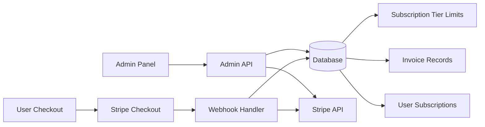

# Stripe Billing Integration

---

## Metadata

| Property | Value |
|----------|-------|
| **Feature Status** | ✅ Complete (Testing Pending) |
| **Last Updated** | 2025-12-26 |
| **Related Features** | [Admin Dashboard](./admin-dashboard.md) |
| **Primary Maintainer** | Development Team |
| **API Stability** | Beta |

---

## Overview

### Purpose

The Stripe Billing Integration enables subscription-based payments for Spicy Tales, allowing users to upgrade from the free tier to paid subscription plans (Basic, Premium, Premium Plus) with automatic billing, invoice generation, and usage tracking.

### Key Capabilities

- **Subscription Management**: Create and manage subscription tiers with different pricing and usage limits
- **Payment Processing**: Integrate with Stripe for secure payment processing and PCI compliance
- **Invoice Tracking**: Automatically sync invoices from Stripe to local database for fast queries
- **Admin Control**: Admin panel for managing subscription tier pricing, limits, and Stripe product synchronization
- **Webhook Integration**: Real-time sync of payment events, subscriptions, and invoices from Stripe

### Implementation Status

#### ✅ Completed

- Phase 1: Core Stripe setup (SDK, client, database migration)
- Phase 2: Stripe customer & product management functions
- Phase 3: Admin panel (backend API endpoints, database queries, frontend UI components, React Query hooks)
- Phase 4: Webhook system (invoice, subscription, customer, payment event handlers with idempotency)
- Phase 5: User-facing checkout flow (Stripe Checkout integration, subscription management, success page)

#### 📋 Pending

- Phase 6: End-to-end testing and error scenario testing

---

## User Experience

### Entry Points

| Location | Access Method | User Role Required |
|----------|---------------|-------------------|
| `/admin/subscription-tiers` | Admin navigation sidebar | Admin |
| `/subscription` | Main navigation | User (for upgrades) |
| Stripe Checkout | Upgrade button on subscription cards | User |
| `/subscription/success` | Post-payment redirect | User |

### User Interface

#### Admin Components

1. **Subscription Tiers List** (`src/routes/admin/subscription-tiers.tsx`)
   - Purpose: Display all subscription tiers with pricing and Stripe sync status
   - User actions: View tiers, click to edit, sync to Stripe
   - Visual location: Admin panel under "Subscription Tiers"
   - Status: ✅ Complete

2. **Subscription Tier Editor** (`src/components/admin/SubscriptionTierEditor.tsx`)
   - Purpose: Edit tier pricing, limits, and features
   - User actions: Update prices, set generation limits, toggle features
   - Visual location: Edit page for individual tier
   - Status: ✅ Complete

#### User Components

1. **Subscription Card** (`src/components/subscription/SubscriptionCard.tsx`)
   - Purpose: Display tier with "Upgrade Now" button and billing period toggle
   - User actions: Select monthly/yearly billing, click to initiate Stripe Checkout
   - Visual location: Subscription page
   - Status: ✅ Complete (with checkout integration)

2. **Checkout Success Page** (`src/routes/subscription/success.tsx`)
   - Purpose: Confirm successful payment and subscription activation
   - User actions: View confirmation, navigate back to app
   - Visual location: Post-payment redirect from Stripe
   - Status: ✅ Complete

---

## Technical Implementation

### Architecture Overview

The Stripe integration follows a database-as-source-of-truth pattern, where all payment and subscription data is synced from Stripe to the local database via webhooks. This enables fast queries, offline access, and provider independence while maintaining Stripe as the canonical payment system.



### Database Schema

#### Migration: 021_add_stripe_integration

**subscription_tier_limits** (modified):

```typescript
{
  tier: subscription_tier (primary key)
  name: varchar(50)
  description: text
  price_monthly: decimal(10,2)
  price_yearly: decimal(10,2)
  text_generations_per_day: integer
  voice_generations_per_day: integer
  features: jsonb
  is_active: boolean

  // NEW Stripe fields
  stripe_product_id: varchar(255)        // Link to Stripe Product
  stripe_price_id_monthly: varchar(255)  // Link to monthly Price
  stripe_price_id_yearly: varchar(255)   // Link to yearly Price
  stripe_metadata: jsonb                 // Additional Stripe data

  created_at: timestamp
  updated_at: timestamp
}
```

**users** (modified):

```typescript
{
  // ... existing fields

  // NEW Stripe fields
  stripe_customer_id: varchar(255)       // Link to Stripe Customer
  stripe_subscription_id: varchar(255)   // Active subscription ID
}
```

**invoices** (modified):

```typescript
{
  // ... existing fields

  // NEW Stripe field
  stripe_invoice_object: jsonb           // Full Stripe invoice (debugging)
}
```

**webhook_events** (new table):

```typescript
{
  id: uuid (primary key)
  event_id: varchar(255) (unique)        // Stripe event ID
  event_type: varchar(100)               // e.g., 'invoice.paid'
  payload: jsonb                         // Full event payload
  processed: boolean (default false)
  processed_at: timestamp
  error: text
  created_at: timestamp
}
```

**Indexes:**

- `users_stripe_customer_id_idx`
- `users_stripe_subscription_id_idx`
- `subscription_tier_limits_stripe_product_id_idx`
- `webhook_events_event_id_idx`
- `webhook_events_processed_idx`

### Core Components

#### Stripe Integration Layer

| File | Purpose | Status |
|------|---------|--------|
| `src/lib/stripe/client.ts` | Stripe SDK initialization and config | ✅ Complete |
| `src/lib/stripe/customers.ts` | Customer creation and management | ✅ Complete |
| `src/lib/stripe/products.ts` | Product/price creation and sync | ✅ Complete |
| `src/lib/stripe/queries.ts` | Database helpers for Stripe data | ✅ Complete |
| `src/lib/stripe/migrate-existing-tiers.ts` | One-time migration script | ✅ Complete |
| `src/lib/stripe/webhooks/utils.ts` | Webhook idempotency helpers | ✅ Complete |
| `src/lib/stripe/webhooks/invoice.ts` | Invoice webhook handlers | ✅ Complete |
| `src/lib/stripe/webhooks/subscription.ts` | Subscription webhook handlers | ✅ Complete |
| `src/lib/stripe/webhooks/customer.ts` | Customer webhook handlers | ✅ Complete |
| `src/lib/stripe/webhooks/payment.ts` | Payment webhook handlers | ✅ Complete |

#### Backend/API Routes

| Route | Method | Path | Purpose | Status |
|-------|--------|------|---------|--------|
| List Tiers | GET | `src/routes/api/admin/subscription-tiers/index.ts` | Get all tiers + stats | ✅ Complete |
| Get Tier | GET | `src/routes/api/admin/subscription-tiers/$id.ts` | Get single tier | ✅ Complete |
| Update Tier | PATCH | `src/routes/api/admin/subscription-tiers/$id.ts` | Update tier + sync Stripe | ✅ Complete |
| Toggle Tier | DELETE | `src/routes/api/admin/subscription-tiers/$id.ts` | Activate/deactivate tier | ✅ Complete |
| Sync Stripe | POST | `src/routes/api/admin/subscription-tiers/sync-stripe.ts` | Manual Stripe sync | ✅ Complete |
| Webhook Handler | POST | `src/routes/api/webhooks/stripe.ts` | Process Stripe events | ✅ Complete |
| Create Checkout | POST | `src/routes/api/checkout/create-session.ts` | Create Stripe Checkout session | ✅ Complete |
| Checkout Success | GET | `src/routes/api/checkout/success.ts` | Verify checkout completion | ✅ Complete |
| Cancel Subscription | POST | `src/routes/api/subscriptions/cancel.ts` | Cancel user subscription | ✅ Complete |
| Change Tier | POST | `src/routes/api/subscriptions/change-tier.ts` | Upgrade/downgrade tier | ✅ Complete |

#### Database Queries

| File | Purpose | Status |
|------|---------|--------|
| `src/lib/db/queries/admin-subscription-tiers.ts` | Admin tier CRUD operations | ✅ Complete |

Key functions:

- `getAllSubscriptionTiers()` - List all tiers
- `getSubscriptionTierByTier(tier)` - Get single tier
- `getSubscriptionTierStats()` - Get user count per tier
- `updateSubscriptionTier(tier, data)` - Update tier + auto-sync Stripe
- `toggleSubscriptionTierStatus(tier)` - Soft delete tier
- `syncTierToStripe(tier)` - Manual Stripe sync

---

## API Reference

### Admin APIs

#### GET /api/admin/subscription-tiers

**Purpose:** List all subscription tiers with statistics

**Response:**

```typescript
{
  tiers: Array<{
    tier: 'free' | 'basic' | 'premium' | 'premium_plus'
    name: string
    description: string | null
    price_monthly: string
    price_yearly: string | null
    text_generations_per_day: number
    voice_generations_per_day: number
    features: Record<string, boolean> | null
    is_active: boolean
    stripe_product_id: string | null
    stripe_price_id_monthly: string | null
    stripe_price_id_yearly: string | null
    stripe_metadata: Record<string, any> | null
    created_at: Date
    updated_at: Date
  }>
  stats: {
    free: number
    basic: number
    premium: number
    premium_plus: number
    total: number
  }
}
```

**Error Codes:**

- `401`: Unauthorized (not logged in)
- `403`: Forbidden (not admin)
- `500`: Internal server error

#### PATCH /api/admin/subscription-tiers/:id

**Purpose:** Update subscription tier and sync to Stripe

**Request:**

```typescript
{
  name?: string
  description?: string | null
  price_monthly?: number
  price_yearly?: number | null
  text_generations_per_day?: number
  voice_generations_per_day?: number
  features?: {
    priority_support?: boolean
    advanced_ai_models?: boolean
    early_access?: boolean
  }
  is_active?: boolean
}
```

**Response:**

```typescript
{
  tier: { /* updated tier object */ }
  message: "Tier updated successfully. Stripe products/prices synced."
}
```

**Error Codes:**

- `400`: Invalid tier ID or validation error
- `401`: Unauthorized
- `403`: Forbidden
- `404`: Tier not found
- `500`: Internal server error

**Note:** When pricing changes, new Stripe prices are created and old ones are archived (Stripe best practice).

#### POST /api/admin/subscription-tiers/sync-stripe

**Purpose:** Manually sync all tiers to Stripe (creates/updates products and prices)

**Response:**

```typescript
{
  message: "Successfully synced N tier(s) to Stripe"
  results: Array<{
    tier: SubscriptionTier
    success: boolean
    error?: string
    result?: {
      productId: string
      monthlyPriceId: string
      yearlyPriceId: string | null
    }
  }>
  stats: {
    success: number
    failed: number
  }
}
```

---

## Configuration

### Environment Variables

```bash
# Required - Get from https://dashboard.stripe.com/apikeys
STRIPE_SECRET_KEY=sk_test_...              # Use sk_test_ for development, sk_live_ for production
STRIPE_PUBLISHABLE_KEY=pk_test_...         # Use pk_test_ for development, pk_live_ for production

# Required - Get after setting up webhook endpoint
STRIPE_WEBHOOK_SECRET=whsec_...            # For webhook signature verification

# Optional - Currency for all prices
STRIPE_CURRENCY=usd                        # Default: usd
```

### Stripe Setup

#### 1. Get API Keys

1. Sign up at <https://dashboard.stripe.com>
2. Navigate to Developers > API keys
3. Copy test mode keys to `.env`

#### 2. Initialize Subscription Tiers

```bash
# Run migration script to create Stripe products for existing tiers
tsx --env-file=.env src/lib/stripe/migrate-existing-tiers.ts
```

This will:

- Create Stripe Products for each tier (Free, Basic, Premium, Premium Plus)
- Create monthly and yearly Prices for each product
- Store Stripe IDs in database
- Display sync results

#### 3. Verify in Stripe Dashboard

1. Open <https://dashboard.stripe.com/products>
2. Verify 4 products were created
3. Check each product has monthly/yearly prices

#### 4. Set up Webhooks (for production)

1. Navigate to Developers > Webhooks
2. Add endpoint: `https://yourdomain.com/api/webhooks/stripe`
3. Select events to listen to (all invoice.*, customer.subscription.*, etc.)
4. Copy webhook signing secret to `STRIPE_WEBHOOK_SECRET`

#### 5. Local Testing with Stripe CLI

```bash
# Install Stripe CLI: https://stripe.com/docs/stripe-cli
stripe login

# Forward webhooks to local server
stripe listen --forward-to localhost:3000/api/webhooks/stripe

# Copy webhook secret from output to .env as STRIPE_WEBHOOK_SECRET
```

---

## Code Locations

### Directory Structure

```
src/
├── lib/
│   ├── stripe/                           # Stripe integration layer
│   │   ├── client.ts                     # ✅ SDK initialization
│   │   ├── customers.ts                  # ✅ Customer management
│   │   ├── products.ts                   # ✅ Product/price management
│   │   ├── queries.ts                    # ✅ Database helpers
│   │   ├── migrate-existing-tiers.ts     # ✅ Migration script
│   │   └── webhooks/                     # ✅ Webhook handlers
│   │       ├── utils.ts                  # ✅ Idempotency tracking
│   │       ├── invoice.ts                # ✅ Invoice events
│   │       ├── subscription.ts           # ✅ Subscription events
│   │       ├── customer.ts               # ✅ Customer events
│   │       └── payment.ts                # ✅ Payment events
│   └── db/
│       ├── migrations/
│       │   └── 021_add_stripe_integration.ts  # ✅ Database migration
│       └── queries/
│           └── admin-subscription-tiers.ts    # ✅ Admin tier queries
├── routes/
│   ├── admin/
│   │   └── subscription-tiers/          # ✅ Admin frontend
│   │       ├── index.tsx                # ✅ List tiers
│   │       └── $id/
│   │           └── edit.tsx             # ✅ Edit tier
│   ├── subscription/                    # ✅ User frontend
│   │   └── success.tsx                  # ✅ Checkout success
│   └── api/
│       ├── admin/
│       │   └── subscription-tiers/      # ✅ Admin API endpoints
│       │       ├── index.ts             # ✅ GET tiers
│       │       ├── $id.ts               # ✅ GET/PATCH/DELETE tier
│       │       └── sync-stripe.ts       # ✅ POST sync
│       ├── checkout/                    # ✅ Checkout API
│       │   ├── create-session.ts        # ✅ Create session
│       │   └── success.ts               # ✅ Verify session
│       ├── subscriptions/               # ✅ Subscription management API
│       │   ├── cancel.ts                # ✅ Cancel subscription
│       │   └── change-tier.ts           # ✅ Change tier
│       └── webhooks/                    # ✅ Webhook handler
│           └── stripe.ts                # ✅ Process events
├── components/
│   ├── admin/                           # ✅ Admin components
│   │   └── SubscriptionTierEditor.tsx   # ✅ Tier editor form
│   └── subscription/
│       └── SubscriptionCard.tsx         # ✅ Modified for checkout
└── hooks/
    └── useAdminSubscriptionTiersQuery.ts  # ✅ React Query hooks
```

### Key Files

| File | Purpose | Status | Lines |
|------|---------|--------|-------|
| `src/lib/stripe/client.ts` | Stripe SDK initialization | ✅ | ~40 |
| `src/lib/stripe/customers.ts` | Customer CRUD operations | ✅ | ~150 |
| `src/lib/stripe/products.ts` | Product/price management | ✅ | ~250 |
| `src/lib/stripe/queries.ts` | Database sync helpers | ✅ | ~150 |
| `src/lib/db/queries/admin-subscription-tiers.ts` | Admin tier queries | ✅ | ~130 |
| `src/lib/db/migrations/021_add_stripe_integration.ts` | Database migration | ✅ | ~180 |
| `src/routes/api/admin/subscription-tiers/index.ts` | List tiers API | ✅ | ~35 |
| `src/routes/api/admin/subscription-tiers/$id.ts` | Tier CRUD API | ✅ | ~150 |
| `src/routes/api/admin/subscription-tiers/sync-stripe.ts` | Manual sync API | ✅ | ~45 |

---

## Architecture Decisions

### 1. Database as Source of Truth

**Decision:** Store full invoice and subscription data locally, synced FROM Stripe via webhooks.

**Rationale:**

- Fast queries without Stripe API calls
- Offline access to historical data
- Provider independence (easier to switch payment providers)
- Consistent data model across features

**Trade-offs:**

- Requires robust webhook handling
- Must handle sync failures gracefully
- More database storage

### 2. Price Immutability

**Decision:** Always create NEW Stripe prices when pricing changes, archive old prices.

**Rationale:**

- Follows Stripe best practices
- Preserves existing subscriptions at their original price
- Historical pricing data remains accurate

**Implementation:**

- `updateSubscriptionTier()` creates new prices when price_monthly/yearly change
- Old prices marked as `active: false` in Stripe
- Database stores new price IDs

### 3. Lazy Customer Creation

**Decision:** Create Stripe customer only when user first attempts to upgrade (not on signup).

**Rationale:**

- Reduces unnecessary Stripe API calls for free users
- Most users never upgrade
- Stripe has customer limits on free plan

**Implementation:**

- `getOrCreateStripeCustomer()` checks if customer exists before creating

### 4. Auto-sync on Admin Save

**Decision:** Immediately create/update Stripe products when admin saves tier changes.

**Rationale:**

- Keeps database and Stripe in sync automatically
- Admin sees immediate feedback on success/failure
- Reduces chance of desynchronization

**Alternative considered:** Manual "Sync to Stripe" button only

- Rejected because requires extra admin step and allows drift

**Implementation:**

- `updateSubscriptionTier()` calls `createOrUpdateTierInStripe()`
- Shows loading state during Stripe API calls
- Manual sync endpoint available as fallback

### 5. Webhook Idempotency

**Decision:** Store all webhook events in database with unique constraint on event_id.

**Rationale:**

- Stripe may retry webhooks on failure
- Prevents duplicate processing (double charges, double tier updates)
- Provides audit trail of all events

**Implementation:**

- `webhook_events` table with unique `event_id`
- Check if event processed before handling
- Mark as processed after successful handling

---

## Testing

### Manual Testing Checklist

#### Setup

- [ ] Environment variables set in `.env`
- [ ] Database migration run successfully
- [ ] Stripe test API keys working
- [ ] Migration script creates products in Stripe

#### Admin Panel (Pending)

- [ ] Can view all subscription tiers
- [ ] Can edit tier pricing and limits
- [ ] Stripe IDs display correctly
- [ ] Manual sync button works
- [ ] Cannot deactivate tier with active users
- [ ] Cannot set pricing on free tier

#### Checkout Flow (Pending)

- [ ] Upgrade button opens Stripe Checkout
- [ ] Can complete payment with test card (4242 4242 4242 4242)
- [ ] Redirect to success page after payment
- [ ] Webhook fires and updates user tier
- [ ] Invoice created in database

#### Webhook Testing (Pending)

- [ ] Local Stripe CLI forwarding works
- [ ] `stripe trigger invoice.paid` creates invoice
- [ ] `stripe trigger customer.subscription.created` updates user tier
- [ ] Duplicate events are not processed twice
- [ ] Failed webhook processing logs error

---

## Troubleshooting

### Common Issues

#### Issue: Migration script fails with "STRIPE_SECRET_KEY is required"

**Symptoms:**

- Error message when running `tsx --env-file=.env src/lib/stripe/migrate-existing-tiers.ts`

**Cause:**

- Stripe API key not set in `.env` file

**Solution:**

1. Copy `.env.example` to `.env`
2. Get test API key from <https://dashboard.stripe.com/apikeys>
3. Add to `.env`: `STRIPE_SECRET_KEY=sk_test_...`
4. Run migration script again

#### Issue: Products created in Stripe but not showing in database

**Symptoms:**

- Stripe Dashboard shows products
- Database `stripe_product_id` column is null

**Cause:**

- Migration script succeeded in Stripe but database update failed

**Solution:**

```bash
# Run sync endpoint via admin API (after admin panel is built)
# Or re-run migration script (safe - won't duplicate products)
tsx --env-file=.env src/lib/stripe/migrate-existing-tiers.ts
```

#### Issue: Webhook signature verification fails

**Symptoms:**

- Webhook endpoint returns 400 error
- Console shows "Stripe signature verification failed"

**Cause:**

- Wrong webhook secret in `.env`

**Solution:**

1. For local testing: Use Stripe CLI secret from `stripe listen` command output
2. For production: Use webhook secret from Stripe Dashboard webhook settings
3. Update `STRIPE_WEBHOOK_SECRET` in `.env`

---

## Next Steps

### Production Readiness (Phase 6 - In Progress)

1. **End-to-end testing**
   - Create new tier in admin panel
   - Test upgrade flow from free to paid
   - Complete payment with test card
   - Verify webhook processing
   - Check invoice creation
   - Test tier changes and cancellation

2. **Error scenario testing**
   - Stripe API failures
   - Webhook delivery failures
   - Payment failures
   - Duplicate webhook handling

3. **Production deployment**
   - Switch to live Stripe keys (`sk_live_...`, `pk_live_...`)
   - Configure production webhook endpoint in Stripe Dashboard
   - Test with real card (small amount)
   - Monitor webhook processing

### Future Enhancements

- Email notifications for payment failures
- Usage-based billing (track generations, bill overages)
- Coupons/discount codes
- Trial periods
- PayPal integration
- Admin webhook monitoring dashboard

---

## Change Log

| Date | Change | Author |
|------|--------|--------|
| 2025-12-26 | Initial implementation: Phases 1-3 backend complete | AI Agent |
| 2025-12-26 | Completed Phase 3 frontend (admin UI components) | AI Agent |
| 2025-12-26 | Completed Phase 4 (webhook system with idempotency) | AI Agent |
| 2025-12-26 | Completed Phase 5 (checkout flow and subscription management) | AI Agent |
| 2025-12-26 | Fixed TypeScript type errors across all files | AI Agent |
| 2025-12-26 | Updated documentation to reflect complete implementation | AI Agent |
