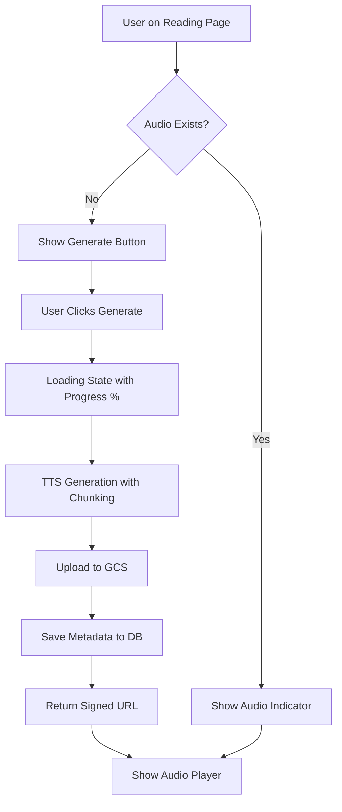
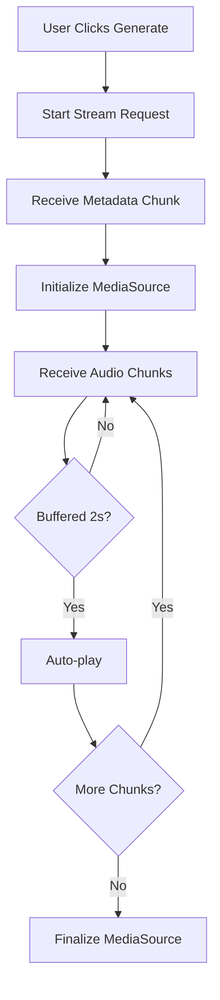
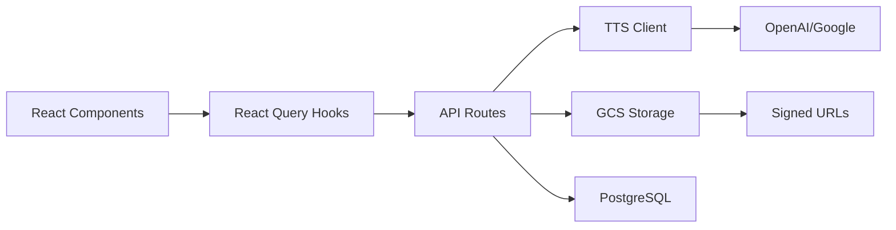

# Text-to-Speech

<!--
  This document follows the standard feature documentation template.
  Migrated from docs/technical/TEXT_TO_SPEECH.md on 2025-12-09
-->

---

## Metadata

| Property | Value |
|----------|-------|
| **Feature Status** | ✅ Production Ready (Non-Streaming) / ⚠️ Experimental (Streaming) |
| **Last Updated** | 2025-12-09 |
| **Related Features** | [Story Experience](./story-experience.md), [AI Story Generation](./ai-story-generation.md), [Authentication](./authentication.md), [Admin Dashboard](./admin-dashboard.md) |
| **Primary Maintainer** | Core Team |
| **API Stability** | Stable (Non-Streaming) / Experimental (Streaming) |

<!-- UPDATE TRIGGER: Update Last Updated date whenever ANY section changes -->
<!-- UPDATE TRIGGER: Update Feature Status when streaming is enabled or disabled -->
<!-- UPDATE TRIGGER: Update Related Features when cross-feature dependencies change -->

---

## Overview

### Purpose

The Text-to-Speech system enables users to listen to their stories with high-quality AI-generated audio narration. The system supports multiple TTS providers, stores audio files in Google Cloud Storage, and provides a full-featured audio player with playback controls.

### Key Capabilities

**Active Production Features** ✅:

- **Non-Streaming Audio Generation**: Full audio generation with progress feedback
- **Multi-Provider Support**: OpenAI TTS, Google Cloud TTS (Journey/Gemini voices)
- **Cloud Storage**: Google Cloud Storage with 90-day lifecycle management
- **Secure Access**: Signed URLs with 7-day expiry, on-demand regeneration
- **Audio Player**: Full-featured controls (play/pause, seek, volume, speed)
- **Intelligent Chunking**: Automatic text splitting for long scenes at sentence boundaries
- **Voice Consistency**: Voice locked to story after first generation
- **Smart Caching**: Audio files cached with React Query and GCS persistence

**Experimental Features** ⚠️:

- **Streaming Audio Playback**: MediaSource API-based streaming (Complete but disabled)
- **Progressive Loading**: Auto-play after buffering 2 seconds

<!-- UPDATE TRIGGER: Update when new capabilities are added or features move between production/experimental -->

### Use Cases

1. **First Time Audio Generation**
   - User navigates to reading page
   - Clicks "Generate Audio" button
   - System generates audio, uploads to GCS, and displays player

2. **Returning to Scene with Audio**
   - Audio indicator shows scene has audio
   - Player loads automatically with fresh signed URL
   - User plays immediately without regeneration

3. **Admin Testing**
   - Admins test TTS providers and voices via `/admin/test`
   - Test audio generation without affecting app settings
   - Test files uploaded with "test" prefix for cleanup

<!-- UPDATE TRIGGER: Add new use cases when feature scope expands -->

---

## User Experience

### Entry Points

| Location | Access Method | User Role Required |
|----------|---------------|-------------------| | Reading Page Header | "Generate Audio" button | User |
| Reading Page | Audio indicator (green volume icon) | User |
| Admin Panel | `/admin/test` testing interface | Admin |

<!-- UPDATE TRIGGER: Update when new UI access points are added -->

### User Interface

#### Primary Components

1. **AudioPlayer** ([src/components/AudioPlayer.tsx](../../src/components/AudioPlayer.tsx))
   - Purpose: Floating audio player with full playback controls
   - User actions: Play/pause, seek, volume control, playback speed (0.5x-2x), close
   - Visual location: Fixed at bottom of reading page

2. **AudioGenerationButton** ([src/components/AudioGenerationButton.tsx](../../src/components/AudioGenerationButton.tsx))
   - Purpose: Trigger audio generation for current scene
   - User actions: Click to generate, shows progress percentage during generation
   - Visual location: Reading page header (replaces audio indicator when no audio exists)

3. **AudioIndicator** ([src/components/AudioIndicator.tsx](../../src/components/AudioIndicator.tsx))
   - Purpose: Shows when audio exists for current scene
   - User actions: None (visual indicator only with tooltip on hover)
   - Visual location: Reading page header (small green volume icon)

4. **Admin Test Interface** ([src/routes/admin/test.tsx](../../src/routes/admin/test.tsx))
   - Purpose: Test TTS providers and voices without affecting production settings
   - User actions: Select provider/model/voice, enter text, generate and play audio
   - Visual location: Admin panel at `/admin/test`

<!-- UPDATE TRIGGER: Update when UI components are added, removed, or significantly refactored -->

#### User Flows

**Audio Generation Flow**:



**Streaming Flow (Experimental)**:



<!-- UPDATE TRIGGER: Update when user flows change or new flows are added -->

### User Feedback

- **Loading States**: Button shows spinner and progress percentage (e.g., "45%") during generation
- **Success States**: Audio player appears automatically when generation completes
- **Error States**: Toast notifications for generation failures with specific error messages
- **Empty States**: "Generate Audio" button shown for scenes without audio
- **Disabled States**: Button disabled while scene text is still being generated

<!-- UPDATE TRIGGER: Update when feedback mechanisms change -->

---

## Technical Implementation

### Architecture Overview

The TTS system follows a layered architecture:

1. **Frontend Layer**: React components and hooks for UI and audio playback
2. **API Layer**: Express routes for audio generation, retrieval, and deletion
3. **TTS Layer**: Provider abstraction with intelligent text chunking
4. **Storage Layer**: Google Cloud Storage with signed URL management
5. **Database Layer**: PostgreSQL for audio metadata and TTS settings



<!-- UPDATE TRIGGER: Update when architectural changes occur -->

### Core Components

#### Frontend Components

| Component | Path | Responsibility |
|-----------|------|----------------|
| AudioPlayer | [src/components/AudioPlayer.tsx](../../src/components/AudioPlayer.tsx) | Full-featured audio player with controls |
| AudioGenerationButton | [src/components/AudioGenerationButton.tsx](../../src/components/AudioGenerationButton.tsx) | Trigger audio generation with progress feedback |
| AudioIndicator | [src/components/AudioIndicator.tsx](../../src/components/AudioIndicator.tsx) | Visual indicator for existing audio |
| StreamingAudioPlayer | [src/components/StreamingAudioPlayer.tsx](../../src/components/StreamingAudioPlayer.tsx) | Streaming player (⚠️ Experimental, disabled) |
| Admin Test Page | [src/routes/admin/test.tsx](../../src/routes/admin/test.tsx) | Admin testing interface for TTS |

<!-- UPDATE TRIGGER: Update when components are added, removed, moved, or renamed -->

#### Backend/API Routes

| Route | Method | Path | Purpose |
|-------|--------|------|---------|
| Audio Check/Generate | GET | [src/routes/api/stories/$id/scene/$number/audio.ts](../../src/routes/api/stories/$id/scene/$number/audio.ts) | Check/generate audio (production endpoint) |
| Audio Delete | DELETE | [src/routes/api/stories/$id/scene/$number/audio.ts](../../src/routes/api/stories/$id/scene/$number/audio.ts) | Delete audio (admin only) |
| Audio Stream | GET | [src/routes/api/stories/$id/scene/$number/audio-stream.ts](../../src/routes/api/stories/$id/scene/$number/audio-stream.ts) | Stream audio generation (⚠️ Experimental) |
| Voices List | GET | [src/routes/api/tts/voices.ts](../../src/routes/api/tts/voices.ts) | List available voices per provider |
| Admin Test Audio | POST | [src/routes/api/admin/test/generate-audio.ts](../../src/routes/api/admin/test/generate-audio.ts) | Generate test audio (admin only) |
| Admin Test Text | POST | [src/routes/api/admin/test/generate-text.ts](../../src/routes/api/admin/test/generate-text.ts) | Generate test text (admin only) |

<!-- UPDATE TRIGGER: Update when API routes are added, removed, or significantly changed -->

#### Database Schema

**scene_audio Table**:

```typescript
{
  id: uuid (primary key)
  story_id: uuid (foreign key → user_stories)
  scene_number: integer
  audio_url: text                    // GCS path (gs://bucket/path)
  file_size: integer                 // bytes
  duration: decimal                  // seconds
  tts_provider: varchar(50)
  voice_id: varchar(255)
  voice_name: varchar(255)
  generated_at: timestamp
  created_at: timestamp
  // Unique constraint: (story_id, scene_number)
}
```

**user_stories Table (TTS fields)**:

```typescript
{
  tts_provider: varchar(50)          // nullable, locked after first generation
  tts_voice_id: varchar(255)         // nullable, locked after first generation
  tts_voice_name: varchar(255)       // nullable
}
```

**users Table (Default TTS settings)**:

```typescript
{
  default_tts_provider: varchar(50)  // nullable
  default_tts_voice_id: varchar(255) // nullable
  default_tts_voice_name: varchar(255) // nullable
}
```

**app_settings Table (TTS configuration)**:

```typescript
category: 'tts'
- tts.provider → 'openai'
- tts.gcs_bucket_name → ''
- tts.gcs_bucket_path → 'audio/'
```

<!-- UPDATE TRIGGER: Update when database schema changes affect this feature -->

**Key Query Functions:**

- Database queries handled inline in API routes
- GCS operations in [src/lib/tts/storage.ts](../../src/lib/tts/storage.ts)

<!-- UPDATE TRIGGER: Update when new database query files are created or moved -->

### State Management

**Client State:**

- **React Query** for audio metadata with 5-minute stale time
- **Local state** for audio player controls (play/pause, volume, speed, seek position)
- **Hooks**: `useAudioGeneration()`, `useAudioPlayer()`, `useStreamingAudioPlayer()` (experimental)

**Server State:**

- **In-memory cache** for TTS configuration with 5-minute TTL
- **Database** for audio metadata persistence
- **GCS** for audio file storage with 90-day lifecycle

<!-- UPDATE TRIGGER: Update when state management approach changes or new hooks are added -->

### Data Flow

**Audio Generation Flow**:

```
1. User clicks "Generate Audio" → AudioGenerationButton
2. Component calls useAudioGeneration.mutate()
3. API route /api/stories/:id/scene/:number/audio?generate=true
4. Determine voice: story settings → user defaults → app defaults
5. Fetch scene content from database
6. generateSpeech() in TTS client:
   - Split text into chunks (4096 chars for OpenAI, sentence-aware)
   - Generate audio for each chunk via provider API
   - Concatenate MP3 buffers
7. uploadAudioToGCS() uploads to GCS bucket
8. Save metadata to scene_audio table
9. Update story TTS settings (first generation only)
10. Generate 7-day signed URL
11. Return audio metadata to client
12. AudioPlayer component renders with signed URL
```

**Audio Playback Flow**:

```
1. User navigates to scene with audio
2. useAudioGeneration query checks database
3. If exists: Generate fresh signed URL on-demand
4. Return audio metadata to client
5. AudioPlayer auto-loads and displays controls
6. User can play immediately
```

<!-- UPDATE TRIGGER: Update when data flow changes significantly -->

### External Dependencies

| Dependency | Purpose | Configuration Location |
|------------|---------|----------------------|
| @google-cloud/storage | GCS audio file storage | [src/lib/tts/storage.ts](../../src/lib/tts/storage.ts) |
| @google-cloud/text-to-speech | Google Cloud TTS provider | [src/lib/tts/client.ts](../../src/lib/tts/client.ts) |
| @google/genai | Google Gemini TTS (streaming) | [src/lib/tts/client.ts](../../src/lib/tts/client.ts) |
| openai | OpenAI TTS provider | [src/lib/tts/client.ts](../../src/lib/tts/client.ts) |

<!-- UPDATE TRIGGER: Update when external dependencies are added or removed -->

---

## API Reference

### Public APIs

#### GET /api/stories/:id/scene/:number/audio

**Status**: ✅ Active in Production

**Purpose**: Check if audio exists or generate new audio for a scene

**Query Parameters**:

- `generate=true` (optional): Trigger audio generation if not exists

**Response**:

```typescript
interface AudioResponse {
  exists: boolean;
  audioUrl: string;        // Fresh 7-day signed GCS URL
  fileSize: number;         // bytes
  duration: number;         // seconds
  provider: string;         // "openai" | "google"
  voice: {
    id: string;
    name: string;
  };
}
```

**Example Usage**:

```typescript
// Check if audio exists
const response = await fetch(`/api/stories/${storyId}/scene/${sceneNumber}/audio`);
const data = await response.json();

// Generate audio if not exists
const response = await fetch(
  `/api/stories/${storyId}/scene/${sceneNumber}/audio?generate=true`
);
const data = await response.json();
```

**Error Codes**:

- `401`: User not authenticated
- `403`: User does not own story
- `404`: Story or scene not found
- `500`: Generation failed, GCS upload failed, or database error

<!-- UPDATE TRIGGER: Update when API signatures change -->

#### DELETE /api/stories/:id/scene/:number/audio

**Status**: ✅ Active in Production

**Purpose**: Delete audio for a scene (admin only)

**Authorization**: Admin role required

**Response**:

```typescript
{ success: true }
```

**Error Codes**:

- `401`: User not authenticated
- `403`: User is not admin
- `404`: Audio not found
- `500`: Deletion failed

<!-- UPDATE TRIGGER: Update when API signatures change -->

#### GET /api/stories/:id/scene/:number/audio-stream

**Status**: ⚠️ Implemented but Disabled

**Purpose**: Stream audio generation with progressive chunk delivery using NDJSON protocol

**Response Format**: NDJSON (Newline-Delimited JSON)

**First Chunk (Metadata)**:

```json
{
  "type": "metadata",
  "metadata": {
    "estimatedDuration": 45.5,
    "format": "mp3",
    "totalChunks": 3,
    "provider": "openai",
    "audioFormat": "mp3",
    "pcmSpecs": {
      "sampleRate": 24000,
      "bitDepth": 16,
      "channels": 1
    }
  }
}
```

**Audio Chunks**:

```json
{
  "type": "audio",
  "index": 0,
  "isLast": false,
  "data": "base64-encoded-audio-data",
  "format": "mp3"
}
```

**Note**: This endpoint is complete but disabled due to MediaSource API stability issues. See [Future Enhancements](#future-enhancements).

<!-- UPDATE TRIGGER: Update when streaming is enabled or API changes -->

#### GET /api/tts/voices

**Status**: ✅ Active in Production

**Purpose**: List available voices for TTS providers

**Query Parameters**:

- `provider` (optional): Filter by provider ("openai" | "google")

**Response**:

```typescript
{
  [provider: string]: Array<{
    id: string;
    name: string;
    language?: string;
    gender?: string;
  }>
}
```

**Example**:

```json
{
  "openai": [
    { "id": "alloy", "name": "Alloy" },
    { "id": "echo", "name": "Echo" },
    { "id": "fable", "name": "Fable" }
  ],
  "google": [
    { "id": "en-US-Journey-F-Puck", "name": "Puck (Male)" },
    { "id": "en-US-Journey-F-Kore", "name": "Kore (Female)" }
  ]
}
```

<!-- UPDATE TRIGGER: Update when new voices are added -->

#### POST /api/admin/test/generate-audio

**Status**: ✅ Active in Production

**Purpose**: Generate test audio for admin testing (does not affect app settings)

**Authorization**: Admin role required

**Request Body**:

```typescript
{
  text: string;
  provider: "openai" | "google" | "elevenlabs" | "azure";
  model: string;
  voiceId: string;
}
```

**Response**:

```typescript
{
  audioUrl: string;    // 7-day signed GCS URL
  duration: number;    // seconds
  fileSize: number;    // bytes
  provider: string;
  model: string;
  voiceId: string;
}
```

**Note**: Test audio files uploaded with "test" story ID prefix for cleanup. Follow same 90-day lifecycle as production audio.

<!-- UPDATE TRIGGER: Update when admin APIs change -->

---

## Code Locations

### Directory Structure

```
src/
├── components/
│   ├── AudioPlayer.tsx                    # Full-featured audio player
│   ├── AudioGenerationButton.tsx          # Generation trigger button
│   ├── AudioIndicator.tsx                 # Audio exists indicator
│   └── StreamingAudioPlayer.tsx           # Streaming player (experimental)
├── hooks/
│   ├── useAudioGeneration.ts              # Audio check/generation hook
│   ├── useAudioPlayer.ts                  # Audio playback hook
│   ├── useStreamingAudioPlayer.ts         # Streaming playback (experimental)
│   ├── useTestAudioGenerationMutation.ts  # Admin test audio hook
│   └── useTestTextGenerationMutation.ts   # Admin test text hook
├── routes/
│   ├── admin/
│   │   └── test.tsx                       # Admin testing interface
│   ├── story/
│   │   └── $id/
│   │       └── read.tsx                   # Reading page (integrates TTS)
│   └── api/
│       ├── stories/
│       │   └── $id/
│       │       └── scene/
│       │           └── $number/
│       │               ├── audio.ts       # Audio API (production)
│       │               └── audio-stream.ts # Streaming API (experimental)
│       ├── tts/
│       │   └── voices.ts                  # Voices list API
│       └── admin/
│           └── test/
│               ├── generate-audio.ts      # Admin test audio API
│               └── generate-text.ts       # Admin test text API
└── lib/
    └── tts/
        ├── client.ts                      # TTS provider abstraction
        ├── config.ts                      # TTS configuration
        ├── storage.ts                     # GCS storage management
        └── voices.ts                      # Voice management
```

<!-- UPDATE TRIGGER: Update when files are added, removed, moved, or renamed within the feature -->

### Key Files

| File | Purpose | Lines of Code |
|------|---------|---------------|
| [src/lib/tts/client.ts](../../src/lib/tts/client.ts) | TTS provider abstraction with intelligent chunking | ~400 |
| [src/lib/tts/storage.ts](../../src/lib/tts/storage.ts) | GCS upload, signed URLs, deletion | ~200 |
| [src/lib/tts/config.ts](../../src/lib/tts/config.ts) | TTS configuration with in-memory cache | ~150 |
| [src/components/AudioPlayer.tsx](../../src/components/AudioPlayer.tsx) | Full-featured audio player UI | ~250 |
| [src/hooks/useAudioGeneration.ts](../../src/hooks/useAudioGeneration.ts) | React Query hook for audio generation | ~150 |
| [src/routes/api/stories/$id/scene/$number/audio.ts](../../src/routes/api/stories/$id/scene/$number/audio.ts) | Production audio API endpoint | ~200 |

<!-- UPDATE TRIGGER: Update when significant files are added or removed -->

---

## Configuration

### Environment Variables

```bash
# TTS Provider Configuration
TTS_PROVIDER=openai                    # openai | google | elevenlabs | azure

# Google Cloud Storage (Required)
GCS_BUCKET_NAME=your-bucket-name       # GCS bucket for audio storage
GCS_BUCKET_PATH=audio/                 # Path prefix within bucket
GCS_SERVICE_ACCOUNT_JSON={"type":"service_account",...}  # Service account JSON

# Google Cloud TTS (Non-streaming, MP3)
# Optional - Falls back to GCS_SERVICE_ACCOUNT_JSON if not provided
GOOGLE_TTS_ACCOUNT_JSON={"type":"service_account",...}

# Google Gemini TTS (Streaming, PCM)
# Required only for streaming TTS with Google provider
GOOGLE_TTS_API_KEY=your-google-api-key

# Provider API Keys
# OpenAI key reused from AI configuration
ELEVENLABS_API_KEY=...                # For ElevenLabs TTS
AZURE_TTS_KEY=...                     # For Azure TTS
AZURE_TTS_REGION=eastus               # Azure region
```

<!-- UPDATE TRIGGER: Update when new environment variables are added or removed -->

### Application Settings

**Settings Location**: Database `app_settings` table, category `tts`

```typescript
// Stored in app_settings table
{
  category: 'tts',
  key: 'provider',
  value: 'openai'
}
{
  category: 'tts',
  key: 'gcs_bucket_name',
  value: ''
}
{
  category: 'tts',
  key: 'gcs_bucket_path',
  value: 'audio/'
}
```

**In-Memory Cache**: 5-minute TTL, falls back to environment variables

<!-- UPDATE TRIGGER: Update when configuration options change -->

### Provider Details

**OpenAI TTS**:

- Model: `tts-1-hd`
- Voices: alloy, echo, fable, onyx, nova, shimmer
- Chunk size: 4096 characters (sentence-aware splitting)
- Output: MP3

**Google Cloud TTS**:

- Models: Journey voices (e.g., `en-US-Journey-F`), Gemini (e.g., `gemini-2.5-flash-lite-preview-tts`)
- Voices: Puck, Charon, Kore, Fenrir, Aoede, etc.
- Chunk sizes: 450 bytes (Gemini Lite), 4500 bytes (Journey)
- Output: MP3 with configurable speaking rate, pitch, volume

---

## Related Features

### Dependencies

- **[AI Story Generation](./ai-story-generation.md)**: Provides scene text content for TTS conversion
- **[Authentication](./authentication.md)**: Requires user identity for story ownership verification

### Dependents

- **[Story Experience](./story-experience.md)**: Integrates audio player in reading page
- **[Admin Dashboard](./admin-dashboard.md)**: Provides admin testing interface at `/admin/test`

<!-- UPDATE TRIGGER: Update when feature dependencies change -->

---

## Testing

### Test Coverage

**Manual Testing Interface**:

- Location: `/admin/test` (Admin only)
- Features: Test AI text generation and TTS audio generation
- Providers: OpenAI, Google, ElevenLabs, Azure
- Test audio files: Stored with "test" prefix for cleanup

**Testing Checklist**:

- [ ] Generate audio for short scene (< 1000 chars)
- [ ] Generate audio for long scene (> 4096 chars, tests chunking)
- [ ] Test OpenAI TTS with different voices
- [ ] Test Google Cloud TTS with Journey voices
- [ ] Verify audio player controls (play/pause, seek, volume, speed)
- [ ] Test signed URL expiry and regeneration (after 7 days)
- [ ] Verify voice consistency (same voice used for all scenes in story)
- [ ] Test admin deletion of audio
- [ ] Test audio generation during scene text streaming (button disabled)
- [ ] Verify GCS upload and lifecycle policy

**React Hooks Testing**:

- Unit tests needed for `useAudioGeneration`, `useAudioPlayer`
- Integration tests for admin test mutations

<!-- UPDATE TRIGGER: Update when test files are added or test coverage changes -->

### Manual Testing Checklist

- [ ] **Audio Generation**: Generate audio for new scene
- [ ] **Playback**: Verify audio plays correctly with controls
- [ ] **Voice Consistency**: Generate audio for multiple scenes, verify same voice
- [ ] **Chunking**: Test with scene > 4096 characters
- [ ] **Signed URLs**: Verify URLs work and regenerate after expiry
- [ ] **Progress Feedback**: Verify progress percentage shows during generation
- [ ] **Error Handling**: Test with invalid API keys
- [ ] **Admin Testing**: Use `/admin/test` to test all providers
- [ ] **GCS Cleanup**: Verify 90-day lifecycle policy
- [ ] **Mobile Responsiveness**: Test audio player on mobile devices

<!-- UPDATE TRIGGER: Update when new test scenarios are identified -->

---

## Performance Considerations

### Optimization Strategies

- **Configuration Caching**: In-memory cache with 5-minute TTL reduces database queries
- **React Query Caching**: 5-minute stale time for audio metadata prevents redundant API calls
- **Signed URL Strategy**: 7-day expiry balances security and performance (no re-generation on every request)
- **Text Chunking**: Sequential generation to avoid provider rate limits
- **MP3 Concatenation**: Direct buffer concatenation without re-encoding
- **GCS Signed URLs**: Lightweight on-demand generation instead of storing URLs in database

### Known Limitations

- **Sequential Chunking**: Long scenes generate chunks sequentially (not parallel) to avoid rate limits
- **No Pre-generation**: Audio generated on-demand, not pre-generated for all scenes
- **Signed URL Expiry**: URLs expire after 7 days, requires page refresh for new URL
- **Streaming Disabled**: MediaSource-based streaming has stability issues, not used in production
- **Provider Rate Limits**: Subject to OpenAI/Google rate limits for TTS API calls

<!-- UPDATE TRIGGER: Update when performance optimizations are added or limitations are discovered -->

---

## Future Enhancements

### Planned Features

- [ ] **Streaming Audio Playback (Re-enable and Stabilize)**
  - Status: Complete implementation exists but disabled
  - Blockers: React effect infinite loops, AbortController timing, browser compatibility
  - Benefits: Start playback within 2 seconds, better UX for long scenes
  - Files: `useStreamingAudioPlayer.ts`, `StreamingAudioPlayer.tsx`, `audio-stream.ts`

- [ ] **Additional TTS Providers**
  - ElevenLabs API integration (infrastructure exists)
  - Azure Cognitive Services implementation (infrastructure exists)

- [ ] **Admin Features**
  - Cost monitoring dashboard
  - Bulk audio deletion
  - Provider usage statistics
  - "Clear Test Audio" button with automatic cleanup
  - Test audio usage statistics

- [ ] **User Features**
  - "Clear all my audio" button in settings
  - Voice selection interface before generation
  - Audio playback history
  - Download audio option

- [ ] **Performance Optimizations**
  - Audio preloading for next scene
  - Service worker caching for frequently played scenes
  - Adaptive bitrate based on connection speed

### Potential Improvements

- Add rate limiting for audio generation API
- Implement background job for 90-day cleanup verification
- Add PCM to MP3 client-side conversion for Google streaming
- Implement feature flag system for streaming
- Add comprehensive error recovery for streaming
- Test streaming with various network conditions

<!-- UPDATE TRIGGER: Update when roadmap changes or enhancements are completed -->

---

## Troubleshooting

### Common Issues

#### Issue: "TTS Provider API key not configured"

**Symptoms:**

- Audio generation fails with API key error
- Error message in browser console

**Cause:**

- No valid API key for selected TTS provider in Admin Settings

**Solution:**

1. Navigate to Admin Settings > API Keys
2. Configure the TTS provider's API key (OpenAI reused from AI config)
3. Test the key
4. Try generating audio again

#### Issue: "Failed to generate audio"

**Symptoms:**

- Audio generation button fails
- Toast notification shows error

**Cause:**

- Provider API failure
- Invalid API key or quota exceeded
- Special characters in scene content
- Network timeout

**Solution:**

1. Check provider API status page
2. Verify API key is valid and has available quota
3. Check scene content for unusual special characters
4. Review error logs for specific error message
5. Retry generation

#### Issue: "Failed to upload to GCS"

**Symptoms:**

- Audio generates but upload fails
- Error in server logs

**Cause:**

- Incorrect GCS_BUCKET_NAME
- Service account lacks Storage Admin permissions
- Invalid GCS_SERVICE_ACCOUNT_JSON
- Bucket does not exist or is inaccessible

**Solution:**

1. Verify GCS_BUCKET_NAME environment variable is correct
2. Check service account has Storage Admin role
3. Verify GCS_SERVICE_ACCOUNT_JSON is valid JSON
4. Confirm bucket exists in GCS console
5. Test bucket access with `gsutil ls gs://bucket-name`

#### Issue: Signed URL Expired (403 Forbidden)

**Symptoms:**

- Audio returns 403 error when playing
- Previously working audio no longer plays

**Cause:**

- Signed URL expired after 7 days

**Solution:**

- Refresh the page (new signed URL generated automatically on every request)
- URLs expire after 7 days but regenerate on-demand
- No manual intervention needed

<!-- UPDATE TRIGGER: Update when new issues are discovered or solved -->

### Debug Mode

**Enable Debug Logging:**

```typescript
// Add to .env.development
DEBUG_TTS=true
```

**Console Output:**

- Look for `[TTS]` prefix in console logs
- Check Network tab for API request/response details
- Inspect GCS upload status in server logs

**Server Logs:**

```bash
# View TTS-related logs
pnpm logs | grep TTS
```

<!-- UPDATE TRIGGER: Update when debugging capabilities change -->

---

## AI Agent Maintenance Guidelines

### When to Update This Document

1. **Provider Changes** (Priority: HIGH)
   - New TTS provider added → Update providers list, configuration, and API reference
   - Provider API changed → Update technical implementation and API reference
   - New voices added → Update voices section and API response examples

2. **Storage Changes** (Priority: HIGH)
   - GCS configuration changed → Update configuration section
   - Caching strategy modified → Update performance section
   - Lifecycle policy changed → Update storage management section

3. **Audio Player Changes** (Priority: MEDIUM)
   - Player component updated → Update user experience section and component table
   - New controls added → Update UI documentation and features list
   - Streaming enabled/disabled → Update metadata status and experimental features

4. **API Changes** (Priority: HIGH)
   - New endpoint added → Add to API Reference section
   - Endpoint signature changed → Update request/response types
   - Error codes changed → Update error documentation

5. **Component Changes** (Priority: HIGH)
   - New component added → Update components table and directory structure
   - Component renamed/moved → Update all path references
   - Component deleted → Remove from components table

6. **Configuration Changes** (Priority: MEDIUM)
   - New environment variable → Add to Configuration section
   - Settings structure changed → Update application settings

### Update Patterns

**Pattern 1: New TTS Provider Added**

```markdown
1. Add provider to "Key Capabilities" under Multi-Provider Support
2. Update "Provider Details" section with new provider specifics
3. Add provider to Configuration > Environment Variables (if new env var needed)
4. Update API Reference for /api/tts/voices with new provider voices
5. Update "External Dependencies" if new npm package added
6. Update "Last Updated" in Metadata
```

**Pattern 2: Streaming Feature Enabled**

```markdown
1. Change Feature Status in Metadata from Experimental to Production
2. Move streaming from "Experimental Features" to "Active Production Features"
3. Update API Reference status for audio-stream endpoint
4. Remove "Why Disabled" notes
5. Update Future Enhancements to remove streaming re-enable task
6. Update "Last Updated" in Metadata
```

**Pattern 3: New Voice Added to Provider**

```markdown
1. Update "Provider Details" section with new voice
2. Update API Reference for GET /api/tts/voices response example
3. Update Admin Testing Interface voice list (if applicable)
4. Update "Last Updated" in Metadata
```

### AI Agent Instructions

**When modifying code related to this feature:**

1. **Before making code changes:**
   - Review this documentation to understand TTS architecture
   - Check "Code Locations" to find all related files
   - Review "API Reference" if modifying endpoints
   - Check "Configuration" for environment variables

2. **After making code changes:**
   - Update relevant sections based on "When to Update This Document"
   - Follow update patterns for consistency
   - Update "Last Updated" date in Metadata
   - If adding new file: Update "Directory Structure" and "Key Files"
   - If modifying API: Update "API Reference" with new signatures
   - If changing component: Update "Frontend Components" table
   - If adding provider: Update "Provider Details" and configuration

3. **Quality checks:**
   - Ensure all file paths are correct and use markdown links
   - Verify TypeScript interfaces in examples match actual code
   - Check that related features cross-references are bidirectional
   - Confirm mermaid diagrams render correctly (if modified)
   - Test that all internal links work

**Automation hooks (for future CI/CD integration):**

- Detect file additions in `src/lib/tts/`, `src/components/Audio*`, `src/hooks/useAudio*` → Prompt to update docs
- Detect API route changes in `src/routes/api/*/audio*` → Validate API Reference is updated
- Detect schema migrations affecting `scene_audio` table → Validate Database Schema section is current
- Detect changes to `src/lib/tts/voices.ts` → Validate voices list is updated

---

## Change Log

| Date | Change | Author |
|------|--------|--------|
| 2025-12-09 | Migrated from docs/technical/TEXT_TO_SPEECH.md to feature-centric structure | AI Assistant |
| 2025-12-08 | Original documentation last updated (pre-migration) | Development Team |
| 2025-12-07 | Streaming TTS implementation completed but disabled | Development Team |

<!-- UPDATE TRIGGER: Add entry whenever significant changes are made to this document -->

---

## Cost Estimation

**Per Scene** (assuming ~2000 characters):

- OpenAI TTS: ~$0.03
- GCS Storage: ~$0.00002/month
- GCS Egress: ~$0.001 per playback

**Monthly for 1000 scenes**:

- Generation: ~$30
- Storage: ~$0.02
- Egress (avg 10 plays/scene): ~$10
- **Total: ~$40/month**

---

## Security

- **Authentication**: All API endpoints require valid session
- **Authorization**: Story ownership verified before audio access
- **Admin-only Deletion**: Role check for DELETE operations
- **Signed URLs**: Time-limited (7-day) access to GCS files
- **Input Validation**: Scene number and text validation
- **Rate Limiting**: Consider implementing for audio generation API

**Recommendations**:

- Monitor API usage and costs
- Set up alerts for unusual activity
- Implement rate limiting for generation endpoint
- Audit test audio cleanup regularly

---

## Storage Management

### Lifecycle Policy

Audio files automatically deleted after 90 days via GCS lifecycle rule:

```json
{
  "action": { "type": "Delete" },
  "condition": { "age": 90 }
}
```

### Manual Cleanup

**List test audio files:**

```bash
gsutil ls gs://your-bucket/audio/test/
```

**Delete test audio (older than 7 days recommended):**

```bash
gsutil -m rm gs://your-bucket/audio/test/**
```

### Planned Background Jobs

- Scheduled 90-day cleanup verification job
- Scheduled 7-day cleanup for test audio files
- Orphaned file detection and cleanup
- Signed URL refresh job (optional)

---

## Deployment Checklist

### Environment Setup

- [ ] Configure GCS bucket
- [ ] Create service account with Storage Admin role
- [ ] Add service account JSON to environment variables
- [ ] Set TTS_PROVIDER environment variable
- [ ] Verify OpenAI API key configured (via Admin Settings)

### Database Migration

- [ ] Run `pnpm db:migrate` on production
- [ ] Verify migration succeeded
- [ ] Run `pnpm db:codegen` to update types

### GCS Configuration

- [ ] Enable uniform bucket-level access
- [ ] Set appropriate CORS policy
- [ ] Configure lifecycle rules for 90-day deletion

### Monitoring

- [ ] Set up logging for audio generation
- [ ] Monitor GCS storage costs
- [ ] Track TTS API usage and costs
- [ ] Monitor signed URL regeneration frequency

### Cost Controls

- [ ] Set budget alerts for GCS
- [ ] Set budget alerts for OpenAI TTS
- [ ] Monitor average audio file sizes
- [ ] Review cleanup job effectiveness

---

## Related Documentation

- [AI Providers](../configuration/AI_PROVIDERS.md) - AI provider configuration (OpenAI, Google, etc.)
- [Admin Dashboard](./admin-dashboard.md) - Admin features and testing interface
- [Story Experience](./story-experience.md) - Reading page integration
- [Implementation Progress](../development/PROGRESS.md) - Full project progress including TTS implementation
